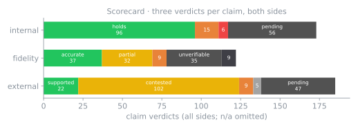
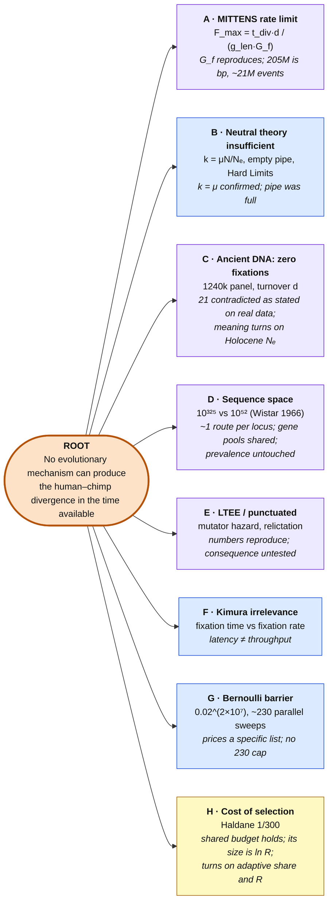
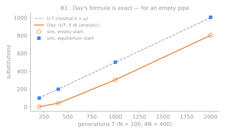
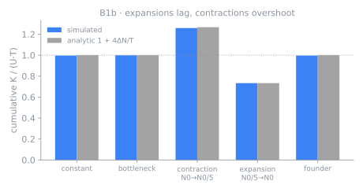
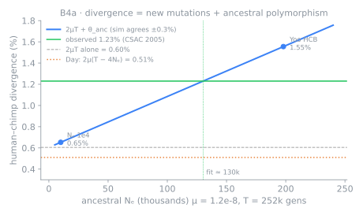
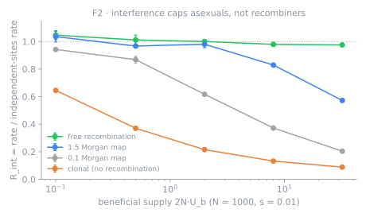
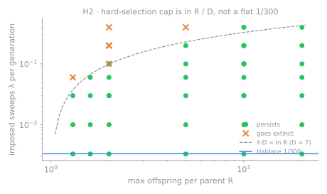

<div align="center">


# evo-sim

### Can evolution make enough mutations fix in the available time?
**An open, numerical audit of Vox Day's *Probability Zero* / MITTENS argument and of his critics, as the groundwork for a simulator you can tune yourself.**

-orange)


</div>

---

> **New here?** Read the whole story at your level: **[ELI5](docs/explain/eli5/README.md)** · **[ELI8](docs/explain/eli8/README.md)** · **[ELI10](docs/explain/eli10/README.md)** · **[ELI12](docs/explain/eli12/README.md)** · **[ELI18](docs/explain/eli18/README.md)**

## Play with it
**[Is There Enough Time](https://raw.githack.com/nickallevato/evo-sim/master/docs/explain/eli-series/play.html)** is an interactive explainer of the math and the sims at five levels (ELI5 to ELI18). It has five small simulations you can run in the browser: a drift jar, a mutation river, a selection race, the MITTENS budget board, and a combination lock. ([source](docs/explain/eli-series/index.html))

<p align="center"><a href="https://raw.githack.com/nickallevato/evo-sim/master/docs/explain/eli-series/play.html#eli10"></a></p>

**Mutation river.** Each dot is one neutral mutation, and its position is the share of the population that carries it. Most dots sink. The few that reach the far bank are substitutions. A bigger population drops in more mutations, but each one is less likely to cross, and the two effects cancel: substitutions arrive at the mutation rate, **k = μ**. This is a real seeded Wright–Fisher run with 2N = 80, μ = 0.02 per copy and an equilibrium start. It gives 9 substitutions in 600 generations against μ × 600 = 12 expected, which is Poisson scatter for a run this short.

<p align="center"><a href="https://raw.githack.com/nickallevato/evo-sim/master/docs/explain/eli-series/play.html#eli12"></a></p>

**Combination lock.** Some features may need several mutations before they help. If each right step is kept (**stepping stones**), the lock opens quickly. If nothing helps until every dial is right at once (a **valley**), the wait grows with the number of combinations. This is an illustrative toy, not the audit's D15 result. D15 tests Hössjer's multi-step waiting time and is still running. Both previews are drawn by [`research/tools/eli_readme_svgs.py`](research/tools/eli_readme_svgs.py).

## Why this exists
Vox Day argues, in *Probability Zero* (2025), the MITTENS papers on Zenodo and many blog posts, that population genetics *mathematically* rules out natural selection explaining the human–chimp divergence. His critics (McCarthy, Mansfield, Hancock, Camestros Felapton, Bowers and others) say his maths is wrong. Both sides mostly trade assertions.

This repo works through each claim on both sides:

1. **Extract** every mathematical or empirical claim, with a verbatim quote and its source.
2. **Arrange** the claims into one argument tree.
3. **Check** each load-bearing equation with an exact Markov chain or a forward simulation. Predictions are pre-registered before each run.
4. **Review** every check three times: a correctness review, a steelman for Day and a steelman for the critics.
5. **Record** three verdicts per claim: *internal* (does it follow?), *fidelity* (does the cited source say that?) and *external* (is it biologically realistic?).

The end product is a **user-controllable evolution simulator** whose knobs are exactly the parameters the dispute turns on.

> **Stance:** neutral. Valid points are recorded as prominently as errors, whoever makes them. Where standard theory makes a firm prediction it is stated as the null hypothesis, then tested rather than assumed.

---

## Scorecard so far

<p align="center"></p>

| ✅ Where **Day** holds up | ✅ Where the **critics** hold up |
|---|---|
| His empty-pipe formula $E[F(T)] = \mu L\int_0^T F_X$ is **exact** for its premise (B1) | Neutral substitution rate is $k=\mu$ for **any** $N_e$: fixation probability is $1/2N$, not $1/2N_e$ (B3) |
| $N_e$ really does set the fixation **timescale** (B3) | The ancestral "pipe" was **full**, not empty. Day has since withdrawn the empty start (B1c, B1d) |
| The Hard Limits exponent $-\pi^2 N_e/G$ is the correct leading-order tail (B2a) | Latency ≠ throughput: many sweeps can be in flight at once (F1) |
| LTEE $G_f \approx 1{,}300$ gens/fixation is a real **throughput** measurement and reproduces (A2) | Recombination removes the clonal-interference ceiling in the tested regime (F2) |
| Balloux–Lehmann fluctuation effect is real (B3b) | Divergence includes ancestral polymorphism: $d = 2\mu T + \theta_{anc}$ (B4a) |
| Soft selection does **not** make the cost of selection disappear (H) | The cap is $\ln R / D$, not a flat 10% (H2). The $0.743\mu$ figure is a window artefact (B3c) |
| Haldane arithmetic (300, 487) holds. Critics' "38M matches 35M SNVs" double-counts, and on Hancock's own event basis the match does not follow (B5c, X1) | 205M "required fixations" counts base pairs, not mutation events. The cited $s=0.001$ is *negative* selection (A3, Zeng 2021) |
| The founder hazard's size (~2.3% per event) and the relictation chain reproduce (E, E4) | $0.02^{2\times10^7}$ prices one pre-specified list. No cap near 230 sweeps under multiplicative fitness (G3, Gc) |
| Parallel sweeps share **one** reproductive budget, so concurrency cannot raise the selected total beyond it. At Haldane's assumed $R\approx1.1$ the long-run rate is *below* 1/300 (H3) | The budget is $\ln R$, not 10%: a coding-only adaptive count is payable at $R\approx1.2$–3 (hard adaptive selection, soft load) (H3) |
| Day's SNV-only 17.5M is 83% of the directly counted events and brackets the polymorphism-corrected count; his base-pair total is the right order for non-aligned sequence (GAP-07b) | By direct count from the human–chimp alignment, 205M is 9.7× the mutation events per lineage; with the measured polymorphic share (15.6% on the human side) it is 10.6–12.6× the *fixed* events, about 8–13× combined (non-T2T assemblies); the critics' observation-based estimates land within 7–19% (GAP-07b, GAP-07c) |
| On the real ancient-DNA genotypes his start-frequency table reproduces to 0.4 points, and his "completions of near-fixed alleles" reading is right in kind (C1d) | His "21" does not reproduce from his stated method on the real genotypes (thousands; his own documented pipeline is 3.6× off). keruru's measured $N_e$ replicates within 4%, and Day's $N_e \approx 2$ is excluded (C1d) |
| Exact-outcome alternatives are about 1 per needed change; the GB1 landscape is rugged at single-nucleotide steps; "reduce or destroy" holds as worded for deep mutational scans (D1) | 71% of single substitutions keep at least half of function and "destroy" alone is rare; GB1's functional variants form one connected network; within genes the beneficial fraction exceeds G1's requirement for up to ~$2\times10^5$ changes (D1) |

**Still open:**
- Cost of selection at human scale (H3) is decided only conditionally. It flips at an adaptive non-coding share of ~0.01–0.6%, below what any α estimate resolves; $R$ is unsourced; soft selection, absolute-fitness gain and epistasis are untested at human scale.
- Ancient DNA: Day's "21" is contradicted as stated on the real genotypes (C1d), but what it means turns on the Holocene $N_e$. The published estimates ([retrieval](docs/research/sources/holocene-ne.md)) agree on recent growth of 100× or more but disagree on its timing, so the literature does not decide it; C1e will run the model on each published trajectory. A neutral comparison for the damage-resistant transversion class (36–44 events) is also open.
- The ancestral $N_e$ needed to fit the divergence.
- Branch D (sequence space). D1 measured G1's open number: about 1–6 routes per needed change per locus (below the flip of ~7–17), while a gene's shared pool of beneficial mutations clears it for about ten needed changes but not 25 or more. Per-sequence prevalence (Axe, Taylor) and cross-family connectivity are untouched.
- What fraction of the differences needed selection at all ([GAP-01](docs/arguments/README.md#4-what-everyone-missed)). It cuts Day's requirement by 20×–6,000×, yet the adaptive count still exceeds Haldane's rate.

---

## The argument map


<sub>🟧 Day's root · 🟦 resolved mostly for the critics · 🟪 mixed · 🟨 open · ⬜ not yet checked. Each branch is drawn in full, claim by claim, in [`docs/research/hierarchy/`](docs/research/hierarchy/README.md).</sub>

**The same arguments, read as a philosopher would:** [`docs/arguments/`](docs/arguments/README.md) gives the root argument in standard form, every objection typed as undermining, undercutting or rebutting, a dated family tree showing how each argument changed on both sides since 1966, and seven gaps neither side has closed.

---

## The math, checked

Each result below links to its check script. All numbers come from reviewed runs ([`RESULTS.md`](research/checks/RESULTS.md)).

### 1 · MITTENS: Day's headline bound
```math
F_{\max} \;=\; \frac{t_{\text{div}}\cdot d}{g_{\text{len}}\cdot G_f}
\qquad
\begin{aligned}
t_{\text{div}} &= 6.3\ \text{My},\; g_{\text{len}} = 25\ \text{y} \;\Rightarrow\; 252{,}000\ \text{gens}\\
G_f &= 1{,}322\ \text{gens per fixation (LTEE throughput)}\\
\text{required} &= 2.05\times10^{8}\ \Rightarrow\ \text{shortfall} \approx 10^{6}\times
\end{aligned}
```
The parameters drift between versions (2019 → 2025 → 2026; see [`ledgers/versions.md`](docs/research/ledgers/versions.md)). The dispute is over three inputs:
- **Numerator:** how many fixations are actually required. Counting base pairs gives 205M; a direct count of mutation events in the human–chimp alignment gives about 21M per lineage, of which SNVs are about 19M (17.5M on CSAC's figure).
- **$G_f$:** whether an asexual bacterial throughput transfers to a sexual, recombining, much larger genome.
- **$d$:** the turnover coefficient.

### 2 · Neutral substitution rate: why $k = \mu$
```math
k \;=\; \underbrace{2N\mu}_{\text{new mutants / gen}} \times \underbrace{\tfrac{1}{2N}}_{P_{\text{fix}}} \;=\; \mu
\qquad\text{vs Day:}\quad k = \mu\,\frac{N}{N_e}
```
<details><summary><b>Proof sketch</b>: fixation probability is set by census N, not Nₑ</summary>

In any exchangeable (Cannings) model, the frequency $p_t$ of a neutral allele is a martingale: $E[p_{t+1}\mid p_t]=p_t$. It is bounded and absorbs at 0 or 1, so $P(\text{fix}) = E[p_\infty] = p_0 = 1/2N$ **for any offspring variance**. Offspring variance lowers $N_e$, which speeds up *time to absorption* ($\bar t_{fix} \approx 4N_e$) but leaves its *probability* unchanged. Check `b3_N_vs_Ne.py`: across $N_e$ = 200 → 19, $P_{fix}$ stays at $0.0025 = 1/M$ while $t_{fix}/N_e \approx 4$.
</details>

### 3 · The "empty pipe": Day's formula is right, but its premise is not
```math
E[F(T)] \;=\; \mu L \int_0^T F_X(u)\,du \;\xrightarrow{T\gg 4N_e}\; \mu L\,(T - 4N_e)
\qquad\text{(empty start)}
\qquad\qquad
E[F(T)] = \mu L\,T \qquad\text{(equilibrium start)}
```
<p align="center"></p>

<details><summary><b>Proof sketch</b></summary>

$\int_0^T F_X(u)\,du = T - E[\min(X,T)] \to T - E[X]$, and $E[X]\approx 4N_e$ (Kimura–Ohta). So the deficit is exactly the mean transit time: mutations that arose before $t=0$ are missing from the pipe. Starting from mutation–drift equilibrium, the pipe already carries in-flight alleles. These drain at rate $\mu L$ while new ones enter at rate $\mu L$, so the expected number of fixations in $[0,T]$ is $\mu L T$ (flux balance, or Little's law). Real ancestral populations carry standing variation, so the empty start is a counterfactual boundary case. Day has since withdrawn it (claim B1d). `b1_start_state.py`
</details>

### 4 · Changing population size: a transient, in **both** directions
```math
\frac{K}{U\,T} \;\approx\; 1 + \frac{4\,(N_{\text{old}}-N_{\text{new}})}{T}
```
<p align="center"></p>

The in-flight inventory is $\approx U\cdot 4N$. After a size change it relaxes to $U\cdot 4N_{\text{new}}$, and the difference comes out as extra fixations or missing ones.
- **Expansions** produce a deficit, which is Day's direction.
- **Contractions** produce an excess.

With sourced human and chimp $N_e$ histories (Yoo 2025, Prado-Martinez 2013), every history tested gives an **excess**: $K/UT$ = 1.9–4.0 (`b1c_ne_history.py`).

### 5 · Divergence is not fixations: ancestral polymorphism
```math
E[d] \;=\; 2\mu T \;+\; \underbrace{4N_{e,\text{anc}}\,\mu}_{\theta_{\text{anc}}}
```
<p align="center"></p>

Two sampled genomes coalesce on average $2N_{e,\text{anc}}$ generations *before* the split. That adds $2\mu\cdot 2N_{e,\text{anc}}$ to their expected divergence. The forward simulation matches this within 0.3% (`b4a_two_lineage_ils.py`).

Neither side gets a free pass from the data:
- **Yoo 2025's ancestral node** overshoots the observed 1.23% by about 25%.
- **$N_e$ = 10⁴** gives only half the observed value.
- **The fit** needs $N_{e,\text{anc}}\approx 130$k, or a different $\mu$ or $T$. It has three parameters, so the external verdict is *contested*.

### 6 · Hard Limits: a correct tail exponent, but a latency
```math
P\big(\text{fix within } G \mid \text{fix}\big) \;\approx\; \exp\!\left(-\frac{\pi^2 N_e}{G}\right)
\quad\text{(leading order; exact chain gives prefactor} \approx 50\,(G/N)^{-1.5})
```
Exact Wright–Fisher chains confirm the $-\pi^2$ exponent (`b2a_hard_limits_chain.py`). This is a per-allele *latency* tail, though. Total throughput is $U\!\int F$, which equals $UT$ at equilibrium.

### 7 · Interference: where the parallel-sweep cap lives
<p align="center"></p>

$R_{\text{int}}$ = (realised rate) / (independent-sites rate).
- **Asexual populations** collapse to 0.09 as supply rises. This is the regime the LTEE measures.
- **Free recombination** holds 0.975 with 272 sweeps in flight. Validated in fwdpy11 (`f2_multilocus.py`, `f2_fwdpy11.py`).
- **Caveat:** tested only at N = 1000, s = 0.01 and soft selection. Human-scale active loci are not tested.

### 8 · Cost of selection: Haldane's 1/300 as a special case
```math
\underbrace{\lambda \cdot D}_{\text{selective deaths / gen}} \;<\; \ln R
\qquad D \approx \ln M + 1
\qquad\text{Haldane: } \frac{\ln R}{D}\approx\frac{0.1}{30} = \frac{1}{300}
```
<p align="center"></p>

Under hard selection, a population with maximum fecundity $R$ survives only while the cost it pays per generation stays below $\ln R$. In the tested grid ($R\ge1.3$) it sustains 9–120× Haldane's rate (`h2_hard_selection_multilocus.py`). Soft selection does not remove the cost in the audit's reconstruction; the soft-selection runs are in fact slower.

**At human scale** (H3, `h3_human_scale.py`, conditional on hard adaptive selection with a soft deleterious load):
- Day's structure holds: concurrent sweeps share one budget.
- At Haldane's assumed $R \approx 1.1$ the rate is ≈ 1/300 over 10,000 generations but only ≈ 1/530–1/1,050 over the 252,000-generation lineage, because load fluctuations eat 27–70% of the cap.
- The minimum $R$ for $10^3$ / $10^4$ / $10^5$ adaptive substitutions is 1.2 / 3.0 / 5×10⁴.
- So a coding-only adaptive count fits at plausible $R$. An adaptive non-coding share of 1% or more does not. Day's 17.5M–205M fail under any cost model.

The flip sits below what any α estimate can resolve, and no sourced net hominid $R$ exists, so **H stays open**.

### 9 · Fixation time of a beneficial mutant
```math
\bar t_{\text{fix}} \;\approx\; \frac{2}{s}\left(\ln 4Ns + \gamma\right)
\qquad\text{vs Day's}\qquad \frac{2}{s}\ln 2N
```
At Day's parameters ($N = 10^4$, $s = 0.001$), the simulation and diffusion give 8,480 generations, against 19,807 from his approximation. That approximation is standard but deterministic. It overstates the conditional fixation time by 2.3× (`beneficial_fix_time.py`).

**Fairness audit (X1).** The R5 draft found 22 of 112 Day claims with an "arithmetic error" or "doesn't follow" verdict against 0 of 51 critic claims. The audit then wrote [one verdict rule](research/checks/results/R4-X1-verdict-rule.md) for both sides, re-scored every numeric claim, and had the rule's application checked blind:

| Error verdicts under one rule | Day | Critics | Fisher p |
|---|---|---|---|
| claims with a number in the author's quoted words (primary) | 13/81 | 1/20 | 0.29 |
| claims with a number in the formal statement | 16/82 | 1/31 | 0.038 |
| all claims | 18/114 | 1/51 | 0.008 |

Per 10,000 quoted words: Day 22.7, critics 10.0. If the three close critic calls went the other way, the gap disappears (16/82 vs 4/31, p = 0.58). **Day's errors are robust to reading; the audit cannot claim critics err less per argument.**

---

## Roadmap


**R4 remaining**
- [x] **E:** hypermutator hazard per founder; exact chains for relictation (Cannings)
- [x] **G1:** what $0.02^{2\times10^7}$ prices: a *specific* outcome or *any* outcome
- [x] **Gaps:** finite-map cap fit (GAP-04), indel/SV event counts (GAP-07), sweep-scan windows (GAP-02)
- [x] **H3:** cost of selection at human scale (long-run hazard, finite supply, hard load at K ≥ 4000)
- [x] **GAP-07b:** direct event count from the human–chimp alignment (9.7×, bracket ~7–14×; follow-ups GAP-07c and a T2T re-run)
- [x] **C1c / C1d:** Day's aDNA 21-count with real call depth and ancestry replacement (model), then on the real AADR genotypes (contradicted as stated; keruru's $N_e$ replicates)
- [x] **D1:** sequence-space spike (RNA folding, deep mutational scans, GB1): alternatives per needed change against G1's flip
- [x] **X1:** arithmetic of every critic and ally claim, and one verdict rule applied to both sides (blind-audited)
- [x] **GAP-07c:** polymorphic share of the divergent sites (15.6% human side; 205M is 10.6–12.6× fixed events)
- [x] **Mapping:** every critic and ally argument attached to the map (12 new claims from the Hancock video, pending review); Holocene $N_e$ literature retrieved
- [ ] **In progress:** XT (cross-tool replication), D15 (regulatory waiting time)
- [ ] **Queued:** C1e (the C1c model on published Holocene trajectories), Mansfield's supply argument, latency vs throughput, Hancock's standing-variation prediction
- [ ] **D follow-ups:** per-sequence prevalence (Axe, Taylor, Keefe–Szostak), multi-mutant decay, a noise null for the beneficial proxy
- [ ] **C follow-ups:** a transversion-matched neutral model; what the transition excess is
- [ ] **H follow-ups:** soft-selection rate limit and epistasis at human $R$; a sourced beneficial DFE and $M$; CIs on T50
- [ ] **Sources:** Yoo 2025's $\mu$, to rescale $N_{e,\text{anc}}$. Verify Takahata 1995, Charlesworth 2009 and the Haak 2015 panel design

**R5:** final verdicts, a sensitivity table, the simulator variable list and a published summary. The [ELI5 / ELI8 / ELI10 / ELI12 / ELI18 explainers](docs/explain/README.md) exist as drafts and get a final pass after R5.

**Simulator knobs (draft):**
- Population: $N$, $N_e$, offspring variance, sexual vs asexual, demography over time, start state
- Mutation: $\mu$, genome length $L$, mutators
- Selection: distribution of $s$ (including negative), dominance, hard vs soft selection
- Recombination: map length
- Generations: generation time, overlapping generations
- Counting: the divergence-counting rule

---

## Repo layout
| Path | What |
|---|---|
| [`docs/research/`](docs/research/README.md) | The audit: rules, glossary, `parameters.yaml`, claim files, argument tree and ledgers (fidelity, balance, contradictions, versions) |
| [`docs/arguments/`](docs/arguments/README.md) | Argument map: standard forms, typed objections, genealogy, gaps and prior art |
| [`docs/research/claims/`](docs/research/claims) | One file per claim, with a verbatim quote, formal statement, pre-registered prediction and three verdicts |
| [`research/checks/`](research/checks) | Reviewed verification scripts, with [`RESULTS.md`](research/checks/RESULTS.md) and [`REVIEW.md`](research/checks/REVIEW.md) |
| `research/checks/results/` | Write-ups, reviews and raw outputs |
| [`research/tools/`](research/tools/README.md) | Harvest and claim-generation tooling, plus `readme_figs.py`, which draws the figures above, and `icon.py` / `icon_raster.py`, which draw the icon, favicon and social preview |

## Reproduce
```bash
python3 -m venv research/.venv
research/.venv/bin/pip install -r research/requirements.txt matplotlib
research/.venv/bin/python -I research/checks/baseline_textbook.py     # textbook baselines, must pass first
research/.venv/bin/python -I research/checks/b4a_two_lineage_ils.py   # any check; seeds are fixed
research/.venv/bin/python -I research/checks/lint_research.py         # claims ↔ tree ↔ provenance lint
research/.venv/bin/python -I research/tools/readme_figs.py            # regenerate docs/img/*.svg
research/.venv/bin/python -I research/tools/icon.py && research/.venv/bin/python -I research/tools/icon_raster.py  # icon, PNG sizes, favicon.ico, social-preview.png
```

## Ground rules
- **Verbatim quotes only.** Each has a locator and a date. A claim known only through an opponent is tagged `secondhand`.
- **Pre-registered predictions.** Every number traces to `parameters.yaml`, a quote, or a stated derivation.
- **No question-begging.** Forward simulations decide; the coalescent is used only for baselines. Scaling is validated before it is used.
- **No full texts in git** (copyright). Only links, short quotes and sha256 hashes.
- **Corrections welcome from either side.** If a quote is wrong, a check is unfair to its author, or a number is misattributed, open an issue with the locator.
