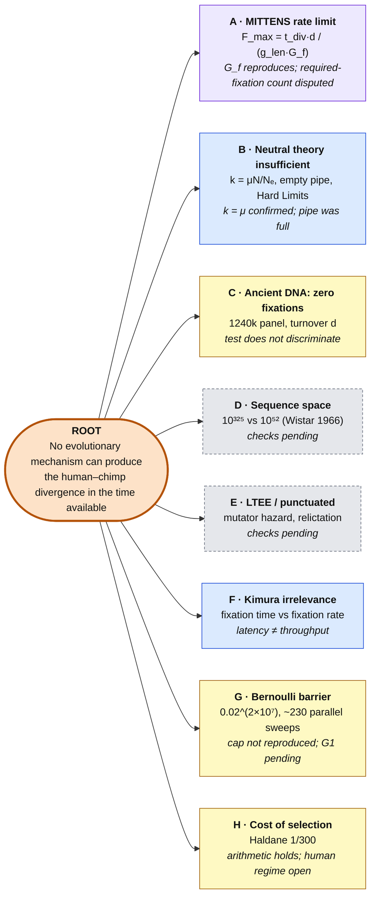
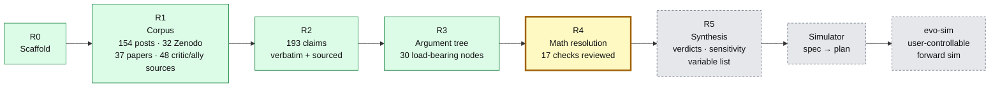

<div align="center">


# evo-sim

### Can evolution make enough mutations fix in the available time?
**An open, numerical audit of Vox Day's *Probability Zero* / MITTENS argument and of his critics, as the groundwork for a simulator you can tune yourself.**

-orange)


</div>

---

> **New here?** Read the whole story at your level: **[ELI5](docs/explain/eli5/README.md)** · **[ELI12](docs/explain/eli12/README.md)** · **[ELI18](docs/explain/eli18/README.md)**

## Why this exists
Vox Day argues, in *Probability Zero* (2025), the MITTENS papers on Zenodo and many blog posts, that population genetics *mathematically* rules out natural selection explaining the human–chimp divergence. His critics (McCarthy, Mansfield, Hancock, Camestros Felapton, Bowers and others) say his maths is wrong. Both sides mostly trade assertions.

This repo works through each claim on both sides:

1. **Extract** every mathematical or empirical claim, with a verbatim quote and its source.
2. **Arrange** the claims into one argument tree.
3. **Check** each load-bearing equation with an exact Markov chain or a forward simulation. Predictions are pre-registered before each run.
4. **Review** every check three times: a correctness review, a steelman for Day and a steelman for the critics.
5. **Record** three verdicts per claim: *internal* (does it follow?), *fidelity* (does the cited source say that?) and *external* (is it biologically realistic?).

The end product is a **user-controllable evolution simulator** whose knobs are exactly the parameters the dispute turns on.

> **Stance:** neutral. Valid points are recorded as prominently as errors, whoever makes them. Where standard theory makes a firm prediction it is stated as the null hypothesis, then tested rather than assumed.

---

## Scorecard so far

<p align="center"></p>

| ✅ Where **Day** holds up | ✅ Where the **critics** hold up |
|---|---|
| His empty-pipe formula $E[F(T)] = \mu L\int_0^T F_X$ is **exact** for its premise (B1) | Neutral substitution rate is $k=\mu$ for **any** $N_e$: fixation probability is $1/2N$, not $1/2N_e$ (B3) |
| $N_e$ really does set the fixation **timescale** (B3) | The ancestral "pipe" was **full**, not empty. Day has since withdrawn the empty start (B1c, B1d) |
| The Hard Limits exponent $-\pi^2 N_e/G$ is the correct leading-order tail (B2a) | Latency ≠ throughput: many sweeps can be in flight at once (F1) |
| LTEE $G_f \approx 1{,}300$ gens/fixation is a real **throughput** measurement and reproduces (A2) | Recombination removes the clonal-interference ceiling in the tested regime (F2) |
| Balloux–Lehmann fluctuation effect is real (B3b) | Divergence includes ancestral polymorphism: $d = 2\mu T + \theta_{anc}$ (B4a) |
| Soft selection does **not** make the cost of selection disappear (H) | The cap is $\ln R / D$, not a flat 10% (H2). The $0.743\mu$ figure is a window artefact (B3c) |
| Haldane arithmetic (300, 487) holds. Critics' "38M matches 35M SNVs" double-counts (B5c) | 205M "required fixations" counts base pairs, not mutation events. The cited $s=0.001$ is *negative* selection (A3, Zeng 2021) |

**Still open:**
- Cost of selection at real human fecundity and hard-selected load.
- Day's ancient-DNA "21 fixations" statistic, which is not reproducible from the published method.
- The ancestral $N_e$ needed to fit the divergence.
- Branches D (sequence space), E (LTEE founders) and G (the 0.02^(2×10⁷) "Bernoulli barrier").

---

## The argument map


<sub>🟧 Day's root · 🟦 resolved mostly for the critics · 🟪 mixed · 🟨 open · ⬜ not yet checked. Each branch is drawn in full, claim by claim, in [`docs/research/hierarchy/`](docs/research/hierarchy/README.md).</sub>

---

## The math, checked

Each result below links to its check script. All numbers come from reviewed runs ([`RESULTS.md`](research/checks/RESULTS.md)).

### 1 · MITTENS: Day's headline bound
```math
F_{\max} \;=\; \frac{t_{\text{div}}\cdot d}{g_{\text{len}}\cdot G_f}
\qquad
\begin{aligned}
t_{\text{div}} &= 6.3\ \text{My},\; g_{\text{len}} = 25\ \text{y} \;\Rightarrow\; 252{,}000\ \text{gens}\\
G_f &= 1{,}322\ \text{gens per fixation (LTEE throughput)}\\
\text{required} &= 2.05\times10^{8}\ \Rightarrow\ \text{shortfall} \approx 10^{6}\times
\end{aligned}
```
The parameters drift between versions (2019 → 2025 → 2026; see [`ledgers/versions.md`](docs/research/ledgers/versions.md)). The dispute is over three inputs:
- **Numerator:** how many fixations are actually required. Counting base pairs gives 205M; counting SNV events gives about 17.5M per lineage.
- **$G_f$:** whether an asexual bacterial throughput transfers to a sexual, recombining, much larger genome.
- **$d$:** the turnover coefficient.

### 2 · Neutral substitution rate: why $k = \mu$
```math
k \;=\; \underbrace{2N\mu}_{\text{new mutants / gen}} \times \underbrace{\tfrac{1}{2N}}_{P_{\text{fix}}} \;=\; \mu
\qquad\text{vs Day:}\quad k = \mu\,\frac{N}{N_e}
```
<details><summary><b>Proof sketch</b>: fixation probability is set by census N, not Nₑ</summary>

In any exchangeable (Cannings) model, the frequency $p_t$ of a neutral allele is a martingale: $E[p_{t+1}\mid p_t]=p_t$. It is bounded and absorbs at 0 or 1, so $P(\text{fix}) = E[p_\infty] = p_0 = 1/2N$ **for any offspring variance**. Offspring variance lowers $N_e$, which speeds up *time to absorption* ($\bar t_{fix} \approx 4N_e$) but leaves its *probability* unchanged. Check `b3_N_vs_Ne.py`: across $N_e$ = 200 → 19, $P_{fix}$ stays at $0.0025 = 1/M$ while $t_{fix}/N_e \approx 4$.
</details>

### 3 · The "empty pipe": Day's formula is right, but its premise is not
```math
E[F(T)] \;=\; \mu L \int_0^T F_X(u)\,du \;\xrightarrow{T\gg 4N_e}\; \mu L\,(T - 4N_e)
\qquad\text{(empty start)}
\qquad\qquad
E[F(T)] = \mu L\,T \qquad\text{(equilibrium start)}
```
<p align="center"></p>

<details><summary><b>Proof sketch</b></summary>

$\int_0^T F_X(u)\,du = T - E[\min(X,T)] \to T - E[X]$, and $E[X]\approx 4N_e$ (Kimura–Ohta). So the deficit is exactly the mean transit time: mutations that arose before $t=0$ are missing from the pipe. Starting from mutation–drift equilibrium, the pipe already carries in-flight alleles. These drain at rate $\mu L$ while new ones enter at rate $\mu L$, so the expected number of fixations in $[0,T]$ is $\mu L T$ (flux balance, or Little's law). Real ancestral populations carry standing variation, so the empty start is a counterfactual boundary case. Day has since withdrawn it (claim B1d). `b1_start_state.py`
</details>

### 4 · Changing population size: a transient, in **both** directions
```math
\frac{K}{U\,T} \;\approx\; 1 + \frac{4\,(N_{\text{old}}-N_{\text{new}})}{T}
```
<p align="center"></p>

The in-flight inventory is $\approx U\cdot 4N$. After a size change it relaxes to $U\cdot 4N_{\text{new}}$, and the difference comes out as extra fixations or missing ones.
- **Expansions** produce a deficit, which is Day's direction.
- **Contractions** produce an excess.

With sourced human and chimp $N_e$ histories (Yoo 2025, Prado-Martinez 2013), every history tested gives an **excess**: $K/UT$ = 1.9–4.0 (`b1c_ne_history.py`).

### 5 · Divergence is not fixations: ancestral polymorphism
```math
E[d] \;=\; 2\mu T \;+\; \underbrace{4N_{e,\text{anc}}\,\mu}_{\theta_{\text{anc}}}
```
<p align="center"></p>

Two sampled genomes coalesce on average $2N_{e,\text{anc}}$ generations *before* the split. That adds $2\mu\cdot 2N_{e,\text{anc}}$ to their expected divergence. The forward simulation matches this within 0.3% (`b4a_two_lineage_ils.py`).

Neither side gets a free pass from the data:
- **Yoo 2025's ancestral node** overshoots the observed 1.23% by about 25%.
- **$N_e$ = 10⁴** gives only half the observed value.
- **The fit** needs $N_{e,\text{anc}}\approx 130$k, or a different $\mu$ or $T$. It has three parameters, so the external verdict is *contested*.

### 6 · Hard Limits: a correct tail exponent, but a latency
```math
P\big(\text{fix within } G \mid \text{fix}\big) \;\approx\; \exp\!\left(-\frac{\pi^2 N_e}{G}\right)
\quad\text{(leading order; exact chain gives prefactor} \approx 50\,(G/N)^{-1.5})
```
Exact Wright–Fisher chains confirm the $-\pi^2$ exponent (`b2a_hard_limits_chain.py`). This is a per-allele *latency* tail, though. Total throughput is $U\!\int F$, which equals $UT$ at equilibrium.

### 7 · Interference: where the parallel-sweep cap lives
<p align="center"></p>

$R_{\text{int}}$ = (realised rate) / (independent-sites rate).
- **Asexual populations** collapse to 0.09 as supply rises. This is the regime the LTEE measures.
- **Free recombination** holds 0.975 with 272 sweeps in flight. Validated in fwdpy11 (`f2_multilocus.py`, `f2_fwdpy11.py`).
- **Caveat:** tested only at N = 1000, s = 0.01 and soft selection. Human-scale active loci are not tested.

### 8 · Cost of selection: Haldane's 1/300 as a special case
```math
\underbrace{\lambda \cdot D}_{\text{selective deaths / gen}} \;<\; \ln R
\qquad D \approx \ln M + 1
\qquad\text{Haldane: } \frac{\ln R}{D}\approx\frac{0.1}{30} = \frac{1}{300}
```
<p align="center"></p>

Under hard selection, a population with maximum fecundity $R$ survives only while the cost it pays per generation stays below $\ln R$. In the tested grid ($R\ge1.3$) it sustains 9–120× Haldane's rate (`h2_hard_selection_multilocus.py`). Soft selection does not remove the cost; the soft-selection runs are in fact slower. Haldane's own regime ($R\approx1.1$, diploid $D\approx 20$–$30$) and real human hard-selected load remain **untested**, so H stays open.

### 9 · Fixation time of a beneficial mutant
```math
\bar t_{\text{fix}} \;\approx\; \frac{2}{s}\left(\ln 4Ns + \gamma\right)
\qquad\text{vs Day's}\qquad \frac{2}{s}\ln 2N
```
At Day's parameters ($N = 10^4$, $s = 0.001$), the simulation and diffusion give 8,480 generations, against 19,807 from his approximation. That approximation is standard but deterministic. It overstates the conditional fixation time by 2.3× (`beneficial_fix_time.py`).

---

## Roadmap



**R4 remaining**
- [ ] **E:** hypermutator hazard per founder; exact chains for relictation (Cannings)
- [ ] **G1:** what $0.02^{2\times10^7}$ prices: a *specific* outcome or *any* outcome
- [ ] **D:** sequence-space simulations (Wistar, Ulam, Weasel)
- [ ] **C1b:** the aDNA 21-count with realistic per-site call depth and ancestry structure
- [ ] **H:** realistic human $R$ and hard-selected load, with confidence intervals on T50
- [ ] **Sources:** Yoo 2025's $\mu$, to rescale $N_{e,\text{anc}}$. Verify Takahata 1995, Charlesworth 2009 and the Haak 2015 panel design

**R5:** final verdicts, a sensitivity table, the simulator variable list and a published summary. The [ELI5 / ELI12 / ELI18 explainers](docs/explain/README.md) exist as drafts and get a final pass after R5.

**Simulator knobs (draft):**
- Population: $N$, $N_e$, offspring variance, sexual vs asexual, demography over time, start state
- Mutation: $\mu$, genome length $L$, mutators
- Selection: distribution of $s$ (including negative), dominance, hard vs soft selection
- Recombination: map length
- Generations: generation time, overlapping generations
- Counting: the divergence-counting rule

---

## Repo layout
| Path | What |
|---|---|
| [`docs/research/`](docs/research/README.md) | The audit: rules, glossary, `parameters.yaml`, claim files, argument tree and ledgers (fidelity, balance, contradictions, versions) |
| [`docs/research/claims/`](docs/research/claims) | One file per claim, with a verbatim quote, formal statement, pre-registered prediction and three verdicts |
| [`research/checks/`](research/checks) | Reviewed verification scripts, with [`RESULTS.md`](research/checks/RESULTS.md) and [`REVIEW.md`](research/checks/REVIEW.md) |
| `research/checks/results/` | Write-ups, reviews and raw outputs |
| [`research/tools/`](research/tools/README.md) | Harvest and claim-generation tooling, plus `readme_figs.py`, which draws the figures above, and `icon.py` / `icon_raster.py`, which draw the icon, favicon and social preview |

## Reproduce
```bash
python3 -m venv research/.venv
research/.venv/bin/pip install -r research/requirements.txt matplotlib
research/.venv/bin/python -I research/checks/baseline_textbook.py     # textbook baselines, must pass first
research/.venv/bin/python -I research/checks/b4a_two_lineage_ils.py   # any check; seeds are fixed
research/.venv/bin/python -I research/checks/lint_research.py         # claims ↔ tree ↔ provenance lint
research/.venv/bin/python -I research/tools/readme_figs.py            # regenerate docs/img/*.svg
research/.venv/bin/python -I research/tools/icon.py && research/.venv/bin/python -I research/tools/icon_raster.py  # icon, PNG sizes, favicon.ico, social-preview.png
```

## Ground rules
- **Verbatim quotes only.** Each has a locator and a date. A claim known only through an opponent is tagged `secondhand`.
- **Pre-registered predictions.** Every number traces to `parameters.yaml`, a quote, or a stated derivation.
- **No question-begging.** Forward simulations decide; the coalescent is used only for baselines. Scaling is validated before it is used.
- **No full texts in git** (copyright). Only links, short quotes and sha256 hashes.
- **Corrections welcome from either side.** If a quote is wrong, a check is unfair to its author, or a number is misattributed, open an issue with the locator.
