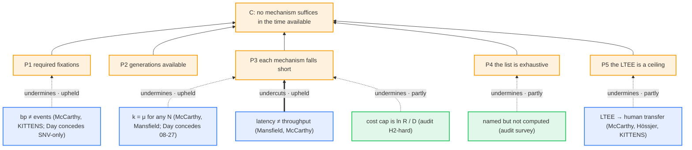
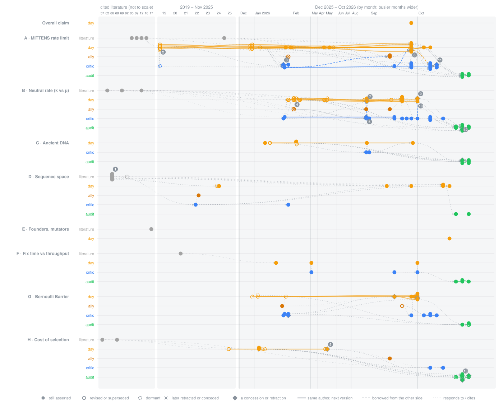

<div align="center">


# The argument map
### Who argued what, when, what it rests on, and what attacks it

[Project README](../../README.md) · [Explainers](../explain/README.md) · [Handoff](../HANDOFF.md) · [Objection graph](defeaters.md) · [Standard forms](../research/argmap/standard-forms.md) · [Gaps](../research/ledgers/gaps.md)

</div>

---

This page traces the debate over Vox Day's *Probability Zero* and MITTENS the way a philosophy seminar would. It does three things:
1. **Reconstructs** each load-bearing argument as numbered premises and a conclusion.
2. **Classifies** every objection by what it attacks: a premise, the inference, or the conclusion.
3. **Dates** every version of every argument, so you can watch the arguments change over time, borrow from each other, and sometimes get withdrawn.

Both sides are drawn with the same rules. A revision is recorded as the next version of an argument, not as a win or a loss, and the audit's own withdrawn claims are on the map too.

> **Status: draft (R4).** The data are in [`docs/research/argmap/`](../research/argmap/). Every quote is checked verbatim against its source by [`argmap_check.py`](../../research/tools/argmap_check.py), and the figures are generated by [`argmap_render.py`](../../research/tools/argmap_render.py). Statuses come from the claim files' current verdicts and may change at R5.

## 1. The main argument in standard form
Day's central claim (ROOT), reconstructed in the strongest form he would accept. Each premise links to the claim file holding the verbatim quote.

| | Premise | Main objections (type · audit status) |
|---|---|---|
| **P1** | The divergence requires about 20M (2025), 205M (2026) or 17.5M (SNV-only, a variant Day accepts) lineage-specific fixations. [A3](../research/claims/A3-required-fixations-2019-2025.md), [A3a](../research/claims/A3a-205m-headline.md), [A3b](../research/claims/A3b-snv-only-concession.md) | 205M counts bases inside structural variants as events (undermines · upheld; Day calls it "a legitimate methodological concern"). |
| **P2** | About 252,000 generations are available (6.3 My at 25 y). [A1](../research/claims/A1-generations-available.md) | Day's own other dates, from 68 kya to 9 My (Day vs Day · untested). |
| **P3** | Each named mechanism delivers far fewer fixations than required: selection at the LTEE rate (A), cost of selection (H), neutral drift (B, F), parallel fixation (G), mutators (E), sequence-space search (D). | Latency is not throughput (undercuts F · upheld). k = μ for any N (undermines B · upheld; Day conceded 2026-08-27). The LTEE-to-human transfer (undermines A2e · partly). Cost cap is ln R / D, not a fixed 10% (undermines H · partly; Haldane's own regime untested). |
| **P4** | *[implicit]* The named mechanisms exhaust the candidates, or the proponent of another one must compute it. [ROOT-M](../research/claims/ROOT-excluded-mechanisms.md) | Five named mechanisms are asserted, not computed (undermines ROOT-M · partly). |
| **P5** | *[implicit]* Mechanisms can't jointly beat the LTEE, which already runs them together. [A2e](../research/claims/A2e-ltee-as-ceiling.md), [G1](../research/claims/G1-average-rate-includes-parallelism.md) | No recombination is a handicap, not an advantage (undermines A2e · upheld). |
| **C** | No evolutionary mechanism, alone or combined, produces the observed divergence in the available time. | |

The inference is **deductive elimination**: if every candidate falls short, the conclusion follows. So the argument is only as strong as its weakest exclusion, and it can also fail at P1 (the size of the target) or P5 (the ceiling).


Dotted arrows undermine a premise; thick arrows undercut an inference. Every objection to every claim is in the [objection graph](defeaters.md).

## 2. How the arguments changed over time
<p align="center"></p>

Each row is one side's work on one topic. A filled dot is a version still asserted, an open dot a version later revised, and a diamond a concession or retraction. A solid line joins an author's successive versions, a dashed line marks a point borrowed from the other side, and dotted lines mark replies and citations. Links between topics (46 of them) are in the data but left out of the picture.

**Numbered moments**
1. **1966-04 (Wistar symposium).** Mayr asks Ulam: "Couldn't they all go on simultaneously?" This is the earliest version of the parallel-fixation objection in the corpus.
2. **2019-02-07.** MITTENS v1: 30M fixations required, 1,600 generations per fixation.
3. **2026-01-25.** Camestros Felapton concedes "the arithmetic itself isn't wrong" in the first edition.
4. **2026-02-04.** Day, replying to McCarthy, gives k = 2Nμ × 1/(2Nₑ) = μN/Nₑ.
5. **2026-05-07.** Day retracts "Term 3" as a bound on total substitutions: it limits adaptive ones only.
6. **2026-08-26.** keruru, until then writing in support of Day's thesis, retracts his substitution-rate and ancient-DNA claims.
7. **2026-08-27.** The next day, Day concedes that Kimura's identity never needed Nₑ.
8. **2026-09-28.** MITTENS 3.0 calls counting structural-variant bases "a legitimate methodological concern" and gives an SNV-only shortfall of 91,600×.
9. **2026-10-01.** Day, answering Mansfield: "The pipeline was full, but it was much shorter."
10. **2026-10-01.** The same post gives k = 32.3μ, without a derivation.
11. **2026-10-04.** KITTENS concedes that its linear scaling was an illustration, not a proof.
12. **2026-10-08.** The audit finds that Hancock's 38M and Nesslig20's 37.8M double-count on an SNV basis.
13. **2026-10-08.** The audit withdraws its own first-draft claim that "literal 1/300" was falsified.

**Patterns in the data** (record ids in [`lineage.yaml`](../research/argmap/lineage.yaml))
- **Fixation probability goes back and forth.** On Day's side, 1/(2Nₑ) (January) gives way to "an assumption imported from Wright–Fisher" (08-23), then a concession (08-27). A post on 09-21 calls P(fix) = x₀ wrong for real populations, and on 10-06 it "holds exactly regardless of offspring distribution". keruru adopted 1/(2Nₑ) the same week Day did and retracted it the day before Day's concession.
- **One post contains both the start-state claim and its revision.** The 2026-10-01 post says the ancestral pipeline is "functionally nonexistent" (¶22), then "full, but much shorter" (¶31). Camestros had raised ancestral variation first, on 2026-01-25.
- **Both sides make unit errors.** Day counts base pairs as fixation events (410M → 205M → the SNV-only concession). Two critics' "matches" to the ~35M SNVs double-count ancestral variation.
- **The parallel-vs-serial dispute dates to 1966.** Day's own texts now carry three descriptions: parallel (MITTENS 3.0), all sequential in Ara+2, and "must be sequential" (Appendix A).
- **The split date doesn't move in one direction.** It goes 9 My → 6–7 My → 200–580 kya → 68 kya → 250 kya–1.3 Mya, then back to 6.3 My in MITTENS 3.0, with no text reconciling the values.

## 3. Objections, by type
Following Pollock's classification:
- **undermining:** attacks a premise. Example: "205M counts bases, not events".
- **undercutting:** grants the premises and attacks the step to the conclusion. Example: "the time for one fixation is not the time between fixations".
- **rebutting:** argues for the opposite conclusion. Example: "a neutral model accounts for the differences".

| Attacker | Undermining | Undercutting | Rebutting | Upheld | Partly | Not upheld | Untested |
|---|---|---|---|---|---|---|---|
| Day (65) | 30 | 19 | 16 | 7 | 34 | 14 | 10 |
| Critics (94) | 46 | 23 | 25 | 29 | 46 | 0 | 19 |
| Allies (3) | 0 | 1 | 2 | 1 | 1 | 0 | 1 |
| Literature (31; includes the audit-raised nodes B1c, B4a and C1, which the lint files under `literature`) | 19 | 9 | 3 | 6 | 21 | 1 | 3 |
| This audit (142 at X1 / GAP-07c; 152 after 2026-10-09 C1e, G2c, F1b, B5b, rows not recounted) | 62 | 72 | 8 | 75 | 67 | 0 | 0 |

**What the counts do and don't mean**
- More attacks land on Day than on the critics. His is the positive argument with most of the load-bearing numbers: 115 of 217 claims.
- 11 of Day's 65 are Day against Day: self-revisions and statements that don't agree with each other. (Before the 2026-10-08 edge fixes this read 19 of 67. Eight of those were mis-typed or mis-aimed edges.)
- Most of Day's 14 not-upheld objections rest on premises he later withdrew himself, such as N/Nₑ and the empty pipeline.
- The critics' count rose from 74 to 94 when the mapping round (2026-10-09) attached the remaining critic and ally arguments, mostly from Hancock's video; 19 of their attacks are still `untested`.
- The audit's 142 attacks fall on Day (63), the critics (28), its own earlier checks (46: reviews, plus GAP-07b retiring GAP-07's upper bound, C1c refuting C1b's call-depth explanation, C1d undercutting C1c's error-term reading, and GAP-07c replacing GAP-07b's raw ratio for fixed events), allies (4) and literature (1). (Counts as of the X1 / GAP-07c / mapping integration, 2026-10-09. The four combined-review checks C1e, G2c, F1b, B5b then added 10 audit rows, d343-d352, to 152 in all: 6 on Day or critic nodes and 4 review rows on the audit's own checks; the per-target breakdown was not recounted.)
- **One verdict rule for both sides.** Since 2026-10-09 the internal and fidelity verdicts that feed `audit_status` follow [one rule](../../research/checks/results/R4-X1-verdict-rule.md), applied to Day, critics and allies alike and checked by a blind audit. Under it Day's error rate is higher in every denominator, but the gap is not robust (13/81 vs 1/20 on the primary denominator, p = 0.29; see the [HANDOFF](../HANDOFF.md)).

The [objection graph](defeaters.md) draws every attack, branch by branch, and computes which arguments survive their objections (grounded semantics, Dung 1995), read three ways. Read its caveats: the computation is all-or-nothing, and it doesn't model support between claims.

## 4. What everyone missed
[`gaps.md`](../research/ledgers/gaps.md) lists considerations that bear on a load-bearing claim and that no party, including this audit, had addressed. "Nobody" is backed by stated search terms and hit counts that anyone can re-run. Each entry was fact-checked ([`gaps-review.md`](../research/ledgers/gaps-review.md)), and the hunt looked as hard for gaps that would help Day as for gaps that would help the critics.

| Gap | What nobody did | Likely helps |
|---|---|---|
| **GAP-01** | Put the **adaptive fraction** (how many differences needed selection at all) into the argument. The CSAC 2005 paper both sides cite contains a test pointing to little positive selection. | **Both.** It cuts Day's 17.5M required selected fixations by 20× to ~6,000×. But the adaptive count still exceeds Haldane's rate by 1.5–7× (coding only), or by far more if even 0.1% of non-coding differences were adaptive. That share is unmeasured. |
| **GAP-04** | Cite the published **finite-map limit** on adaptive substitution (Weissman & Barton 2012). | **Both.** If every difference were adaptive, the requirement is about 4× over the cap (Day). At realistic adaptive rates interference is negligible (critics). |
| **GAP-02** | Answer Day's "**sweep signatures are absent**" point, or check how far back sweep scans can see. | **Both.** |
| **GAP-03** | Engage Birky & Walsh 1988: **linkage doesn't change the neutral rate**, though it slows beneficial substitution. | Critics, mainly. |
| **GAP-05** | Put numbers on **slightly harmful fixations** in hominids. | Day-leaning on the premise. |
| **GAP-06** | Fit **mutation rate and generation time** consistently, with linked selection, in the divergence fit (this audit's own gap). | Critics, weakly. |
| **GAP-07** | Count **indel and structural-variant events** from measured mutation rates. | Critics, modestly: it confirms "bases ≠ events" independently. A direct alignment count (GAP-07b) gives 21M events per lineage, 205M ≈ 9.7× (bracket ~7–14×), and credits Day's SNV-only 17.5M as close to the event count. |

Tally by main beneficiary: two-sided 3, critics 3, Day 1.

The older literature on this family of arguments is in [`prior-art.md`](../research/sources/prior-art.md), with the access status of each item. Examples include published resolutions of Haldane's dilemma from the 1970s, the specific-vs-any waiting-time results of Durrett & Schmidt, and Nunney's cost-of-selection simulations. Neither Day nor his critics cite most of it.

## How to check this page
```sh
research/.venv/bin/python -I research/tools/argmap_check.py    # quotes verbatim, ids, dates, edge coverage
research/.venv/bin/python -I research/tools/argmap_render.py   # regenerates the figure and defeaters.md
```
Corrections from either side are welcome as issues with a locator.
