<!-- GENERATED by research/tools/argmap_render.py from docs/research/argmap/defeaters.yaml; do not edit by hand. -->
# Objection graph (generated)

Arrows run from an objection to what it attacks. Line style gives the type:
- **dotted**: undermines (attacks a premise);
- **thick**: undercuts (grants the premises, attacks the step from premises to conclusion);
- **solid**: rebuts (argues for the opposite conclusion).

Colours: orange = Day, amber = ally, blue = critic, green = this audit's checks, grey = literature.

## A · MITTENS rate limit (part 1)

Objections to A1, A2, A2e, A3, A4, A6, A2a, A2d, A5.

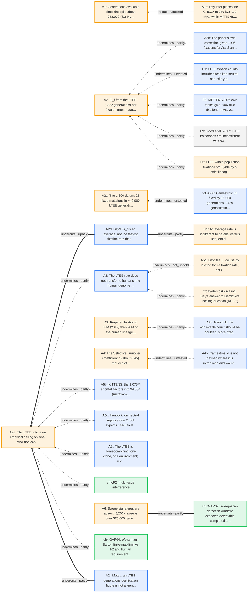

## A · MITTENS rate limit (part 2)

Objections to A3a, A3x, A5a, A5b, A5c, A5d, A5e, A5f, A.

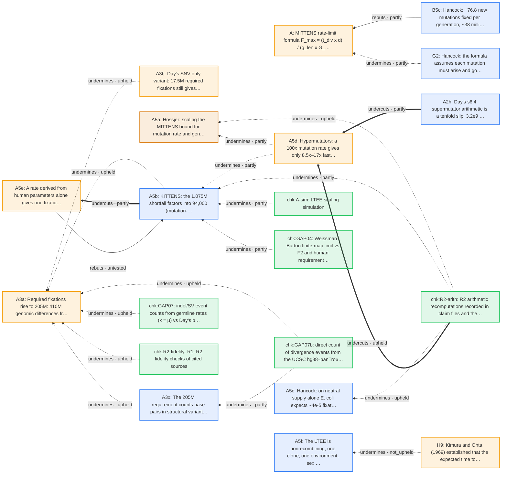

## B · Neutral rate (k vs μ) (part 1)

Objections to B1, B2, B4, B5, B9, B1a, B6.

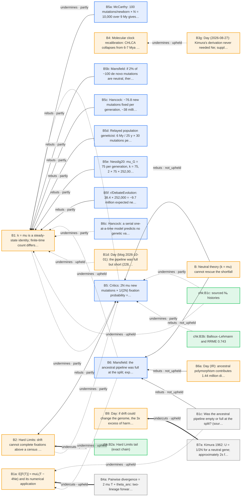

## B · Neutral rate (k vs μ) (part 2)

Objections to B2b, B2c, B2d, B3a, B3c, B3d, B3e, B3f, B3h.

```mermaid
flowchart RL
  classDef day fill:#f59e0b22,stroke:#f59e0b,stroke-width:2px
  classDef ally fill:#d9770622,stroke:#d97706,stroke-width:2px
  classDef critic fill:#3b82f622,stroke:#3b82f6,stroke-width:2px
  classDef literature fill:#a3a3a322,stroke:#a3a3a3,stroke-width:2px
  classDef audit fill:#22c55e22,stroke:#22c55e,stroke-width:2px
  B2b["B2b: Census ceiling X = (Vk + 2) G / 16 from 4Ne < G"]:::day
  B2c["B2c: 'One in ten to the seventy-eight-millionth': exp(-pi^2 Ne/G)…"]:::day
  B2d["B2d: Second objection: fixations run in parallel; steady-state fl…"]:::day
  B2e["B2e: keruru (Zenodo draft): a temporal N_e measured from ancient …"]:::critic
  B3a["B3a: k = 2N mu × 1/(2Ne) = mu N/Ne: supply uses census N, fixatio…"]:::day
  B3c["B3c: Real Rate of Molecular Evolution: k = mu × (sum N_i^2 / sum …"]:::day
  B3d["B3d: k = 32.3 mu (Bergeron pedigree rate vs Yoo required rate) an…"]:::day
  B3e["B3e: Day (2026-02-04): 'corrected' McCarthy calculation gives 8.2…"]:::day
  B3f["B3f: k = 800,000 mu from N = 8e9 and Ne = 1e4 (Day-Grok exchange,…"]:::day
  B3g["B3g: Day (2026-08-27): Kimura's derivation never needed Ne; suppl…"]:::day
  B3h["B3h: Ne ≈ 10,000 is derived from theta = 4 Ne mu, which 'presuppo…"]:::day
  B3i["B3i: Matev: if every allele at a site had fixation probability 1/…"]:::critic
  B5["B5: Critics: 2N mu new mutations × 1/(2N) fixation probability =…"]:::critic
  B5a["B5a: McCarthy: 100 mutations/newborn × N = 10,000 over 9 My gives…"]:::critic
  B5b["B5b: Mansfield: if 2% of ~100 de novo mutations are neutral, ther…"]:::critic
  B5c["B5c: Hancock: ~76.8 new mutations fixed per generation, ~38 milli…"]:::critic
  B5d["B5d: Relayed population geneticist: 6 My / 25 y × 30 mutations pe…"]:::critic
  B5e["B5e: Nesslig20: mu_G = 75 per generation, k = 75, 2 × 75 × 252,00…"]:::critic
  B5f["B5f: r/DebateEvolution: 38.4 × 252,000 = ~9.7 million expected ne…"]:::critic
  B5g["B5g: Camestros Felapton commenter Paul King: neutral mutations re…"]:::critic
  B5h["B5h: Hossjer (ally): neutral fixation rate is d × mu per site; 3e…"]:::ally
  B7["B7: Neutral fixation probability is 1/(2N), the starting frequen…"]:::critic
  B7a["B7a: Kimura 1962: U = 1/2N for a neutral gene; approximately 2s f…"]:::literature
  B7c["B7c: keruru (former ally): supply is 2N mu with census N; fixatio…"]:::critic
  C5b["C5b: A temporal-method Ne from ancient genomes (8,139 over 102 ge…"]:::critic
  F1["F1: Mansfield: time to fix one allele is not important; the time…"]:::critic
  F1b["F1b: McCarthy: mutations do not increase in frequency one at a ti…"]:::critic
  H7["H7: Keightley 2012: a genome-wide deleterious mutation rate of U…"]:::literature
  chk_B2a["chk:B2a: Hard Limits tail (exact chain)"]:::audit
  chk_B3["chk:B3: N vs Nₑ in fixation probability"]:::audit
  chk_B3b["chk:B3b: Balloux–Lehmann and RRME 0.743"]:::audit
  chk_R2_arith["chk:R2-arith: R2 arithmetic recomputations recorded in claim files and the…"]:::audit
  chk_R2_arith -->|"rebuts · partly"| B2b
  B2e -.->|"undermines · untested"| B2b
  chk_B2a ==>|"undercuts · partly"| B2c
  F1 -.->|"undermines · partly"| B2d
  F1b -.->|"undermines · partly"| B2d
  B5 -->|"rebuts · upheld"| B3a
  B5a -.->|"undermines · partly"| B3a
  B5b -->|"rebuts · upheld"| B3a
  B5c -->|"rebuts · upheld"| B3a
  B5d -->|"rebuts · upheld"| B3a
  B5e -->|"rebuts · upheld"| B3a
  B5f -->|"rebuts · upheld"| B3a
  B5g -->|"rebuts · upheld"| B3a
  B5h -->|"rebuts · upheld"| B3a
  B7 -.->|"undermines · upheld"| B3a
  B7a -.->|"undermines · upheld"| B3a
  B7c -.->|"undermines · upheld"| B3a
  chk_B3 -.->|"undermines · upheld"| B3a
  B3i -.->|"undermines · upheld"| B3a
  chk_B3b -.->|"undermines · upheld"| B3c
  B5c -.->|"undermines · partly"| B3d
  chk_B3b ==>|"undercuts · partly"| B3d
  B3g -.->|"undermines · upheld"| B3e
  B3g -.->|"undermines · upheld"| B3f
  H7 -.->|"undermines · untested"| B3h
  C5b -.->|"undermines · partly"| B3h
```

## B · Neutral rate (k vs μ) (part 3)

Objections to B7, B4g, B5a, B5b, B5c, B5d, B5e, B5f, B6a, B6c, B7c.

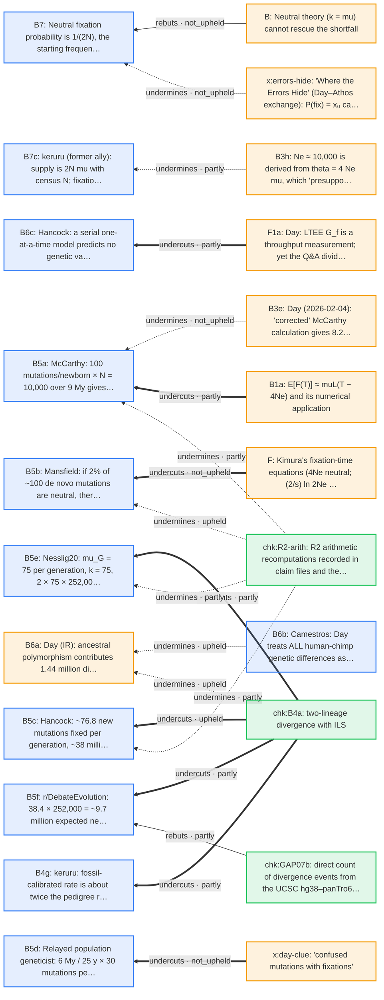

## C · Ancient DNA

Objections to C1, C2, C4, C5, C6, C7, C1a, C2c, C2d, C5a, C.

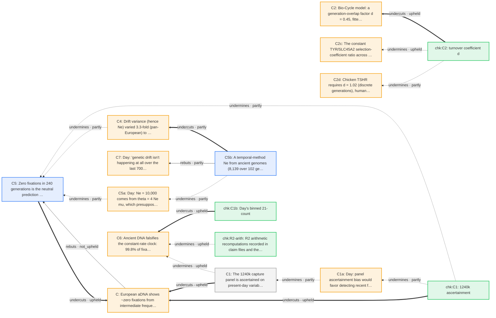

## D · Sequence space (part 1)

Objections to D1, D10, D2g, D3, D4, D5, D6, D9, D1a, D1b, D2a, D2b.

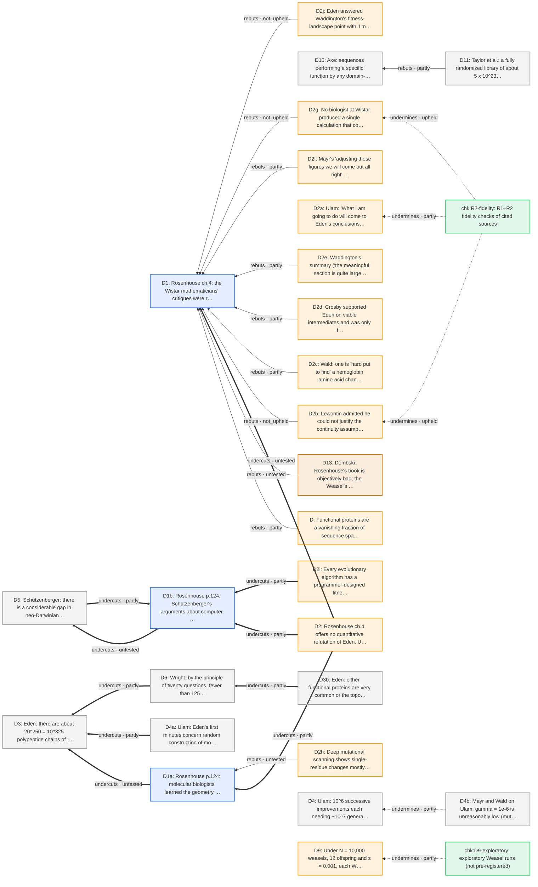

## D · Sequence space (part 2)

Objections to D2f, D2h, D2j, D3c, D4a, D9a, D.

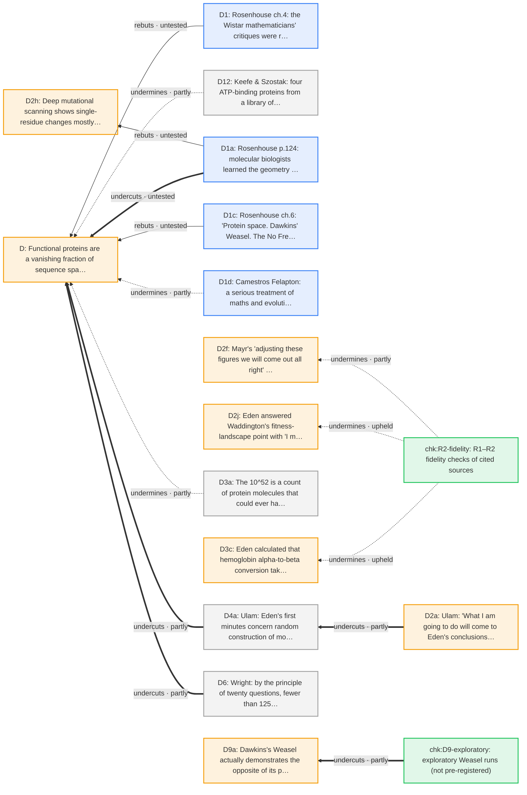

## E · Founders, mutators

Objections to E5, E3, E7, E.

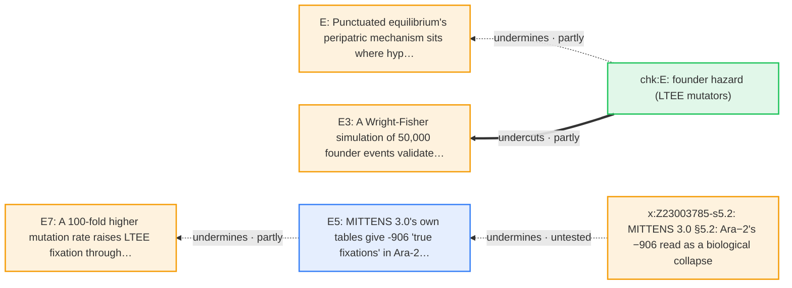

## F · Fix time vs throughput

Objections to F, F1, F2, F3, F4, F1a, F3a.

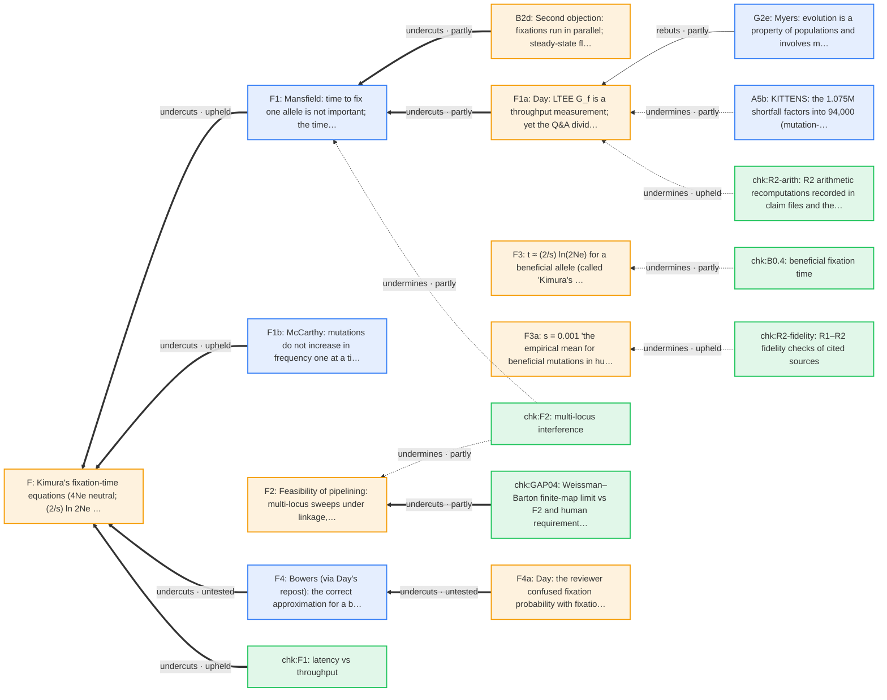

## G · Bernoulli Barrier (part 1)

Objections to G1, G2, G2g, G3, G4, Ga, Gc, G1a, G2a, G3b.

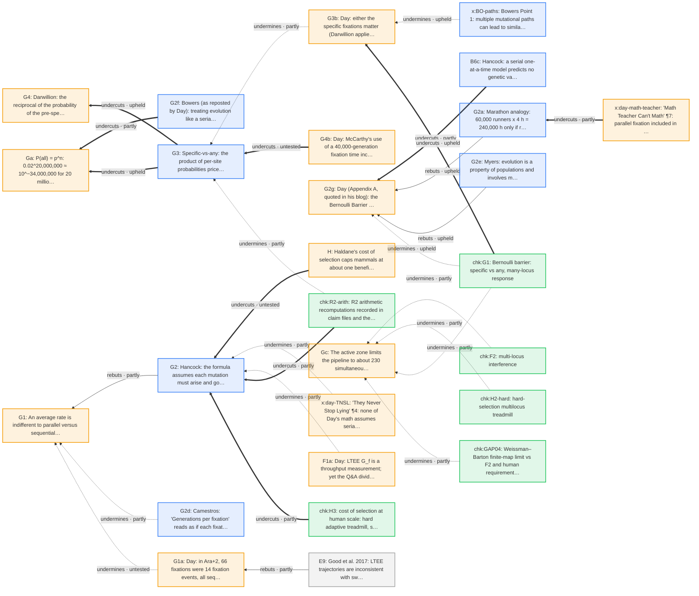

## G · Bernoulli Barrier (part 2)

Objections to G4b, G.

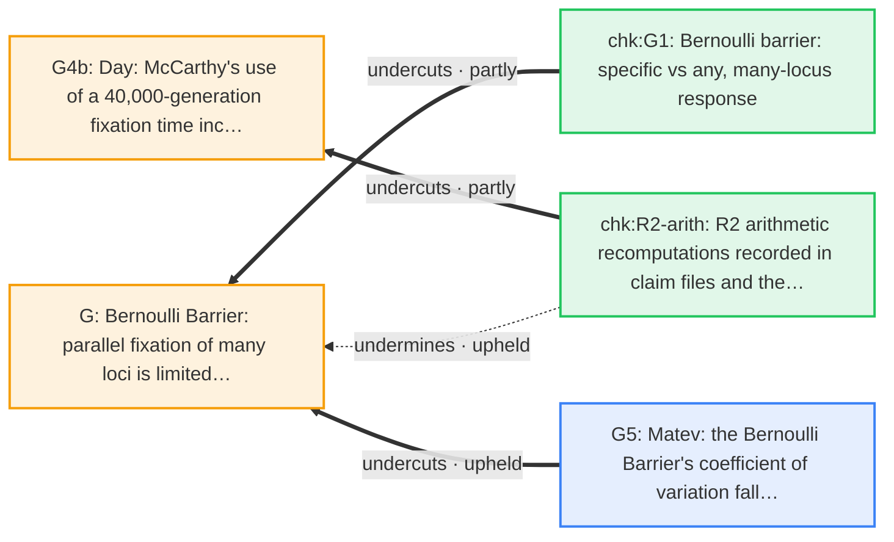

## H · Cost of selection

Objections to H2, H5, H8, H9, H.

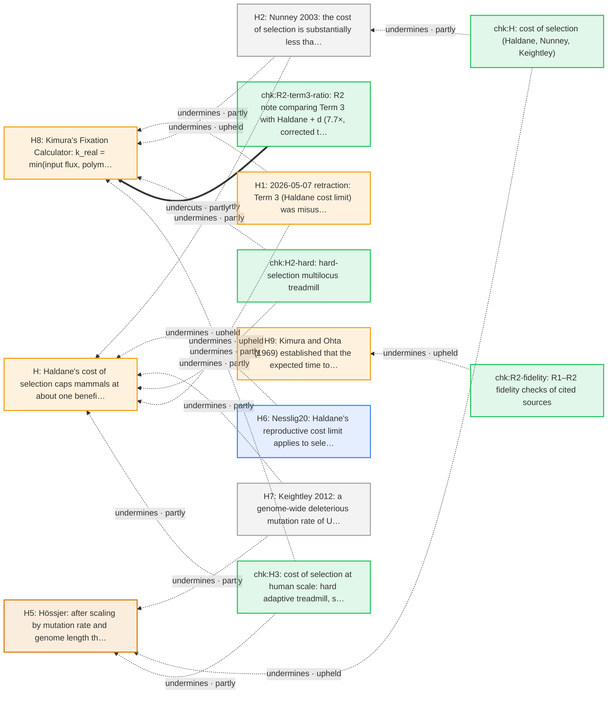

## Overall claim

Objections to ROOT, ROOT-M.

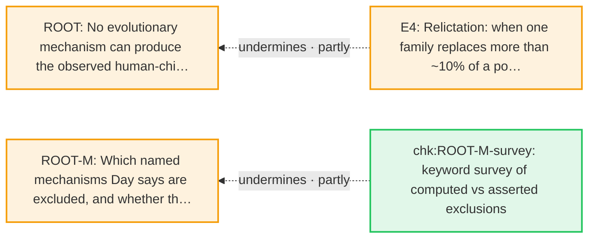

## Other: objections to audit checks and unregistered items (part 1)

Objections to chk:A-sim, chk:B0, chk:B0.4, chk:B1, chk:B1c, chk:B3, chk:B4a, chk:C1, chk:C1b, chk:C2, chk:F1, chk:F2, chk:GAP02, chk:GAP04, chk:GAP07, chk:GAP07b, chk:H, chk:H2-hard.

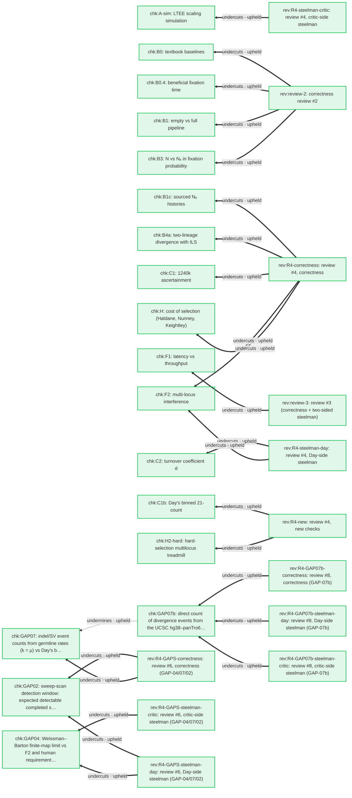

## Other: objections to audit checks and unregistered items (part 2)

Objections to chk:H3, chk:R2-term3-ratio, x:darwinzdf42-hitchhiking, x:dawkins-weasel, x:eugine-sqrtN.

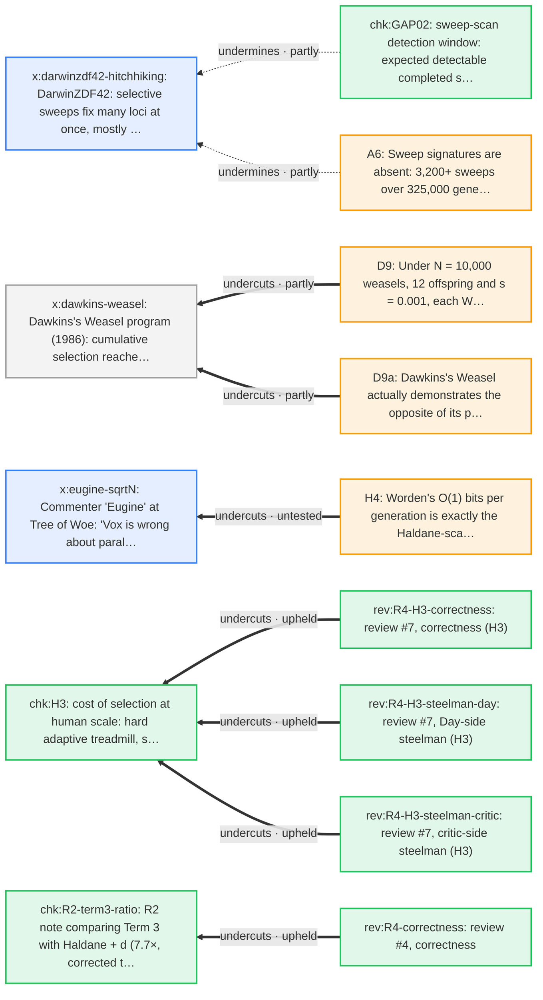

## Which arguments survive their objections

This uses grounded semantics (Dung 1995): an argument is *accepted* when every attacker is rejected, *rejected* when an accepted argument attacks it, and *undecided* otherwise (for example, mutual attacks that nothing settles). Three readings:
- **As argued** counts every recorded attack.
- **Audited, strict** counts only the attacks this audit's checks upheld in full.
- **Audited, lenient** also counts attacks upheld in part.

**Read with care.** Grounded semantics is all-or-nothing: one surviving objection to one premise rejects the whole argument, even when the objection only trims a number. These columns summarise the recorded objections. They are not a separate verdict; the claim files' three verdicts remain the reference. Claims without recorded objections are not listed.

| Side | as argued: accepted / rejected / undecided | audited, strict: accepted / rejected / undecided | audited, lenient: accepted / rejected / undecided |
|---|---|---|---|
| literature (19) | 14 / 5 / 0 | 19 / 0 / 0 | 14 / 5 / 0 |
| day (89) | 34 / 54 / 1 | 60 / 29 / 0 | 36 / 53 / 0 |
| ally (4) | 2 / 2 / 0 | 3 / 1 / 0 | 2 / 2 / 0 |
| critic (51) | 29 / 21 / 1 | 49 / 2 / 0 | 36 / 15 / 0 |
| audit (43) | 23 / 20 / 0 | 23 / 20 / 0 | 23 / 20 / 0 |

**Support is not modelled by Dung's framework.** A claim can be *accepted* (no surviving direct objection) while claims it rests on are rejected. The last column lists those rejected supports (lenient reading), so read both together. ROOT, for instance, draws few direct objections; most objections target its supports.

Load-bearing claims are in **bold**.

| Claim | Side | As argued | Audited, strict | Audited, lenient | Rejected supports (lenient) |
|---|---|---|---|---|---|
| **A** | day | accepted | accepted | accepted | A2, A2e, A3, A5a, G1, G2g |
| A1 | day | rejected | accepted | accepted | – |
| A1c | day | accepted | accepted | accepted | B4 |
| A2 | day | rejected | accepted | rejected | E7 |
| A2a | day | rejected | accepted | accepted | A2 |
| A2c | critic | accepted | accepted | accepted | – |
| A2d | critic | accepted | accepted | accepted | – |
| **A2e** | day | rejected | rejected | rejected | A2 |
| A2h | critic | accepted | accepted | accepted | – |
| A2i | critic | accepted | accepted | accepted | – |
| A3 | day | rejected | accepted | rejected | – |
| A3a | day | rejected | rejected | rejected | – |
| A3b | day | accepted | accepted | accepted | – |
| A3d | critic | accepted | accepted | accepted | – |
| A3x | critic | accepted | accepted | accepted | – |
| A4 | day | rejected | accepted | accepted | – |
| A4b | critic | accepted | accepted | accepted | – |
| A5 | critic | rejected | accepted | rejected | – |
| A5a | ally | rejected | rejected | rejected | – |
| A5b | critic | rejected | accepted | rejected | – |
| A5c | critic | rejected | rejected | rejected | – |
| A5d | day | rejected | rejected | rejected | – |
| A5e | day | accepted | accepted | accepted | – |
| A5f | critic | accepted | accepted | accepted | – |
| A5g | day | accepted | accepted | accepted | – |
| A6 | day | accepted | accepted | accepted | – |
| **B** | day | accepted | accepted | accepted | B1, B2, B4, B9, F |
| **B1** | day | rejected | rejected | rejected | B1a |
| B1a | day | rejected | rejected | rejected | – |
| **B1c** | literature | accepted | accepted | accepted | B1 |
| B1d | day | accepted | accepted | accepted | – |
| **B2** | day | rejected | accepted | rejected | B2b, B2c, B2d, C7 |
| **B2b** | day | rejected | accepted | rejected | – |
| B2c | day | rejected | accepted | rejected | – |
| B2d | day | rejected | accepted | rejected | – |
| B2e | critic | accepted | accepted | accepted | – |
| **B3a** | day | rejected | rejected | rejected | B3f |
| B3c | day | rejected | rejected | rejected | – |
| B3d | day | rejected | accepted | rejected | – |
| B3e | day | rejected | rejected | rejected | B3a |
| B3f | day | rejected | rejected | rejected | – |
| **B3g** | day | accepted | accepted | accepted | – |
| B3h | day | rejected | accepted | rejected | – |
| B3i | critic | accepted | accepted | accepted | – |
| B4 | day | rejected | rejected | rejected | B3a, C6 |
| **B4a** | literature | accepted | accepted | accepted | – |
| B4g | critic | accepted | accepted | accepted | – |
| **B5** | critic | rejected | accepted | rejected | – |
| B5a | critic | rejected | accepted | rejected | – |
| B5b | critic | rejected | rejected | rejected | – |
| B5c | critic | rejected | accepted | rejected | – |
| B5d | critic | rejected | accepted | accepted | – |
| B5e | critic | rejected | accepted | rejected | – |
| B5f | critic | accepted | accepted | accepted | – |
| B5g | critic | accepted | accepted | accepted | – |
| B5h | ally | accepted | accepted | accepted | – |
| **B6** | critic | rejected | accepted | accepted | – |
| B6a | day | rejected | rejected | rejected | – |
| B6b | critic | accepted | accepted | accepted | – |
| B6c | critic | accepted | accepted | accepted | – |
| **B7** | critic | rejected | accepted | accepted | – |
| B7a | literature | accepted | accepted | accepted | – |
| B7c | critic | accepted | accepted | accepted | – |
| B9 | day | rejected | rejected | rejected | – |
| C | day | undecided | rejected | rejected | C4, C6 |
| C1 | literature | rejected | accepted | rejected | – |
| C1a | day | accepted | accepted | accepted | – |
| **C2** | day | accepted | accepted | accepted | – |
| C2c | day | accepted | accepted | accepted | – |
| C2d | day | accepted | accepted | accepted | – |
| C4 | day | rejected | accepted | rejected | – |
| C5 | critic | undecided | accepted | accepted | – |
| C5a | day | rejected | accepted | rejected | C4 |
| C5b | critic | accepted | accepted | accepted | – |
| C6 | day | rejected | rejected | rejected | – |
| C7 | day | rejected | accepted | rejected | C |
| D | day | rejected | accepted | rejected | D10, D2g, D3, D4, D9, D9a |
| D1 | critic | rejected | accepted | rejected | – |
| D10 | literature | rejected | accepted | rejected | – |
| D11 | literature | accepted | accepted | accepted | – |
| D12 | literature | accepted | accepted | accepted | – |
| D13 | ally | accepted | accepted | accepted | – |
| D1a | critic | rejected | accepted | rejected | – |
| D1b | critic | rejected | accepted | rejected | – |
| D1c | critic | accepted | accepted | accepted | – |
| D1d | critic | accepted | accepted | accepted | – |
| D2 | day | accepted | accepted | accepted | – |
| D2a | day | rejected | accepted | rejected | D4 |
| D2b | day | rejected | rejected | rejected | – |
| D2c | day | accepted | accepted | accepted | – |
| D2d | day | accepted | accepted | accepted | – |
| D2e | day | accepted | accepted | accepted | D2j |
| D2f | day | rejected | accepted | rejected | – |
| D2g | day | rejected | rejected | rejected | D3c |
| D2h | day | accepted | accepted | accepted | – |
| D2i | day | accepted | accepted | accepted | – |
| D2j | day | rejected | rejected | rejected | – |
| D3 | literature | rejected | accepted | rejected | – |
| D3a | literature | accepted | accepted | accepted | D3 |
| D3b | literature | accepted | accepted | accepted | D |
| D3c | day | rejected | rejected | rejected | – |
| D4 | literature | rejected | accepted | rejected | – |
| D4a | literature | accepted | accepted | accepted | – |
| D4b | literature | accepted | accepted | accepted | – |
| D5 | literature | accepted | accepted | accepted | – |
| D6 | literature | rejected | accepted | rejected | – |
| D9 | day | rejected | accepted | rejected | – |
| D9a | day | rejected | accepted | rejected | D9 |
| E | day | rejected | accepted | rejected | E3, E7 |
| E1 | critic | accepted | accepted | accepted | – |
| E3 | day | rejected | accepted | rejected | – |
| E4 | day | accepted | accepted | accepted | F |
| **E5** | critic | rejected | accepted | accepted | – |
| **E6** | day | accepted | accepted | accepted | – |
| E7 | day | accepted | accepted | rejected | – |
| E9 | literature | accepted | accepted | accepted | – |
| **F** | day | rejected | rejected | rejected | – |
| **F1** | critic | accepted | accepted | accepted | – |
| **F1a** | day | rejected | rejected | rejected | – |
| F1b | critic | accepted | accepted | accepted | – |
| **F2** | day | accepted | accepted | accepted | F1a |
| F3 | day | accepted | accepted | accepted | F3a |
| **F3a** | day | rejected | rejected | rejected | – |
| F4 | critic | rejected | accepted | accepted | – |
| F4a | day | accepted | accepted | accepted | – |
| G | day | rejected | rejected | rejected | Ga, Gc |
| G1 | day | rejected | accepted | rejected | A2 |
| G1a | day | rejected | accepted | rejected | G1 |
| G2 | critic | rejected | accepted | rejected | – |
| G2a | critic | rejected | accepted | rejected | – |
| G2d | critic | accepted | accepted | accepted | – |
| G2e | critic | accepted | accepted | accepted | – |
| G2f | critic | accepted | accepted | accepted | – |
| G2g | day | rejected | rejected | rejected | – |
| G3 | critic | rejected | accepted | rejected | – |
| G3b | day | rejected | rejected | rejected | – |
| G4 | day | accepted | rejected | accepted | Ga |
| G4b | day | rejected | accepted | rejected | – |
| G5 | critic | accepted | accepted | accepted | – |
| Ga | day | rejected | rejected | rejected | G3 |
| Gc | day | rejected | accepted | rejected | G |
| **H** | day | rejected | rejected | rejected | H5, H8, H9 |
| **H1** | day | accepted | accepted | accepted | – |
| **H2** | literature | accepted | accepted | accepted | – |
| H4 | day | accepted | accepted | accepted | – |
| **H5** | ally | rejected | accepted | rejected | – |
| H6 | critic | accepted | accepted | accepted | – |
| H7 | literature | accepted | accepted | accepted | – |
| **H8** | day | rejected | rejected | rejected | – |
| H9 | day | rejected | rejected | rejected | – |
| **ROOT** | day | rejected | accepted | rejected | C, D, E, F, G, H, ROOT-M |
| **ROOT-M** | day | rejected | accepted | rejected | ROOT |
| chk:A-sim | audit | rejected | rejected | rejected | – |
| chk:B0 | audit | rejected | rejected | rejected | – |
| chk:B0.4 | audit | rejected | rejected | rejected | – |
| chk:B1 | audit | rejected | rejected | rejected | – |
| chk:B1c | audit | rejected | rejected | rejected | – |
| chk:B2a | audit | accepted | accepted | accepted | – |
| chk:B3 | audit | rejected | rejected | rejected | – |
| chk:B3b | audit | accepted | accepted | accepted | – |
| chk:B4a | audit | rejected | rejected | rejected | – |
| chk:C1 | audit | rejected | rejected | rejected | – |
| chk:C1b | audit | rejected | rejected | rejected | – |
| chk:C2 | audit | rejected | rejected | rejected | – |
| chk:D9-exploratory | audit | accepted | accepted | accepted | – |
| chk:E | audit | accepted | accepted | accepted | – |
| chk:F1 | audit | rejected | rejected | rejected | – |
| chk:F2 | audit | rejected | rejected | rejected | – |
| chk:G1 | audit | accepted | accepted | accepted | – |
| chk:GAP02 | audit | rejected | rejected | rejected | – |
| chk:GAP04 | audit | rejected | rejected | rejected | – |
| chk:GAP07 | audit | rejected | rejected | rejected | – |
| chk:GAP07b | audit | rejected | rejected | rejected | – |
| chk:H | audit | rejected | rejected | rejected | – |
| chk:H2-hard | audit | rejected | rejected | rejected | – |
| chk:H3 | audit | rejected | rejected | rejected | – |
| chk:R2-arith | audit | accepted | accepted | accepted | – |
| chk:R2-fidelity | audit | accepted | accepted | accepted | – |
| chk:R2-term3-ratio | audit | rejected | rejected | rejected | – |
| chk:ROOT-M-survey | audit | accepted | accepted | accepted | – |
| rev:R4-GAP07b-correctness | audit | accepted | accepted | accepted | – |
| rev:R4-GAP07b-steelman-critic | audit | accepted | accepted | accepted | – |
| rev:R4-GAP07b-steelman-day | audit | accepted | accepted | accepted | – |
| rev:R4-GAPS-correctness | audit | accepted | accepted | accepted | – |
| rev:R4-GAPS-steelman-critic | audit | accepted | accepted | accepted | – |
| rev:R4-GAPS-steelman-day | audit | accepted | accepted | accepted | – |
| rev:R4-H3-correctness | audit | accepted | accepted | accepted | – |
| rev:R4-H3-steelman-critic | audit | accepted | accepted | accepted | – |
| rev:R4-H3-steelman-day | audit | accepted | accepted | accepted | – |
| rev:R4-correctness | audit | accepted | accepted | accepted | – |
| rev:R4-new | audit | accepted | accepted | accepted | – |
| rev:R4-steelman-critic | audit | accepted | accepted | accepted | – |
| rev:R4-steelman-day | audit | accepted | accepted | accepted | – |
| rev:review-2 | audit | accepted | accepted | accepted | – |
| rev:review-3 | audit | accepted | accepted | accepted | – |
| x:BO-paths | critic | accepted | accepted | accepted | – |
| x:CA-06 | critic | accepted | accepted | accepted | – |
| x:Z23003785-s5.2 | day | accepted | accepted | accepted | – |
| x:darwinzdf42-hitchhiking | critic | rejected | accepted | rejected | – |
| x:dawkins-weasel | literature | accepted | accepted | accepted | – |
| x:day-TNSL | day | accepted | accepted | accepted | – |
| x:day-clue | day | accepted | accepted | accepted | – |
| x:day-dembski-scaling | day | accepted | accepted | accepted | – |
| x:day-math-teacher | day | accepted | accepted | accepted | – |
| x:errors-hide | day | accepted | accepted | accepted | – |
| x:eugine-sqrtN | critic | rejected | accepted | accepted | – |
