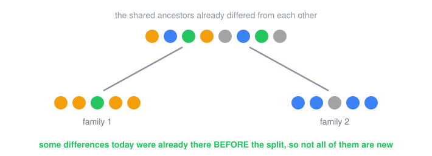
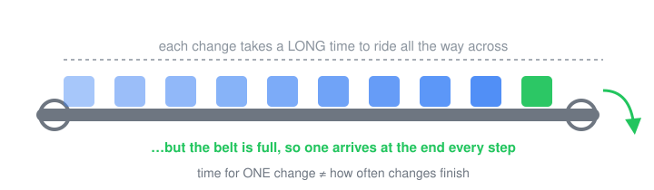
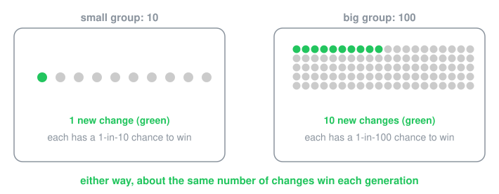
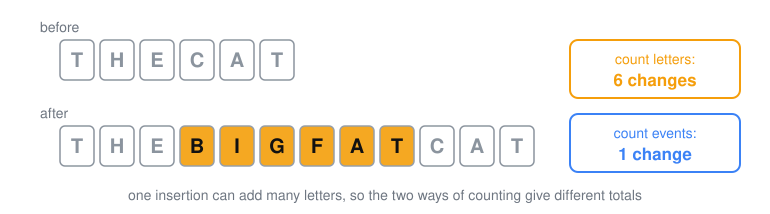
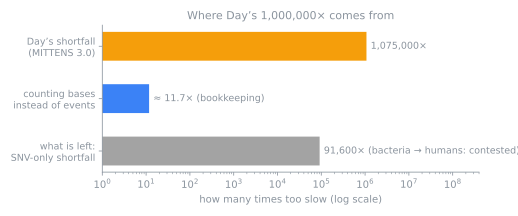

# Is there enough time? Pick your level

The same story at five depths: the question, both sides' arguments, what the checks found, and what's still open.

| | | | | |
|:---:|:---:|:---:|:---:|:---:|
| [ **ELI5**](eli5/README.md) | [ **ELI8**](eli8/README.md) | [ **ELI10**](eli10/README.md) | [ **ELI12**](eli12/README.md) | [ **ELI18**](eli18/README.md) |
| Read-aloud. No names. | Simple words, a few numbers. | Names, DNA words, the raffle. | The main numbers and charts. | Equations, claim IDs, every check linked. |

All five follow the same seven steps, so you can move up a level without getting lost:
1. The question
2. One side's case
3. The other side's case
4. How we checked
5. What we found
6. What's still open
7. Caveats

These are drafts written before the final verdicts (stage R5), so the numbers may still change.

## Interactive version: the math and the sims
[`eli-series/index.html`](eli-series/index.html) is a single page with a level switcher (deep links `#eli5`, `#eli8`, `#eli10`, `#eli12`, `#eli18`). It explains the math in the dispute and how the audit's simulations work: Play it in the browser via [`play.html`](https://raw.githack.com/nickallevato/evo-sim/master/docs/explain/eli-series/play.html) (generated from `index.html` by `research/tools/eli_readme_svgs.py`).
- drift and the 1/(2N) chance;
- k = μ, and the empty start versus equilibrium;
- selection and Kimura's formula;
- Haldane's cost;
- the MITTENS budget;
- Nₑ versus N;
- multi-step waiting times (D15);
- pre-registration and cross-tool replication.

The page has five browser sims. All of them are small Wright–Fisher toys with true binomial sampling, not audit results:
- a drift jar;
- a mutation river (a substitution counter with empty and equilibrium starts);
- a selection race against Kimura and 2s;
- a MITTENS budget board with sourced presets for Day's and the critics' inputs;
- an illustrative combination lock for valleys versus stepping stones.

**Sources and method.**
- **Numbers and quotes.** Every number and quote on the page carries a footnote (S1–S32) that gives the file path and the quote or claim id: `quotes-day.md` and `quotes-critics.md` line ids, claim files, `RESULTS.md`, and the `R4-*` results.
- **Verification.** A separate assistant pass cross-checked each number against its source.
- **Verdicts.** Verdicts are the claim-file values as of 2026-10-09. D15 and XT are shown as pending.
- **Neutrality.** The page follows hard rule 1 (both sides credited and faulted) and rule RH (no fact-checking of rhetoric).
- **Publishing.** Not yet published as an Artifact. The file follows the Artifact page contract: theme tokens, works at 400 px, honours reduced motion.
