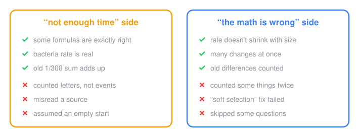
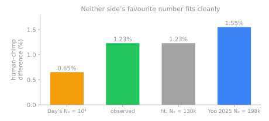

# Is there enough time?
### The whole story, for a first-year undergrad (or any curious adult)

[ELI5](../eli5/README.md) · [ELI8](../eli8/README.md) · [ELI10](../eli10/README.md) · [ELI12](../eli12/README.md) · **ELI18** · [back to the project](../../../README.md)

---

> **How to read this.** Each section names the claim IDs it rests on, so you can open the claim file (verbatim quote, source, prediction, verdicts) or the check in [`RESULTS.md`](../../../research/checks/RESULTS.md).
>
> Every claim gets three verdicts:
> - **internal:** does the conclusion follow from its own premises?
> - **fidelity:** does the cited source say that?
> - **external:** are the premises realistic?
>
> These are R4 results; the final R5 verdicts are not in yet.

## 1. The question
The human and chimpanzee genomes differ by about **1.23%** in aligned single-nucleotide sites (CSAC 2005), plus indels and structural variants. Split-date estimates vary (Day uses 6.3 My, Langergraber 2012 gives ≥ 7–8 My). At about 25 years per generation, that's roughly **250,000 generations** per lineage.

Population genetics has standard results for how fast new mutations arise, spread and **fix** (reach 100% frequency). The dispute is whether those rates add up to the observed divergence in that time.

## 2. Day's case
Vox Day's argument runs through *Probability Zero* (2025), around 30 Zenodo papers (co-authored with "Claude Athos"), and blog posts from 2019 onward. Its core is **MITTENS**:

$$F_{\max} = \frac{t_{\text{div}}\cdot d}{g_{\text{len}}\cdot G_f}$$

- $G_f \approx 1{,}322$ generations per fixation is measured from Lenski's *E. coli* long-term evolution experiment (LTEE) ([A2](../../research/claims/A2-ltee-gf.md)).
- In the 2026 version: 252,000 generations ÷ 1,322 ≈ 190 fixations possible, against **205 million required**, a shortfall of about **1,075,000×**.

Supporting arguments:
- **B. Neutral theory is insufficient.**
  - The substitution rate is $k = \mu N/N_e$, not $\mu$ ([B3](../../research/claims/B3-k-neq-mu-values-umbrella.md)).
  - Fixations lag by about $4N_e$ after a population starts out ([B1](../../research/claims/B1-intrinsic-irrelevance-steady-state.md)).
  - "Hard Limits": $P(\text{fix within }G) \approx e^{-\pi^2 N_e/G}$ ([B2a](../../research/claims/B2a-exp-pi2-ne-over-g.md)).
- **C. Ancient DNA** shows almost no fixations in 7,000 years ([C6](../../research/claims/C6-molecular-clock-stopped.md)). A turnover coefficient $d$ is meant to correct for overlapping generations ([C2](../../research/claims/C2-bio-cycle-d.md)).
- **G. The "Bernoulli barrier":** an improbability bound, $0.02^{2\times10^7}$.
- **H. Haldane's cost of selection:** about 1 substitution per 300 generations ([H](../../research/claims/H-haldane-limit.md)).

## 3. The critics' case
Dennis McCarthy, Brian Mansfield, Zach Hancock (with Gutsick Gibbon), Camestros Felapton, keruru, Nesslig20, Joe Bowers and a Reddit thread nicknamed "KITTENS" responded. Their points:

- **The neutral rate is $k = \mu$.** New mutants arrive at $2N\mu$ per generation, and each fixes with probability $1/2N$:
  $$k = 2N\mu \cdot \tfrac{1}{2N} = \mu$$
  This holds regardless of $N_e$.
- **Latency is not throughput.** The time for one sweep (about $4N_e$, or $\tfrac{2}{s}\ln 4Ns$) doesn't limit how many sweeps can run at once ([F1](../../research/claims/F1-latency-not-throughput-mansfield.md)).
- **Ancestral polymorphism.** Two genomes coalesce on average $2N_{e,\text{anc}}$ generations before the split, so
  $$E[d] = 2\mu T + 4N_{e,\text{anc}}\mu$$
  ([B4a](../../research/claims/B4a-two-lineage-divergence-with-ils.md)).
- **Scaling.** An asexual bacterium with a 4.6 Mb genome is a poor model for a sexual mammal with a 3 Gb genome ([A5f](../../research/claims/A5f-clonal-lineage-vs-recombining.md)).
- **Counting.** The 205M figure counts base pairs inside structural variants, not mutation events ([A3x](../../research/claims/A3x-bp-vs-events.md)).

Allies on Day's side include Ola Hössjer, who re-derives the chain and finds about a 2× gap (that gap comes entirely from $d$), and William Dembski.

## 4. Method
- **Sources.** 193 claims (107 Day, 46 critic, 16 ally, 24 literature), each with a machine-verified verbatim quote. There is a balance ledger, a citation-fidelity ledger and a version-drift ledger.
- **Checks.** Each is an exact Markov chain or a forward Wright–Fisher, Cannings or individual-based simulation. Predictions are pre-registered for each side. Seeds are fixed, and the textbook baselines must pass first.
- **The coalescent is used only for baselines,** because it assumes the equilibrium being disputed.
- **Reviews.** Every check gets a correctness review plus a Day-side and a critic-side steelman review. Four review rounds have run so far, with every major finding resolved.

## 5. Results

### Where Day holds up
| Finding | Evidence |
|---|---|
| The empty-start formula $E[F(T)] = \mu L\int_0^T F_X$ is **exact** | [B1](../../research/claims/B1-intrinsic-irrelevance-steady-state.md): simulation matches at every T |
| $N_e$ sets the fixation **timescale** ($t_{fix}/N_e \approx 4$ across $N_e$ = 200→19) | [B3](../../research/claims/B3-k-neq-mu-values-umbrella.md) |
| The $-\pi^2$ exponent is the correct leading-order tail | [B2a](../../research/claims/B2a-exp-pi2-ne-over-g.md): exact chains |
| The Balloux–Lehmann effect is real: with overlapping generations plus fluctuating N, $k\ne\mu$, so "k = μ" is a discrete-generation result | [B3b](../../research/claims/B3b-balloux-lehmann-overlap-and-fluctuation.md) |
| $G_f \approx 1{,}300$ reproduces, and interference genuinely caps asexual throughput | [A2](../../research/claims/A2-ltee-gf.md), [F2](../../research/claims/F2-multi-locus-interference-feasibility.md): clonal $R_{int}$ falls to 0.09 |
| Soft selection does **not** remove the cost: soft was slower than hard at equal supply | [H2](../../research/claims/H2-nunney-2003.md) |
| $d\cdot s$ is exact for hazard-scale $s$ | [C2](../../research/claims/C2-bio-cycle-d.md) |

### Where the critics hold up
| Finding | Evidence |
|---|---|
| $P_{fix} = 1/2N$ for any offspring variance (a martingale), so neutral $k=\mu$. Day conceded this on 2026-08-27; then 32.3μ appeared, underived | [B3](../../research/claims/B3-k-neq-mu-values-umbrella.md) |
| The pipe was full: sourced $N_e$ histories give an **excess**, $K/UT$ = 1.9–4.0. Day revised to "full, but much shorter" | [B1c](../../research/claims/B1c-ancestral-pipeline-state-ne-history.md), [B1d](../../research/claims/B1d-full-but-short-pipe-revision.md) |
| Pipelining works: 0.397 substitutions per generation while one sweep takes 847 generations | [F1](../../research/claims/F1-latency-not-throughput-mansfield.md) |
| Free recombination keeps $R_{int}$ = 0.975 with 272 sweeps in flight | [F2](../../research/claims/F2-multi-locus-interference-feasibility.md) |
| Hard-selection cap is $\lambda D < \ln R$ with $D\approx\ln M+1$: 9–100× above 1/300 for $R\ge1.3$ | [H](../../research/claims/H-haldane-limit.md) |
| 205M is a bp count; Yoo 2025 contains neither 410 nor 187 Mb | [A3x](../../research/claims/A3x-bp-vs-events.md) |
| Day's 0.743μ is a window artefact | [B3c](../../research/claims/B3c-rrme-k-0743-mu.md) |

The 1,075,000× breaks down as ≈ 11.7× (bp vs events) × 91,600× (SNV-only). The remaining factor is a question of **LTEE → human transfer**:
- The asexual response is sublinear ($a$ = 0.23–0.34).
- Free recombination is linear in the tested range.
- Human-scale numbers of active loci (~10⁴–10⁵) are untested.

### Where both slipped
- **Critics:** Hancock's 38M and Nesslig20's 37.8M "match" the ~35M SNVs only by double-counting. On an SNV basis $2\mu T \approx 19$M, and the rest (~15M) is ancestral ([B5c](../../research/claims/B5c-hancock-76-8-per-generation.md), [B5e](../../research/claims/B5e-nesslig20-37-8-million.md)).
- **Day:** cites Zeng 2021's $s\approx0.001$, which is *negative* selection, as if it were beneficial. Cites Kimura & Ohta 1969 for a recombination claim, but the paper never mentions recombination.
- **Day's fixation time:** $(2/s)\ln 2N$ overstates the conditional fixation time by 2.3× at $N=10^4, s=0.001$: 19,807 vs 8,480 generations.
- **Divergence fit:** neither side's favourite $N_e$ fits.

## 6. Open
| Topic | Status |
|---|---|
| **H at human scale** | Haldane's own regime ($R\approx1.1$, diploid $D\approx 20$–30) plus a hard-selected deleterious load ($U\approx2.2$ needs about 18 offspring per female under hard selection) |
| **C6** | Day's 21-fixation aDNA count isn't reproducible from the published procedure (the simulation gives 1,200–17,000). Needs a per-site call-depth model. The 1240k panel is ascertained on present-day variation, so "zero fixations from < 50%" is the neutral expectation ([C1](../../research/claims/C1-1240k-ascertainment.md)). |
| **[G1](../../research/claims/G1-average-rate-includes-parallelism.md)** | Does $0.02^{2\times10^7}$ price a *specific* outcome or *any* outcome? |
| **[D](../../research/claims/D-sequence-space-wistar.md)** | Sequence space (Wistar 1966) |
| **[E](../../research/claims/E-hypermutation-hazard.md)** | LTEE founders and mutators: not yet checked |
| **$N_{e,\text{anc}}$ / $\mu$ / $T$** | A three-parameter fit; Yoo 2025's μ is unrecorded |

## 7. Caveats about this audit
- **AI-driven:** almost all of it was done by AI agents (Anthropic's Claude), directed by one person. The steelman reviews are AI reviewing AI.
- **Not peer-reviewed,** and no population geneticist has checked it.
- **Sources:** the paid book wasn't bought, so book-only claims are `secondhand`. No author was contacted.
- **Limited regimes:** many checks ran at N ≈ 10³, s = 0.01, in a single population. "Holds in the tested regime" is weaker than "holds".
- **Branding:** the project icon combines a helix and a Christian cross. That was the maintainer's choice; judge the neutrality claim with it in view.
- **Corrections** are welcome from either side, as issues with a locator.

**Further:**
- [Main README](../../../README.md): the full math with proof sketches.
- [Handoff briefing](../../HANDOFF.md).
- [Balance ledger](../../research/ledgers/balance.md).
- [Milestone posts](../../HANDOFF.md#milestone-posts).
