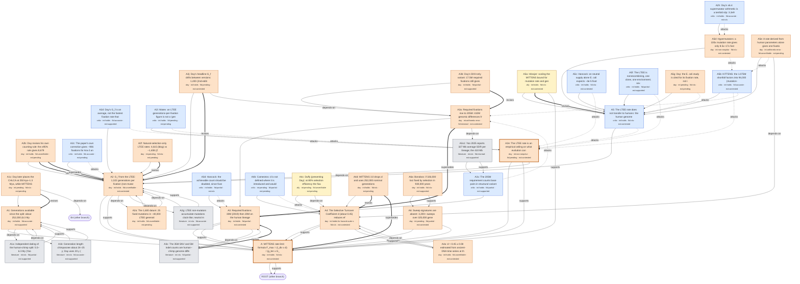

# Branch A

```mermaid
flowchart TD
  n_A["A: MITTENS rate-limit formula F_max = (t_div x d) / (g_len x G_<br/><small>day · int:holds · fid:n/a · ext:contested</small>"]
  style n_A fill:#fde2c8,stroke:#b45309,stroke-width:3px
  n_A --> n_ROOT
  n_A -->|supports| n_ROOT
  n_A1["A1: Generations available since the split: about 252,000 (6.3 My<br/><small>day · int:holds · fid:accurate · ext:supported</small>"]
  style n_A1 fill:#fde2c8,stroke:#b45309
  n_A1 --> n_A
  n_A1 -->|depends-on| n_A1a
  n_A1 -->|depends-on| n_A1b
  n_A1a["A1a: Independent dating of the human-chimp split: 5.5–6.3 My (Yoo<br/><small>literature · int:n/a · fid:partial · ext:supported</small>"]
  style n_A1a fill:#e5e7eb,stroke:#374151
  n_A1a --> n_A1
  n_A1a -->|supports| n_A1
  n_A1b["A1b: Generation length: chimpanzee about 24–25 y; Day uses 20 y (<br/><small>literature · int:n/a · fid:accurate · ext:supported</small>"]
  style n_A1b fill:#e5e7eb,stroke:#374151
  n_A1b --> n_A1
  n_A1b -->|supports| n_A1
  n_A1c["A1c: Day later places the CHLCA at 250 kya–1.3 Mya, while MITTENS<br/><small>day · int:pending · fid:n/a · ext:pending</small>"]
  style n_A1c fill:#fde2c8,stroke:#b45309
  n_A1c --> n_A1
  n_A1c ==>|revises| n_A1
  n_A1c -->|depends-on| n_B4
  n_A2["A2: G_f from the LTEE: 1,322 generations per fixation (non-mutat<br/><small>day · int:holds · fid:unverifiable · ext:contested</small>"]
  style n_A2 fill:#fde2c8,stroke:#b45309
  n_A2 --> n_A
  n_A2 -->|supports| n_A
  n_A2 -->|depends-on| n_A2a
  n_A2 -->|depends-on| n_A2g
  n_A2a["A2a: The 1,600 datum: 25 fixed mutations in ~40,000 LTEE generati<br/><small>day · int:holds · fid:unverifiable · ext:pending</small>"]
  style n_A2a fill:#fde2c8,stroke:#b45309
  n_A2a --> n_A2
  n_A2a -->|depends-on| n_A2
  n_A2b["A2b: Day revises his own counting rule: the ≥95% rule gives 8,679<br/><small>day · int:holds · fid:unverifiable · ext:pending</small>"]
  style n_A2b fill:#fde2c8,stroke:#b45309
  n_A2b --> n_A2
  n_A2b ==>|revises| n_A2
  n_A2b ==>|supersedes| n_A2
  n_A2c["A2c: The paper's own correction gives −906 fixations for Ara-2 an<br/><small>critic · int:holds · fid:accurate · ext:pending</small>"]
  style n_A2c fill:#dbeafe,stroke:#1d4ed8
  n_A2c --> n_A2
  n_A2c -.->|attacks| n_A2
  n_A2d["A2d: Day's G_f is an average, not the fastest fixation rate that <br/><small>critic · int:holds · fid:accurate · ext:supported</small>"]
  style n_A2d fill:#dbeafe,stroke:#1d4ed8
  n_A2d --> n_A2
  n_A2d -.->|attacks| n_A2e
  n_A2e["A2e: The LTEE rate is an empirical ceiling on what evolution can <br/><small>day · int:non-sequitur · fid:pending · ext:contested</small>"]
  style n_A2e fill:#fde2c8,stroke:#b45309,stroke-width:3px
  n_A2e --> n_A
  n_A2e -->|supports| n_A
  n_A2e -->|depends-on| n_A2
  n_A2f["A2f: Natural-selection-only LTEE rates: 4,615 (blog) vs ~1,408 (Z<br/><small>day · int:pending · fid:n/a · ext:pending</small>"]
  style n_A2f fill:#fde2c8,stroke:#b45309
  n_A2f --> n_A2
  n_A2f ==>|revises| n_A2
  n_A2g["A2g: LTEE non-mutators accumulate mutations clock-like; neutral m<br/><small>literature · int:n/a · fid:accurate · ext:supported</small>"]
  style n_A2g fill:#e5e7eb,stroke:#374151
  n_A2g --> n_A2
  n_A2g -->|supports| n_A2
  n_A2h["A2h: Day's s6.4 supermutator arithmetic is a tenfold slip: 3.2e9 <br/><small>critic · int:holds · fid:accurate · ext:n/a</small>"]
  style n_A2h fill:#dbeafe,stroke:#1d4ed8
  n_A2h --> n_A5d
  n_A2h -.->|attacks| n_A5d
  n_A2i["A2i: Matev: an LTEE generations-per-fixation figure is not a 'gen<br/><small>critic · int:holds · fid:pending · ext:pending</small>"]
  style n_A2i fill:#dbeafe,stroke:#1d4ed8
  n_A2i --> n_A2e
  n_A2i -.->|attacks| n_A2e
  n_A2j["A2j: Day's headline G_f drifts between versions: 1,400 (2nd-editi<br/><small>day · int:holds · fid:pending · ext:contested</small>"]
  style n_A2j fill:#fde2c8,stroke:#b45309
  n_A2j --> n_A2
  n_A2j ==>|revises| n_A2
  n_A2j -->|depends-on| n_A3a
  n_A3["A3: Required fixations: 30M (2019) then 20M on the human lineage<br/><small>day · int:holds · fid:partial · ext:contested</small>"]
  style n_A3 fill:#fde2c8,stroke:#b45309
  n_A3 --> n_A
  n_A3 -->|supports| n_A
  n_A3 -->|depends-on| n_A3c
  n_A3a["A3a: Required fixations rise to 205M: 410M genomic differences fr<br/><small>day · int:arithmetic-error · fid:misread · ext:contested</small>"]
  style n_A3a fill:#fde2c8,stroke:#b45309
  n_A3a --> n_A3
  n_A3a ==>|supersedes| n_A3
  n_A3a -->|depends-on| n_A3x1
  n_A3b["A3b: Day's SNV-only variant: 17.5M required fixations still gives<br/><small>day · int:holds · fid:partial · ext:supported</small>"]
  style n_A3b fill:#fde2c8,stroke:#b45309
  n_A3b --> n_A3a
  n_A3b ==>|revises| n_A3a
  n_A3c["A3c: The 35M SNV and 5M indel counts are human–chimp genome diffe<br/><small>literature · int:n/a · fid:partial · ext:supported</small>"]
  style n_A3c fill:#e5e7eb,stroke:#374151
  n_A3c --> n_A3
  n_A3c ==>|revises| n_A3
  n_A3d["A3d: Hancock: the achievable count should be doubled, since fixat<br/><small>critic · int:holds · fid:partial · ext:n/a</small>"]
  style n_A3d fill:#dbeafe,stroke:#1d4ed8
  n_A3d --> n_A3
  n_A3d -.->|attacks| n_A3
  n_A3x["A3x: The 205M requirement counts base pairs in structural variant<br/><small>critic · int:holds · fid:partial · ext:supported</small>"]
  style n_A3x fill:#dbeafe,stroke:#1d4ed8
  n_A3x --> n_A3
  n_A3x -.->|attacks| n_A3a
  n_A3x1["A3x1: Yoo 2025 reports 327 Mb average SDR per lineage; the 410 Mb <br/><small>literature · int:n/a · fid:misread · ext:supported</small>"]
  style n_A3x1 fill:#e5e7eb,stroke:#374151
  n_A3x1 --> n_A3x
  n_A3x1 -->|supports| n_A3x
  n_A4["A4: The Selective Turnover Coefficient d (about 0.45) reduces ef<br/><small>day · int:holds for hazard-scale s · fid:n/a · ext:contested</small>"]
  style n_A4 fill:#fde2c8,stroke:#b45309
  n_A4 --> n_A
  n_A4 -->|supports| n_A
  n_A4 -->|depends-on| n_A4a
  n_A4a["A4a: d ≈ 0.45 ± 0.08 estimated from ancient-DNA time series at th<br/><small>day · int:holds · fid:unverifiable · ext:contested</small>"]
  style n_A4a fill:#fde2c8,stroke:#b45309
  n_A4a --> n_A4
  n_A4a -->|depends-on| n_A4
  n_A4b["A4b: Camestros: d is not defined where it is introduced and would<br/><small>critic · int:pending · fid:partial · ext:pending</small>"]
  style n_A4b fill:#dbeafe,stroke:#1d4ed8
  n_A4b --> n_A4
  n_A4b -.->|attacks| n_A4
  n_A4c["A4c: Duffy (presenting Day): at 80% selection efficiency the fixa<br/><small>ally · int:pending · fid:unverifiable · ext:pending</small>"]
  style n_A4c fill:#fef3c7,stroke:#a16207
  n_A4c --> n_A4
  n_A4c -->|depends-on| n_A4
  n_A4d["A4d: MITTENS 3.0 drops d and uses 252,000 nominal generations<br/><small>day · int:holds · fid:n/a · ext:pending</small>"]
  style n_A4d fill:#fde2c8,stroke:#b45309
  n_A4d --> n_A4
  n_A4d ==>|revises| n_A4
  n_A4d ==>|supersedes| n_A
  n_A5["A5: The LTEE rate does not transfer to humans: the human genome <br/><small>critic · int:holds · fid:n/a · ext:contested</small>"]
  style n_A5 fill:#dbeafe,stroke:#1d4ed8
  n_A5 --> n_A2
  n_A5 -.->|attacks| n_A2e
  n_A5a["A5a: Hössjer: scaling the MITTENS bound for mutation rate and gen<br/><small>ally · int:holds · fid:n/a · ext:contested</small>"]
  style n_A5a fill:#fef3c7,stroke:#a16207
  n_A5a --> n_A5
  n_A5a ==>|revises| n_A5
  n_A5a -->|supports| n_A
  n_A5b["A5b: KITTENS: the 1.075M shortfall factors into 94,000 (mutation-<br/><small>critic · int:holds · fid:accurate · ext:contested</small>"]
  style n_A5b fill:#dbeafe,stroke:#1d4ed8
  n_A5b --> n_A5
  n_A5b -.->|attacks| n_A2e
  n_A5b -.->|attacks| n_A3a
  n_A5c["A5c: Hancock: on neutral supply alone E. coli expects ~4e-5 fixat<br/><small>critic · int:holds · fid:n/a · ext:contested</small>"]
  style n_A5c fill:#dbeafe,stroke:#1d4ed8
  n_A5c --> n_A5
  n_A5c -.->|attacks| n_A2e
  n_A5d["A5d: Hypermutators: a 100x mutation rate gives only 8.5x–17x fast<br/><small>day · int:non-sequitur · fid:n/a · ext:contested</small>"]
  style n_A5d fill:#fde2c8,stroke:#b45309
  n_A5d --> n_A5
  n_A5d -.->|attacks| n_A5b
  n_A5e["A5e: A rate derived from human parameters alone gives one fixatio<br/><small>day · int:arithmetic-error · fid:unverifiable · ext:pending</small>"]
  style n_A5e fill:#fde2c8,stroke:#b45309
  n_A5e --> n_A5
  n_A5e -.->|attacks| n_A5b
  n_A5e -->|depends-on| n_A4
  n_A5f["A5f: The LTEE is nonrecombining, one clone, one environment; sex <br/><small>critic · int:holds · fid:partial · ext:supported</small>"]
  style n_A5f fill:#dbeafe,stroke:#1d4ed8
  n_A5f --> n_A5
  n_A5f -.->|attacks| n_A2e
  n_A5g["A5g: Day: the E. coli study is cited for its fixation rate, not i<br/><small>day · int:pending · fid:n/a · ext:pending</small>"]
  style n_A5g fill:#fde2c8,stroke:#b45309
  n_A5g --> n_A5
  n_A5g -.->|attacks| n_A5
  n_A6["A6: Sweep signatures are absent: 3,200+ sweeps over 325,000 gene<br/><small>day · int:pending · fid:partial · ext:contested</small>"]
  style n_A6 fill:#fde2c8,stroke:#b45309
  n_A6 --> n_A
  n_A6 -->|supports| n_A
  n_A6a["A6a: Bonobos: if 326,000 loci fixed by selection in 930,000 years<br/><small>day · int:holds · fid:n/a · ext:supported</small>"]
  style n_A6a fill:#fde2c8,stroke:#b45309
  n_A6a --> n_A6
  n_A6a -->|supports| n_A6
  n_B4(["B4 (other branch)"])
  n_ROOT(["ROOT (other branch)"])
```
