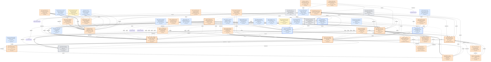

# Branch B

```mermaid
flowchart TD
  n_B["B: Neutral theory (k = mu) cannot rescue the shortfall<br/><small>day · int:pending · fid:partial · ext:contested</small>"]
  style n_B fill:#fde2c8,stroke:#b45309,stroke-width:3px
  n_B --> n_ROOT
  n_B -->|supports| n_ROOT
  n_B -->|depends-on| n_B1
  n_B -->|depends-on| n_B2
  n_B -->|depends-on| n_B3
  n_B -->|depends-on| n_B4
  n_B -.->|attacks| n_B5
  n_B -.->|attacks| n_B6
  n_B -.->|attacks| n_B7
  n_B1["B1: k = mu is a steady-state identity; finite-time count differs<br/><small>day · int:holds · fid:n/a · ext:contested</small>"]
  style n_B1 fill:#fde2c8,stroke:#b45309,stroke-width:3px
  n_B1 --> n_B
  n_B1 -->|supports| n_B
  n_B1 -->|depends-on| n_B1a
  n_B1 -->|depends-on| n_B1c
  n_B1a["B1a: E[F(T)] ≈ muL(T − 4Ne) and its numerical application<br/><small>day · int:holds · fid:n/a · ext:pending</small>"]
  style n_B1a fill:#fde2c8,stroke:#b45309
  n_B1a --> n_B1
  n_B1a -->|supports| n_B1
  n_B1b["B1b: k = mu holds only after one size is held for ~4Ne generation<br/><small>day · int:holds · fid:n/a · ext:pending</small>"]
  style n_B1b fill:#fde2c8,stroke:#b45309
  n_B1b --> n_B1
  n_B1b -->|supports| n_B1
  n_B1b -->|depends-on| n_B1c
  n_B1c["B1c: Was the ancestral pipeline empty or full at the split? (sour<br/><small>literature · int:holds · fid:n/a · ext:contradicted</small>"]
  style n_B1c fill:#e5e7eb,stroke:#374151,stroke-width:3px
  n_B1c --> n_B1
  n_B1c -->|depends-on| n_B1
  n_B1c -.->|attacks| n_B1a
  n_B1d["B1d: Day (blog 2026-10-01): the pipeline was full but short (228,<br/><small>day · int:pending · fid:n/a · ext:contested</small>"]
  style n_B1d fill:#fde2c8,stroke:#b45309
  n_B1d --> n_B1
  n_B1d ==>|revises| n_B1
  n_B1d ==>|revises| n_B1c
  n_B1d ==>|revises| n_B1a
  n_B1e["B1e: Chalub 2022 shows k = mu is an asymptote / 1/(2N) is importe<br/><small>day · int:pending · fid:partial · ext:pending</small>"]
  style n_B1e fill:#fde2c8,stroke:#b45309
  n_B1e --> n_B1
  n_B1e -->|supports| n_B1
  n_B1e -->|supports| n_B7
  n_B2["B2: Hard Limits: drift cannot complete fixations above a census <br/><small>day · int:pending · fid:unverifiable · ext:contested</small>"]
  style n_B2 fill:#fde2c8,stroke:#b45309,stroke-width:3px
  n_B2 --> n_B
  n_B2 -->|supports| n_B
  n_B2 -->|depends-on| n_B2a
  n_B2 -->|depends-on| n_B2b
  n_B2 -->|depends-on| n_B2c
  n_B2a["B2a: F(T) ~ exp(−pi^2 Ne / T) for T << 4Ne (short-time fixation t<br/><small>day · int:holds · fid:unverifiable · ext:pending</small>"]
  style n_B2a fill:#fde2c8,stroke:#b45309
  n_B2a --> n_B2
  n_B2a -->|supports| n_B2
  n_B2b["B2b: Census ceiling X = (Vk + 2) G / 16 from 4Ne < G<br/><small>day · int:holds · fid:unverifiable · ext:contested</small>"]
  style n_B2b fill:#fde2c8,stroke:#b45309,stroke-width:3px
  n_B2b --> n_B2
  n_B2b -->|supports| n_B2
  n_B2c["B2c: 'One in ten to the seventy-eight-millionth': exp(-pi^2 Ne/G)<br/><small>day · int:holds · fid:unverifiable · ext:contested</small>"]
  style n_B2c fill:#fde2c8,stroke:#b45309
  n_B2c --> n_B2
  n_B2c -->|supports| n_B2
  n_B2c -->|depends-on| n_B2a
  n_B2d["B2d: Second objection: fixations run in parallel; steady-state fl<br/><small>day · int:holds · fid:n/a · ext:pending</small>"]
  style n_B2d fill:#fde2c8,stroke:#b45309
  n_B2d --> n_B2
  n_B2d -->|supports| n_B2
  n_B2d -.->|attacks| n_F1
  n_B2e["B2e: keruru (Zenodo draft): a temporal N_e measured from ancient <br/><small>critic · int:holds · fid:n/a · ext:contested</small>"]
  style n_B2e fill:#dbeafe,stroke:#1d4ed8
  n_B2e --> n_B2b
  n_B2e -.->|attacks| n_B2b
  n_B3["B3: k differs from mu: the family of Day k/mu values (N/Ne, 0.74<br/><small>day · int:pending · fid:partial · ext:contradicted</small>"]
  style n_B3 fill:#fde2c8,stroke:#b45309,stroke-width:3px
  n_B3 --> n_B
  n_B3 -->|supports| n_B
  n_B3 -->|depends-on| n_B3a
  n_B3 -->|depends-on| n_B3b
  n_B3 -->|depends-on| n_B3c
  n_B3 -->|depends-on| n_B3d
  n_B3a["B3a: k = 2N mu × 1/(2Ne) = mu N/Ne: supply uses census N, fixatio<br/><small>day · int:holds · fid:misread · ext:contradicted</small>"]
  style n_B3a fill:#fde2c8,stroke:#b45309,stroke-width:3px
  n_B3a --> n_B3
  n_B3a -->|supports| n_B3
  n_B3b["B3b: Balloux & Lehmann 2012: k depends on N under overlapping gen<br/><small>day · int:holds · fid:partial · ext:supported</small>"]
  style n_B3b fill:#fde2c8,stroke:#b45309
  n_B3b --> n_B3
  n_B3b -->|supports| n_B3
  n_B3b -->|depends-on| n_B3c
  n_B3c["B3c: Real Rate of Molecular Evolution: k = mu × (sum N_i^2 / sum <br/><small>day · int:non-sequitur · fid:misread · ext:contradicted</small>"]
  style n_B3c fill:#fde2c8,stroke:#b45309
  n_B3c --> n_B3
  n_B3c -->|supports| n_B3
  n_B3c -->|depends-on| n_B3b
  n_B3d["B3d: k = 32.3 mu (Bergeron pedigree rate vs Yoo required rate) an<br/><small>day · int:pending · fid:unverifiable · ext:contested</small>"]
  style n_B3d fill:#fde2c8,stroke:#b45309
  n_B3d --> n_B3
  n_B3d -->|supports| n_B3
  n_B3e["B3e: Day (2026-02-04): 'corrected' McCarthy calculation gives 8.2<br/><small>day · int:non-sequitur · fid:n/a · ext:contradicted</small>"]
  style n_B3e fill:#fde2c8,stroke:#b45309
  n_B3e --> n_B3
  n_B3e -.->|attacks| n_B5a
  n_B3e -->|depends-on| n_B3a
  n_B3f["B3f: k = 800,000 mu from N = 8e9 and Ne = 1e4 (Day-Grok exchange,<br/><small>day · int:holds · fid:n/a · ext:contradicted</small>"]
  style n_B3f fill:#fde2c8,stroke:#b45309
  n_B3f --> n_B3
  n_B3f -->|supports| n_B3a
  n_B3g["B3g: Day (2026-08-27): Kimura's derivation never needed Ne; suppl<br/><small>day · int:holds · fid:accurate · ext:supported</small>"]
  style n_B3g fill:#fde2c8,stroke:#b45309,stroke-width:3px
  n_B3g --> n_B3
  n_B3g ==>|supersedes| n_B3a
  n_B3g ==>|revises| n_B3
  n_B3g ==>|revises| n_B4
  n_B3h["B3h: Ne ≈ 10,000 is derived from theta = 4 Ne mu, which 'presuppo<br/><small>day · int:pending · fid:n/a · ext:contested</small>"]
  style n_B3h fill:#fde2c8,stroke:#b45309
  n_B3h --> n_B3
  n_B3h -.->|attacks| n_B7c
  n_B3i["B3i: Matev: if every allele at a site had fixation probability 1/<br/><small>critic · int:holds · fid:n/a · ext:supported</small>"]
  style n_B3i fill:#dbeafe,stroke:#1d4ed8
  n_B3i --> n_B3a
  n_B3i -.->|attacks| n_B3a
  n_B4["B4: Molecular clock recalibration: CHLCA collapses from 6-7 Mya <br/><small>day · int:holds · fid:unverifiable · ext:contested</small>"]
  style n_B4 fill:#fde2c8,stroke:#b45309
  n_B4 --> n_B
  n_B4 -->|supports| n_B
  n_B4 -->|depends-on| n_B3a
  n_B4a["B4a: Pairwise divergence = 2 mu T + theta_anc: two-lineage forwar<br/><small>literature · int:holds · fid:accurate · ext:contested</small>"]
  style n_B4a fill:#e5e7eb,stroke:#374151,stroke-width:3px
  n_B4a --> n_B4
  n_B4a -->|depends-on| n_B6
  n_B4a -->|depends-on| n_B1b
  n_B4a -.->|attacks| n_B1a
  n_B4b["B4b: CHLCA recalibrated from 6.5 Mya to 68 kya (census 600,000; B<br/><small>day · int:holds · fid:unverifiable · ext:contested</small>"]
  style n_B4b fill:#fde2c8,stroke:#b45309
  n_B4b --> n_B4
  n_B4b ==>|revises| n_B4
  n_B4c["B4c: Day (2026-05-07): CHLCA falls in 250 kya to 1.3 Mya, not 68-<br/><small>day · int:pending · fid:n/a · ext:pending</small>"]
  style n_B4c fill:#fde2c8,stroke:#b45309
  n_B4c --> n_B4
  n_B4c ==>|supersedes| n_B4b
  n_B4c ==>|revises| n_B4
  n_B4d["B4d: Dating by k = mu is circular: the divergence date is derived<br/><small>day · int:pending · fid:partial · ext:contested</small>"]
  style n_B4d fill:#fde2c8,stroke:#b45309
  n_B4d --> n_B4
  n_B4d -->|supports| n_B4
  n_B4e["B4e: McCarthy: the 6-9 My human-chimp dates are based on Kimura's<br/><small>critic · int:pending · fid:unverifiable · ext:contested</small>"]
  style n_B4e fill:#dbeafe,stroke:#1d4ed8
  n_B4e --> n_B4
  n_B4e -->|supports| n_B4d
  n_B4f["B4f: Hossjer (ally): neutral theory cannot explain common ancestr<br/><small>ally · int:pending · fid:unverifiable · ext:contested</small>"]
  style n_B4f fill:#fef3c7,stroke:#a16207
  n_B4f --> n_B4
  n_B4f -->|supports| n_B4d
  n_B4g["B4g: keruru: fossil-calibrated rate is about twice the pedigree r<br/><small>critic · int:pending · fid:unverifiable · ext:contested</small>"]
  style n_B4g fill:#dbeafe,stroke:#1d4ed8
  n_B4g --> n_B4
  n_B4g -->|supports| n_B4d
  n_B5["B5: Critics: 2N mu new mutations × 1/(2N) fixation probability =<br/><small>critic · int:holds · fid:accurate · ext:contested</small>"]
  style n_B5 fill:#dbeafe,stroke:#1d4ed8,stroke-width:3px
  n_B5 --> n_B
  n_B5 -.->|attacks| n_B1
  n_B5 -.->|attacks| n_B2
  n_B5 -.->|attacks| n_B3a
  n_B5a["B5a: McCarthy: 100 mutations/newborn × N = 10,000 over 9 My gives<br/><small>critic · int:holds · fid:n/a · ext:contested</small>"]
  style n_B5a fill:#dbeafe,stroke:#1d4ed8
  n_B5a --> n_B5
  n_B5a -.->|attacks| n_B1
  n_B5a -.->|attacks| n_B3a
  n_B5b["B5b: Mansfield: if 2% of ~100 de novo mutations are neutral, ther<br/><small>critic · int:holds · fid:n/a · ext:contested</small>"]
  style n_B5b fill:#dbeafe,stroke:#1d4ed8
  n_B5b --> n_B5
  n_B5b -.->|attacks| n_B1
  n_B5b -.->|attacks| n_B3a
  n_B5c["B5c: Hancock: ~76.8 new mutations fixed per generation, ~38 milli<br/><small>critic · int:holds · fid:n/a · ext:contradicted</small>"]
  style n_B5c fill:#dbeafe,stroke:#1d4ed8
  n_B5c --> n_B5
  n_B5c -.->|attacks| n_B1
  n_B5c -.->|attacks| n_B3a
  n_B5c -.->|attacks| n_A
  n_B5d["B5d: Relayed population geneticist: 6 My / 25 y × 30 mutations pe<br/><small>critic · int:holds · fid:n/a · ext:contested</small>"]
  style n_B5d fill:#dbeafe,stroke:#1d4ed8
  n_B5d --> n_B5
  n_B5d -.->|attacks| n_B1
  n_B5d -.->|attacks| n_B3a
  n_B5e["B5e: Nesslig20: mu_G = 75 per generation, k = 75, 2 × 75 × 252,00<br/><small>critic · int:holds · fid:n/a · ext:contested</small>"]
  style n_B5e fill:#dbeafe,stroke:#1d4ed8
  n_B5e --> n_B5
  n_B5e -.->|attacks| n_B1
  n_B5e -.->|attacks| n_B3a
  n_B5f["B5f: r/DebateEvolution: 38.4 × 252,000 = ~9.7 million expected ne<br/><small>critic · int:holds · fid:n/a · ext:contested</small>"]
  style n_B5f fill:#dbeafe,stroke:#1d4ed8
  n_B5f --> n_B5
  n_B5f -.->|attacks| n_B1
  n_B5f -.->|attacks| n_B3a
  n_B5g["B5g: Camestros Felapton commenter Paul King: neutral mutations re<br/><small>critic · int:holds · fid:accurate · ext:contested</small>"]
  style n_B5g fill:#dbeafe,stroke:#1d4ed8
  n_B5g --> n_B5
  n_B5g -.->|attacks| n_B3a
  n_B5g -->|supports| n_F1
  n_B5h["B5h: Hossjer (ally): neutral fixation rate is d × mu per site; 3e<br/><small>ally · int:holds · fid:accurate · ext:contested</small>"]
  style n_B5h fill:#fef3c7,stroke:#a16207
  n_B5h --> n_B5
  n_B5h -->|supports| n_B5
  n_B5h -.->|attacks| n_B3a
  n_B6["B6: Mansfield: the ancestral pipeline was full at the split; exp<br/><small>critic · int:holds · fid:n/a · ext:supported</small>"]
  style n_B6 fill:#dbeafe,stroke:#1d4ed8,stroke-width:3px
  n_B6 --> n_B1
  n_B6 -.->|attacks| n_B1
  n_B6 -.->|attacks| n_B1a
  n_B6a["B6a: Day (IR): ancestral polymorphism contributes 1.44 million di<br/><small>day · int:arithmetic-error · fid:n/a · ext:contradicted</small>"]
  style n_B6a fill:#fde2c8,stroke:#b45309
  n_B6a --> n_B6
  n_B6a -.->|attacks| n_B6
  n_B6b["B6b: Camestros: Day treats ALL human-chimp genetic differences as<br/><small>critic · int:holds · fid:accurate · ext:supported</small>"]
  style n_B6b fill:#dbeafe,stroke:#1d4ed8
  n_B6b --> n_B6
  n_B6b -.->|attacks| n_B6a
  n_B6c["B6c: Hancock: a serial one-at-a-time model predicts no genetic va<br/><small>critic · int:pending · fid:n/a · ext:pending</small>"]
  style n_B6c fill:#dbeafe,stroke:#1d4ed8
  n_B6c --> n_B6
  n_B6c -.->|attacks| n_B1
  n_B6c -.->|attacks| n_G2g
  n_B7["B7: Neutral fixation probability is 1/(2N), the starting frequen<br/><small>critic · int:holds · fid:accurate · ext:supported</small>"]
  style n_B7 fill:#dbeafe,stroke:#1d4ed8,stroke-width:3px
  n_B7 --> n_B3
  n_B7 -.->|attacks| n_B3a
  n_B7 -->|supports| n_B5
  n_B7a["B7a: Kimura 1962: U = 1/2N for a neutral gene; approximately 2s f<br/><small>literature · int:n/a · fid:partial · ext:n/a</small>"]
  style n_B7a fill:#e5e7eb,stroke:#374151
  n_B7a --> n_B7
  n_B7a -->|supports| n_B7
  n_B7a -.->|attacks| n_B3a
  n_B7b["B7b: Kimura & Ohta 1969: neutral fixation takes about 4Ne generat<br/><small>literature · int:n/a · fid:accurate · ext:n/a</small>"]
  style n_B7b fill:#e5e7eb,stroke:#374151
  n_B7b --> n_B7
  n_B7b -->|supports| n_B7
  n_B7b -->|supports| n_B1a
  n_B7c["B7c: keruru (former ally): supply is 2N mu with census N; fixatio<br/><small>critic · int:holds · fid:accurate · ext:supported</small>"]
  style n_B7c fill:#dbeafe,stroke:#1d4ed8
  n_B7c --> n_B7
  n_B7c -.->|attacks| n_B3a
  n_B7c -->|supports| n_B7
  n_B9["B9: Day: if drift could change the genome, the 3x excess of harm<br/><small>day · int:non-sequitur · fid:n/a · ext:pending</small>"]
  style n_B9 fill:#fde2c8,stroke:#b45309
  n_B9 --> n_B
  n_B9 -->|supports| n_B
  n_B9 -->|depends-on| n_H10
  n_A(["A (other branch)"])
  n_F1(["F1 (other branch)"])
  n_G2g(["G2g (other branch)"])
  n_H10(["H10 (other branch)"])
  n_ROOT(["ROOT (other branch)"])
```
