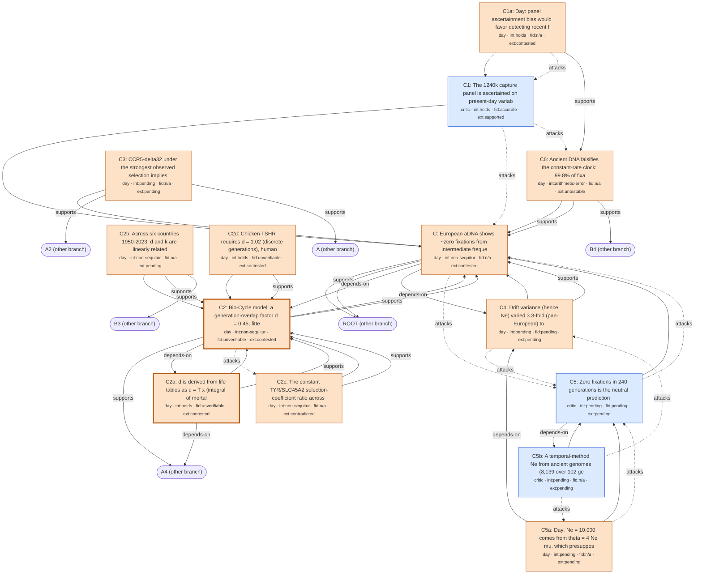

# Branch C

```mermaid
flowchart TD
  n_C["C: European aDNA shows ~zero fixations from intermediate freque<br/><small>day · int:non-sequitur · fid:n/a · ext:contested</small>"]
  style n_C fill:#fde2c8,stroke:#b45309
  n_C --> n_ROOT
  n_C -->|supports| n_ROOT
  n_C -->|depends-on| n_C2
  n_C -->|depends-on| n_C4
  n_C -.->|attacks| n_C5
  n_C1["C1: The 1240k capture panel is ascertained on present-day variab<br/><small>critic · int:holds · fid:accurate · ext:supported</small>"]
  style n_C1 fill:#dbeafe,stroke:#1d4ed8
  n_C1 --> n_C
  n_C1 -.->|attacks| n_C
  n_C1 -.->|attacks| n_C6
  n_C1a["C1a: Day: panel ascertainment bias would favor detecting recent f<br/><small>day · int:holds · fid:n/a · ext:contested</small>"]
  style n_C1a fill:#fde2c8,stroke:#b45309
  n_C1a --> n_C1
  n_C1a -.->|attacks| n_C1
  n_C1a -->|supports| n_C6
  n_C2["C2: Bio-Cycle model: a generation-overlap factor d = 0.45, fitte<br/><small>day · int:non-sequitur · fid:unverifiable · ext:contested</small>"]
  style n_C2 fill:#fde2c8,stroke:#b45309,stroke-width:3px
  n_C2 --> n_C
  n_C2 -->|supports| n_C
  n_C2 -->|supports| n_A4
  n_C2 -->|depends-on| n_C2a
  n_C2 -.->|attacks| n_C2c
  n_C2a["C2a: d is derived from life tables as d = T x (integral of mortal<br/><small>day · int:holds · fid:unverifiable · ext:contested</small>"]
  style n_C2a fill:#fde2c8,stroke:#b45309,stroke-width:3px
  n_C2a --> n_C2
  n_C2a -->|supports| n_C2
  n_C2a -->|depends-on| n_A4
  n_C2b["C2b: Across six countries 1950-2023, d and k are linearly related<br/><small>day · int:non-sequitur · fid:n/a · ext:pending</small>"]
  style n_C2b fill:#fde2c8,stroke:#b45309
  n_C2b --> n_C2
  n_C2b -->|supports| n_C2
  n_C2b -->|supports| n_B3
  n_C2c["C2c: The constant TYR/SLC45A2 selection-coefficient ratio across <br/><small>day · int:non-sequitur · fid:n/a · ext:contradicted</small>"]
  style n_C2c fill:#fde2c8,stroke:#b45309
  n_C2c --> n_C2
  n_C2c -->|supports| n_C2
  n_C2d["C2d: Chicken TSHR requires d = 1.02 (discrete generations), human<br/><small>day · int:holds · fid:unverifiable · ext:contested</small>"]
  style n_C2d fill:#fde2c8,stroke:#b45309
  n_C2d --> n_C2
  n_C2d -->|supports| n_C2
  n_C3["C3: CCR5-delta32 under the strongest observed selection implies <br/><small>day · int:pending · fid:n/a · ext:pending</small>"]
  style n_C3 fill:#fde2c8,stroke:#b45309
  n_C3 --> n_C
  n_C3 -->|supports| n_A2
  n_C3 -->|supports| n_A
  n_C4["C4: Drift variance (hence Ne) varied 3.3-fold (pan-European) to <br/><small>day · int:pending · fid:pending · ext:pending</small>"]
  style n_C4 fill:#fde2c8,stroke:#b45309
  n_C4 --> n_C
  n_C4 -->|supports| n_C
  n_C4 -.->|attacks| n_C5
  n_C5["C5: Zero fixations in 240 generations is the neutral prediction <br/><small>critic · int:pending · fid:pending · ext:pending</small>"]
  style n_C5 fill:#dbeafe,stroke:#1d4ed8
  n_C5 --> n_C
  n_C5 -.->|attacks| n_C
  n_C5 -->|depends-on| n_C5b
  n_C5a["C5a: Day: Ne = 10,000 comes from theta = 4 Ne mu, which presuppos<br/><small>day · int:pending · fid:n/a · ext:pending</small>"]
  style n_C5a fill:#fde2c8,stroke:#b45309
  n_C5a --> n_C5
  n_C5a -.->|attacks| n_C5
  n_C5a -->|depends-on| n_C4
  n_C5b["C5b: A temporal-method Ne from ancient genomes (8,139 over 102 ge<br/><small>critic · int:pending · fid:n/a · ext:pending</small>"]
  style n_C5b fill:#dbeafe,stroke:#1d4ed8
  n_C5b --> n_C5
  n_C5b -.->|attacks| n_C5a
  n_C5b -.->|attacks| n_C4
  n_C6["C6: Ancient DNA falsifies the constant-rate clock: 99.8% of fixa<br/><small>day · int:arithmetic-error · fid:n/a · ext:untestable</small>"]
  style n_C6 fill:#fde2c8,stroke:#b45309
  n_C6 --> n_C
  n_C6 -->|supports| n_C
  n_C6 -->|supports| n_B4
  n_A(["A (other branch)"])
  n_A2(["A2 (other branch)"])
  n_A4(["A4 (other branch)"])
  n_B3(["B3 (other branch)"])
  n_B4(["B4 (other branch)"])
  n_ROOT(["ROOT (other branch)"])
```
