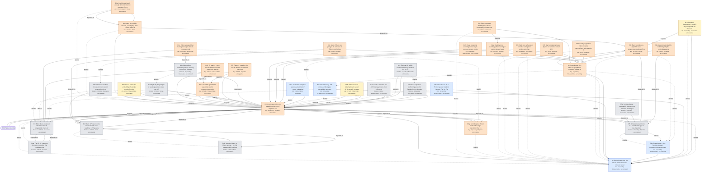

# Branch D

```mermaid
flowchart TD
  n_D["D: Functional proteins are a vanishing fraction of sequence spa<br/><small>day · int:pending · fid:partial · ext:contested</small>"]
  style n_D fill:#fde2c8,stroke:#b45309
  n_D --> n_ROOT
  n_D -->|supports| n_ROOT
  n_D -->|depends-on| n_D3
  n_D -->|depends-on| n_D4
  n_D -->|depends-on| n_D5
  n_D -->|depends-on| n_D2g
  n_D -.->|attacks| n_D1
  n_D1["D1: Rosenhouse ch.4: the Wistar mathematicians' critiques were r<br/><small>critic · int:pending · fid:unverifiable · ext:contested</small>"]
  style n_D1 fill:#dbeafe,stroke:#1d4ed8
  n_D1 --> n_D
  n_D1 -.->|attacks| n_D
  n_D10["D10: Axe: sequences performing a specific function by any domain-<br/><small>literature · int:pending · fid:accurate · ext:contested</small>"]
  style n_D10 fill:#e5e7eb,stroke:#374151
  n_D10 --> n_D
  n_D10 -->|supports| n_D
  n_D11["D11: Taylor et al.: a fully randomized library of about 5 x 10^23<br/><small>literature · int:holds · fid:accurate · ext:contested</small>"]
  style n_D11 fill:#e5e7eb,stroke:#374151
  n_D11 --> n_D
  n_D11 -.->|attacks| n_D10
  n_D11 -->|supports| n_D
  n_D12["D12: Keefe & Szostak: four ATP-binding proteins from a library of<br/><small>literature · int:n/a · fid:unverifiable · ext:contested</small>"]
  style n_D12 fill:#e5e7eb,stroke:#374151
  n_D12 --> n_D
  n_D12 -.->|attacks| n_D
  n_D13["D13: Dembski: Rosenhouse's book is objectively bad; the Weasel's <br/><small>ally · int:pending · fid:accurate · ext:contested</small>"]
  style n_D13 fill:#fef3c7,stroke:#a16207
  n_D13 --> n_D1
  n_D13 -.->|attacks| n_D1
  n_D13 -->|supports| n_D2i
  n_D14["D14: Rebekah Davis (relaying Eden): about 10^36 genetic transfers<br/><small>ally · int:holds · fid:accurate · ext:contested</small>"]
  style n_D14 fill:#fef3c7,stroke:#a16207
  n_D14 --> n_D
  n_D14 -->|supports| n_D
  n_D1a["D1a: Rosenhouse p.124: molecular biologists learned the geometry <br/><small>critic · int:pending · fid:unverifiable · ext:contested</small>"]
  style n_D1a fill:#dbeafe,stroke:#1d4ed8
  n_D1a --> n_D1
  n_D1a -.->|attacks| n_D3
  n_D1a -.->|attacks| n_D
  n_D1b["D1b: Rosenhouse p.124: Schützenberger's arguments about computer <br/><small>critic · int:pending · fid:unverifiable · ext:contested</small>"]
  style n_D1b fill:#dbeafe,stroke:#1d4ed8
  n_D1b --> n_D1
  n_D1b -.->|attacks| n_D5
  n_D1c["D1c: Rosenhouse ch.6: 'Protein space. Dawkins' Weasel. The No Fre<br/><small>critic · int:pending · fid:unverifiable · ext:contested</small>"]
  style n_D1c fill:#dbeafe,stroke:#1d4ed8
  n_D1c --> n_D1
  n_D1c -.->|attacks| n_D
  n_D1d["D1d: Camestros Felapton: a serious treatment of maths and evoluti<br/><small>critic · int:n/a · fid:n/a · ext:pending</small>"]
  style n_D1d fill:#dbeafe,stroke:#1d4ed8
  n_D1d --> n_D
  n_D1d -.->|attacks| n_D
  n_D2["D2: Rosenhouse ch.4 offers no quantitative refutation of Eden, U<br/><small>day · int:pending · fid:unverifiable · ext:pending</small>"]
  style n_D2 fill:#fde2c8,stroke:#b45309
  n_D2 --> n_D1
  n_D2 -.->|attacks| n_D1
  n_D2 -.->|attacks| n_D1a
  n_D2 -.->|attacks| n_D1b
  n_D2 -->|depends-on| n_D2i
  n_D2a["D2a: Ulam: 'What I am going to do will come to Eden's conclusions<br/><small>day · int:n/a · fid:partial · ext:contested</small>"]
  style n_D2a fill:#fde2c8,stroke:#b45309
  n_D2a --> n_D2
  n_D2a -.->|attacks| n_D4a
  n_D2a -->|depends-on| n_D4
  n_D2b["D2b: Lewontin admitted he could not justify the continuity assump<br/><small>day · int:n/a · fid:misread · ext:contested</small>"]
  style n_D2b fill:#fde2c8,stroke:#b45309
  n_D2b --> n_D2
  n_D2b -.->|attacks| n_D1
  n_D2b -->|depends-on| n_D5
  n_D2c["D2c: Wald: one is 'hard put to find' a hemoglobin amino-acid chan<br/><small>day · int:pending · fid:accurate · ext:contested</small>"]
  style n_D2c fill:#fde2c8,stroke:#b45309
  n_D2c --> n_D2
  n_D2c -->|supports| n_D
  n_D2c -.->|attacks| n_D1
  n_D2d["D2d: Crosby supported Eden on viable intermediates and was only f<br/><small>day · int:n/a · fid:partial · ext:contested</small>"]
  style n_D2d fill:#fde2c8,stroke:#b45309
  n_D2d --> n_D2
  n_D2d -.->|attacks| n_D1
  n_D2e["D2e: Waddington's summary ('the meaningful section is quite large<br/><small>day · int:holds · fid:partial · ext:contested</small>"]
  style n_D2e fill:#fde2c8,stroke:#b45309
  n_D2e --> n_D2
  n_D2e -.->|attacks| n_D1
  n_D2e -->|supports| n_D
  n_D2f["D2f: Mayr's 'adjusting these figures we will come out all right' <br/><small>day · int:n/a · fid:partial · ext:contested</small>"]
  style n_D2f fill:#fde2c8,stroke:#b45309
  n_D2f --> n_D2
  n_D2f -.->|attacks| n_D1
  n_D2g["D2g: No biologist at Wistar produced a single calculation that co<br/><small>day · int:pending · fid:partial · ext:contested</small>"]
  style n_D2g fill:#fde2c8,stroke:#b45309
  n_D2g --> n_D
  n_D2g -->|supports| n_D
  n_D2g -.->|attacks| n_D1
  n_D2h["D2h: Deep mutational scanning shows single-residue changes mostly<br/><small>day · int:pending · fid:unverifiable · ext:contested</small>"]
  style n_D2h fill:#fde2c8,stroke:#b45309
  n_D2h --> n_D2
  n_D2h -->|supports| n_D
  n_D2h -.->|attacks| n_D1a
  n_D2i["D2i: Every evolutionary algorithm has a programmer-designed fitne<br/><small>day · int:holds · fid:n/a · ext:contested</small>"]
  style n_D2i fill:#fde2c8,stroke:#b45309
  n_D2i --> n_D2
  n_D2i -.->|attacks| n_D1b
  n_D2i -->|depends-on| n_D5
  n_D2j["D2j: Eden answered Waddington's fitness-landscape point with 'I m<br/><small>day · int:n/a · fid:misread · ext:contested</small>"]
  style n_D2j fill:#fde2c8,stroke:#b45309
  n_D2j --> n_D2
  n_D2j -.->|attacks| n_D1
  n_D2j -->|supports| n_D2e
  n_D3["D3: Eden: there are about 20^250 = 10^325 polypeptide chains of <br/><small>literature · int:holds · fid:accurate · ext:contested</small>"]
  style n_D3 fill:#e5e7eb,stroke:#374151
  n_D3 --> n_D
  n_D3 -->|supports| n_D
  n_D3 -->|depends-on| n_D3a
  n_D3a["D3a: The 10^52 is a count of protein molecules that could ever ha<br/><small>literature · int:holds · fid:partial · ext:contested</small>"]
  style n_D3a fill:#e5e7eb,stroke:#374151
  n_D3a --> n_D3
  n_D3a -->|depends-on| n_D3
  n_D3a -.->|attacks| n_D
  n_D3b["D3b: Eden: either functional proteins are very common or the topo<br/><small>literature · int:pending · fid:accurate · ext:contested</small>"]
  style n_D3b fill:#e5e7eb,stroke:#374151
  n_D3b --> n_D3
  n_D3b -->|depends-on| n_D
  n_D3b -.->|attacks| n_D6
  n_D3c["D3c: Eden calculated that hemoglobin alpha-to-beta conversion tak<br/><small>day · int:pending · fid:misread · ext:contested</small>"]
  style n_D3c fill:#fde2c8,stroke:#b45309
  n_D3c --> n_D3
  n_D3c -.->|attacks| n_D2g
  n_D3c -->|depends-on| n_D3b
  n_D4["D4: Ulam: 10^6 successive improvements each needing ~10^7 genera<br/><small>literature · int:holds · fid:n/a · ext:contested</small>"]
  style n_D4 fill:#e5e7eb,stroke:#374151
  n_D4 --> n_D
  n_D4 -->|supports| n_D
  n_D4 -->|depends-on| n_D4b
  n_D4a["D4a: Ulam: Eden's first minutes concern random construction of mo<br/><small>literature · int:holds · fid:accurate · ext:contested</small>"]
  style n_D4a fill:#e5e7eb,stroke:#374151
  n_D4a --> n_D4
  n_D4a -.->|attacks| n_D3
  n_D4a -.->|attacks| n_D
  n_D4b["D4b: Mayr and Wald on Ulam: gamma = 1e-6 is unreasonably low (mut<br/><small>literature · int:n/a · fid:n/a · ext:contested</small>"]
  style n_D4b fill:#e5e7eb,stroke:#374151
  n_D4b --> n_D4
  n_D4b -.->|attacks| n_D4
  n_D5["D5: Schützenberger: there is a considerable gap in neo-Darwinian<br/><small>literature · int:pending · fid:partial · ext:contested</small>"]
  style n_D5 fill:#e5e7eb,stroke:#374151
  n_D5 --> n_D
  n_D5 -->|supports| n_D
  n_D5 -.->|attacks| n_D1b
  n_D5a["D5a: Schützenberger: typographic changes that preserve meaning ar<br/><small>literature · int:pending · fid:accurate · ext:untestable</small>"]
  style n_D5a fill:#e5e7eb,stroke:#374151
  n_D5a --> n_D5
  n_D5a -->|depends-on| n_D5
  n_D6["D6: Wright: by the principle of twenty questions, fewer than 125<br/><small>literature · int:holds · fid:n/a · ext:contested</small>"]
  style n_D6 fill:#e5e7eb,stroke:#374151
  n_D6 --> n_D
  n_D6 -.->|attacks| n_D3
  n_D6 -.->|attacks| n_D
  n_D7["D7: Fisher: a mutation with a 0.1% benefit has 500 to 1 odds aga<br/><small>day · int:holds · fid:partial · ext:supported</small>"]
  style n_D7 fill:#fde2c8,stroke:#b45309
  n_D7 --> n_D
  n_D7 -->|supports| n_D7a
  n_D7a["D7a: The odds against 500 sequential specific mutations each with<br/><small>day · int:holds · fid:unverifiable · ext:contested</small>"]
  style n_D7a fill:#fde2c8,stroke:#b45309
  n_D7a --> n_D
  n_D7a -->|depends-on| n_D7
  n_D7a -->|supports| n_D
  n_D7b["D7b: To reach a 1-in-a-million chance over 500 steps each step ne<br/><small>day · int:holds · fid:unverifiable · ext:untestable</small>"]
  style n_D7b fill:#fde2c8,stroke:#b45309
  n_D7b --> n_D
  n_D7b -->|depends-on| n_D7a
  n_D8["D8: Richard Milton: the probability of a single protein forming <br/><small>ally · int:n/a · fid:unverifiable · ext:pending</small>"]
  style n_D8 fill:#fef3c7,stroke:#a16207
  n_D8 --> n_D
  n_D8 -->|supports| n_D
  n_D9["D9: Under N = 10,000 weasels, 12 offspring and s = 0.001, each W<br/><small>day · int:holds · fid:n/a · ext:contested</small>"]
  style n_D9 fill:#fde2c8,stroke:#b45309
  n_D9 --> n_D
  n_D9 -->|depends-on| n_D2i
  n_D9 -.->|attacks| n_D
  n_D9a["D9a: Dawkins's Weasel actually demonstrates the opposite of its p<br/><small>day · int:non-sequitur · fid:n/a · ext:contested</small>"]
  style n_D9a fill:#fde2c8,stroke:#b45309
  n_D9a --> n_D9
  n_D9a -->|depends-on| n_D9
  n_D9a -.->|attacks| n_D
  n_ROOT(["ROOT (other branch)"])
```
