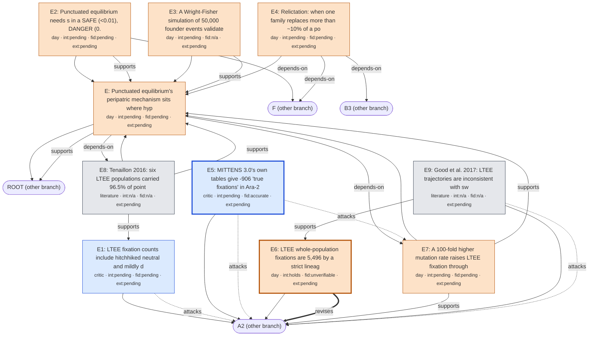

# Branch E

```mermaid
flowchart TD
  n_E["E: Punctuated equilibrium's peripatric mechanism sits where hyp<br/><small>day · int:pending · fid:pending · ext:pending</small>"]
  style n_E fill:#fde2c8,stroke:#b45309
  n_E --> n_ROOT
  n_E -->|supports| n_ROOT
  n_E -->|depends-on| n_E7
  n_E -->|depends-on| n_E8
  n_E1["E1: LTEE fixation counts include hitchhiked neutral and mildly d<br/><small>critic · int:pending · fid:pending · ext:pending</small>"]
  style n_E1 fill:#dbeafe,stroke:#1d4ed8
  n_E1 --> n_A2
  n_E1 -.->|attacks| n_A2
  n_E2["E2: Punctuated equilibrium needs s in a SAFE (<0.01), DANGER (0.<br/><small>day · int:pending · fid:pending · ext:pending</small>"]
  style n_E2 fill:#fde2c8,stroke:#b45309
  n_E2 --> n_E
  n_E2 -->|supports| n_E
  n_E2 -->|depends-on| n_F
  n_E3["E3: A Wright-Fisher simulation of 50,000 founder events validate<br/><small>day · int:pending · fid:n/a · ext:pending</small>"]
  style n_E3 fill:#fde2c8,stroke:#b45309
  n_E3 --> n_E
  n_E3 -->|supports| n_E
  n_E4["E4: Relictation: when one family replaces more than ~10% of a po<br/><small>day · int:pending · fid:pending · ext:pending</small>"]
  style n_E4 fill:#fde2c8,stroke:#b45309
  n_E4 --> n_E
  n_E4 -->|depends-on| n_B3
  n_E4 -->|depends-on| n_F
  n_E5["E5: MITTENS 3.0's own tables give -906 'true fixations' in Ara-2<br/><small>critic · int:pending · fid:accurate · ext:pending</small>"]
  style n_E5 fill:#dbeafe,stroke:#1d4ed8,stroke-width:3px
  n_E5 --> n_A2
  n_E5 -.->|attacks| n_A2
  n_E5 -.->|attacks| n_E7
  n_E6["E6: LTEE whole-population fixations are 5,496 by a strict lineag<br/><small>day · int:holds · fid:unverifiable · ext:pending</small>"]
  style n_E6 fill:#fde2c8,stroke:#b45309,stroke-width:3px
  n_E6 --> n_A2
  n_E6 ==>|revises| n_A2
  n_E7["E7: A 100-fold higher mutation rate raises LTEE fixation through<br/><small>day · int:pending · fid:pending · ext:pending</small>"]
  style n_E7 fill:#fde2c8,stroke:#b45309
  n_E7 --> n_E
  n_E7 -->|supports| n_E
  n_E7 -->|supports| n_A2
  n_E8["E8: Tenaillon 2016: six LTEE populations carried 96.5% of point <br/><small>literature · int:n/a · fid:n/a · ext:pending</small>"]
  style n_E8 fill:#e5e7eb,stroke:#374151
  n_E8 --> n_E
  n_E8 -->|supports| n_E
  n_E8 -->|supports| n_E1
  n_E9["E9: Good et al. 2017: LTEE trajectories are inconsistent with sw<br/><small>literature · int:n/a · fid:n/a · ext:pending</small>"]
  style n_E9 fill:#e5e7eb,stroke:#374151
  n_E9 --> n_A2
  n_E9 -.->|attacks| n_A2
  n_E9 -->|supports| n_E6
  n_A2(["A2 (other branch)"])
  n_B3(["B3 (other branch)"])
  n_F(["F (other branch)"])
  n_ROOT(["ROOT (other branch)"])
```
