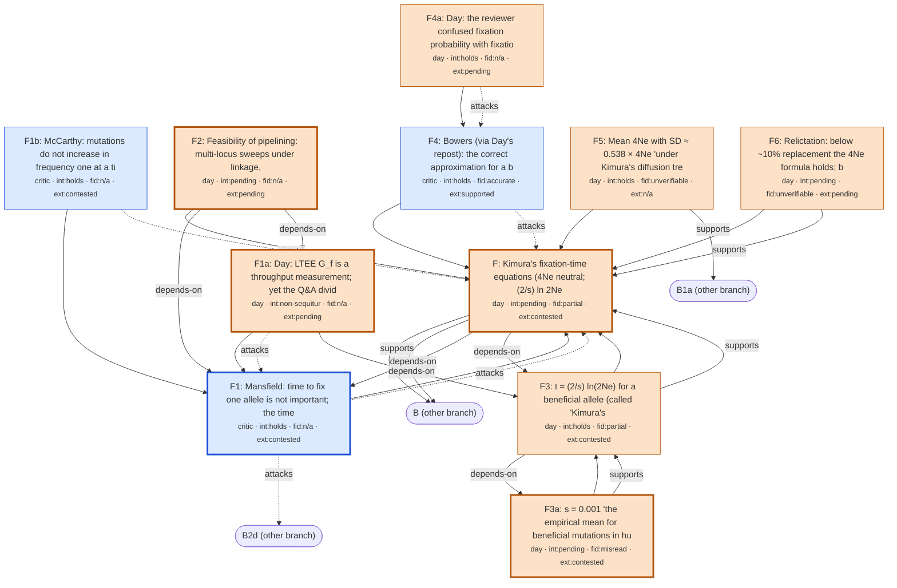

# Branch F

```mermaid
flowchart TD
  n_F["F: Kimura's fixation-time equations (4Ne neutral; (2/s) ln 2Ne <br/><small>day · int:pending · fid:partial · ext:contested</small>"]
  style n_F fill:#fde2c8,stroke:#b45309,stroke-width:3px
  n_F --> n_B
  n_F -->|supports| n_B
  n_F -->|depends-on| n_F1
  n_F -->|depends-on| n_F3
  n_F1["F1: Mansfield: time to fix one allele is not important; the time<br/><small>critic · int:holds · fid:n/a · ext:contested</small>"]
  style n_F1 fill:#dbeafe,stroke:#1d4ed8,stroke-width:3px
  n_F1 --> n_F
  n_F1 -.->|attacks| n_F
  n_F1 -.->|attacks| n_B2d
  n_F1a["F1a: Day: LTEE G_f is a throughput measurement; yet the Q&A divid<br/><small>day · int:non-sequitur · fid:n/a · ext:pending</small>"]
  style n_F1a fill:#fde2c8,stroke:#b45309,stroke-width:3px
  n_F1a --> n_F1
  n_F1a -.->|attacks| n_F1
  n_F1a -->|depends-on| n_F3
  n_F1b["F1b: McCarthy: mutations do not increase in frequency one at a ti<br/><small>critic · int:holds · fid:n/a · ext:contested</small>"]
  style n_F1b fill:#dbeafe,stroke:#1d4ed8
  n_F1b --> n_F1
  n_F1b -.->|attacks| n_F
  n_F2["F2: Feasibility of pipelining: multi-locus sweeps under linkage,<br/><small>day · int:pending · fid:n/a · ext:pending</small>"]
  style n_F2 fill:#fde2c8,stroke:#b45309,stroke-width:3px
  n_F2 --> n_F
  n_F2 -->|depends-on| n_F1
  n_F2 -->|depends-on| n_F1a
  n_F3["F3: t ≈ (2/s) ln(2Ne) for a beneficial allele (called 'Kimura's <br/><small>day · int:holds · fid:partial · ext:contested</small>"]
  style n_F3 fill:#fde2c8,stroke:#b45309
  n_F3 --> n_F
  n_F3 -->|supports| n_F
  n_F3 -->|depends-on| n_F3a
  n_F3a["F3a: s = 0.001 'the empirical mean for beneficial mutations in hu<br/><small>day · int:pending · fid:misread · ext:contested</small>"]
  style n_F3a fill:#fde2c8,stroke:#b45309,stroke-width:3px
  n_F3a --> n_F3
  n_F3a -->|supports| n_F3
  n_F4["F4: Bowers (via Day's repost): the correct approximation for a b<br/><small>critic · int:holds · fid:accurate · ext:supported</small>"]
  style n_F4 fill:#dbeafe,stroke:#1d4ed8
  n_F4 --> n_F
  n_F4 -.->|attacks| n_F
  n_F4a["F4a: Day: the reviewer confused fixation probability with fixatio<br/><small>day · int:holds · fid:n/a · ext:pending</small>"]
  style n_F4a fill:#fde2c8,stroke:#b45309
  n_F4a --> n_F4
  n_F4a -.->|attacks| n_F4
  n_F5["F5: Mean 4Ne with SD ≈ 0.538 × 4Ne 'under Kimura's diffusion tre<br/><small>day · int:holds · fid:unverifiable · ext:n/a</small>"]
  style n_F5 fill:#fde2c8,stroke:#b45309
  n_F5 --> n_F
  n_F5 -->|supports| n_B1a
  n_F6["F6: Relictation: below ~10% replacement the 4Ne formula holds; b<br/><small>day · int:pending · fid:unverifiable · ext:pending</small>"]
  style n_F6 fill:#fde2c8,stroke:#b45309
  n_F6 --> n_F
  n_F6 -->|supports| n_F
  n_B(["B (other branch)"])
  n_B1a(["B1a (other branch)"])
  n_B2d(["B2d (other branch)"])
```
