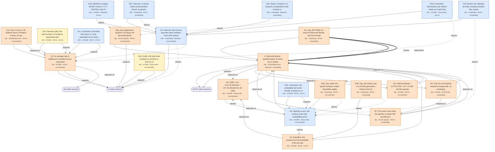

# Branch G

```mermaid
flowchart TD
  n_G["G: Bernoulli Barrier: parallel fixation of many loci is limited<br/><small>day · int:arithmetic-error · fid:partial · ext:pending</small>"]
  style n_G fill:#fde2c8,stroke:#b45309
  n_G --> n_ROOT
  n_G -->|supports| n_ROOT
  n_G -->|depends-on| n_Ga
  n_G -->|depends-on| n_Gb
  n_G -->|depends-on| n_Gc
  n_G -->|depends-on| n_Gd
  n_G1["G1: An average rate is indifferent to parallel versus sequential<br/><small>day · int:holds · fid:n/a · ext:contested</small>"]
  style n_G1 fill:#fde2c8,stroke:#b45309
  n_G1 --> n_A
  n_G1 -->|supports| n_A
  n_G1 -->|depends-on| n_A2
  n_G1a["G1a: Day: in Ara+2, 66 fixations were 14 fixation events, all seq<br/><small>day · int:arithmetic-error · fid:n/a · ext:contested</small>"]
  style n_G1a fill:#fde2c8,stroke:#b45309
  n_G1a --> n_G1
  n_G1a -->|depends-on| n_G1
  n_G1b["G1b: Samson (ally): the total number of mutations separating spec<br/><small>ally · int:holds · fid:n/a · ext:n/a</small>"]
  style n_G1b fill:#fef3c7,stroke:#a16207
  n_G1b --> n_G1
  n_G1b -->|supports| n_G1
  n_G1c["G1c: Camestros concedes that Day's G_f was calculated as an avera<br/><small>critic · int:holds · fid:n/a · ext:n/a</small>"]
  style n_G1c fill:#dbeafe,stroke:#1d4ed8
  n_G1c --> n_G1
  n_G1c -->|supports| n_G1
  n_G2["G2: Hancock: the formula assumes each mutation must arise and go<br/><small>critic · int:pending · fid:partial · ext:contested</small>"]
  style n_G2 fill:#dbeafe,stroke:#1d4ed8
  n_G2 --> n_A
  n_G2 -.->|attacks| n_A
  n_G2 -.->|attacks| n_G1
  n_G2a["G2a: Marathon analogy: 60,000 runners x 4 h = 240,000 h only if r<br/><small>critic · int:holds · fid:partial · ext:n/a</small>"]
  style n_G2a fill:#dbeafe,stroke:#1d4ed8
  n_G2a --> n_G2
  n_G2a -.->|attacks| n_G2g
  n_G2b["G2b: Duffy: 180 total fixed mutations is all there is time for (2<br/><small>ally · int:holds · fid:accurate · ext:contested</small>"]
  style n_G2b fill:#fef3c7,stroke:#a16207
  n_G2b --> n_A
  n_G2b -->|supports| n_A
  n_G2c["G2c: Hancock: a strictly serial model predicts almost no genetic <br/><small>critic · int:pending · fid:n/a · ext:pending</small>"]
  style n_G2c fill:#dbeafe,stroke:#1d4ed8
  n_G2c --> n_G2
  n_G2c -.->|attacks| n_G2
  n_G2d["G2d: Camestros: 'Generations per fixation' reads as if each fixat<br/><small>critic · int:holds · fid:accurate · ext:n/a</small>"]
  style n_G2d fill:#dbeafe,stroke:#1d4ed8
  n_G2d --> n_G2
  n_G2d -.->|attacks| n_G1
  n_G2e["G2e: Myers: evolution is a property of populations and involves m<br/><small>critic · int:pending · fid:partial · ext:pending</small>"]
  style n_G2e fill:#dbeafe,stroke:#1d4ed8
  n_G2e --> n_G2
  n_G2e -.->|attacks| n_G2g
  n_G2f["G2f: Bowers (as reposted by Day): treating evolution like a seria<br/><small>critic · int:pending · fid:n/a · ext:pending</small>"]
  style n_G2f fill:#dbeafe,stroke:#1d4ed8
  n_G2f --> n_G2
  n_G2f -.->|attacks| n_G3
  n_G2g["G2g: Day (Appendix A, quoted in his blog): the Bernoulli Barrier <br/><small>day · int:non-sequitur · fid:n/a · ext:contested</small>"]
  style n_G2g fill:#fde2c8,stroke:#b45309
  n_G2g --> n_G
  n_G2g -->|supports| n_A
  n_G3["G3: Specific-vs-any: the product of per-site probabilities price<br/><small>critic · int:holds · fid:accurate · ext:contested</small>"]
  style n_G3 fill:#dbeafe,stroke:#1d4ed8
  n_G3 --> n_G
  n_G3 -.->|attacks| n_Ga
  n_G3 -.->|attacks| n_G4
  n_G3a["G3a: Camestros: the probability that some number is picked in a l<br/><small>critic · int:holds · fid:n/a · ext:n/a</small>"]
  style n_G3a fill:#dbeafe,stroke:#1d4ed8
  n_G3a --> n_G3
  n_G3a -->|supports| n_G3
  n_G3b["G3b: Day: either the specific fixations matter (Darwillion applie<br/><small>day · int:pending · fid:n/a · ext:contested</small>"]
  style n_G3b fill:#fde2c8,stroke:#b45309
  n_G3b --> n_G3
  n_G3b -.->|attacks| n_G3
  n_G4["G4: Darwillion: the reciprocal of the probability of the pre-spe<br/><small>day · int:holds · fid:n/a · ext:n/a</small>"]
  style n_G4 fill:#fde2c8,stroke:#b45309
  n_G4 --> n_G
  n_G4 -->|depends-on| n_Ga
  n_G4b["G4b: Day: McCarthy's use of a 40,000-generation fixation time inc<br/><small>day · int:pending · fid:n/a · ext:pending</small>"]
  style n_G4b fill:#fde2c8,stroke:#b45309
  n_G4b --> n_G4
  n_G4b -.->|attacks| n_G3
  n_Ga["Ga: P(all) = p^n: 0.02^20,000,000 ≈ 10^−34,000,000 for 20 millio<br/><small>day · int:holds · fid:accurate · ext:contested</small>"]
  style n_Ga fill:#fde2c8,stroke:#b45309
  n_Ga --> n_G
  n_Ga -->|depends-on| n_G3
  n_Gb["Gb: P(all beneficial) = 0.5^157,000 = 10^−47,262 and the populat<br/><small>day · int:holds · fid:n/a · ext:contested</small>"]
  style n_Gb fill:#fde2c8,stroke:#b45309
  n_Gb --> n_G
  n_Gb -->|depends-on| n_G
  n_Gc["Gc: The active zone limits the pipeline to about 230 simultaneou<br/><small>day · int:non-sequitur · fid:n/a · ext:pending</small>"]
  style n_Gc fill:#fde2c8,stroke:#b45309
  n_Gc --> n_G
  n_Gc -->|depends-on| n_G
  n_Gd["Gd: Only 2% of beneficial mutations escape drift, so sustaining <br/><small>day · int:holds · fid:accurate · ext:pending</small>"]
  style n_Gd fill:#fde2c8,stroke:#b45309
  n_Gd --> n_G
  n_Gd -->|depends-on| n_Gc
  n_Ge["Ge: Day: MITTENS 3.0 omits the Bernoulli Barrier and the Averagi<br/><small>day · int:pending · fid:n/a · ext:pending</small>"]
  style n_Ge fill:#fde2c8,stroke:#b45309
  n_Ge --> n_G
  n_Ge ==>|revises| n_G
  n_Ge ==>|supersedes| n_G
  n_A(["A (other branch)"])
  n_A2(["A2 (other branch)"])
  n_ROOT(["ROOT (other branch)"])
```
