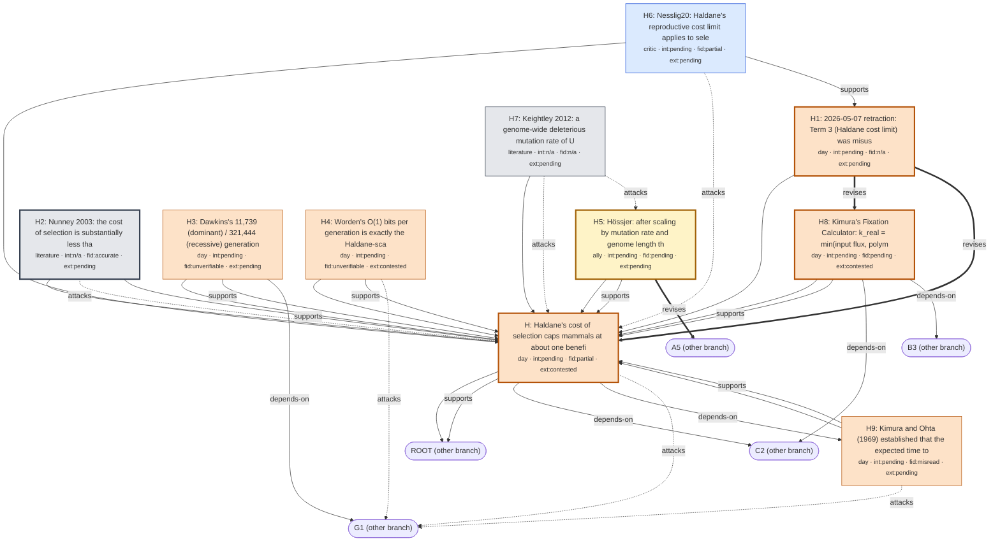

# Branch H

```mermaid
flowchart TD
  n_H["H: Haldane's cost of selection caps mammals at about one benefi<br/><small>day · int:pending · fid:partial · ext:contested</small>"]
  style n_H fill:#fde2c8,stroke:#b45309,stroke-width:3px
  n_H --> n_ROOT
  n_H -->|supports| n_ROOT
  n_H -->|depends-on| n_C2
  n_H -->|depends-on| n_H9
  n_H -.->|attacks| n_G1
  n_H1["H1: 2026-05-07 retraction: Term 3 (Haldane cost limit) was misus<br/><small>day · int:pending · fid:n/a · ext:pending</small>"]
  style n_H1 fill:#fde2c8,stroke:#b45309,stroke-width:3px
  n_H1 --> n_H
  n_H1 ==>|revises| n_H8
  n_H1 ==>|revises| n_H
  n_H2["H2: Nunney 2003: the cost of selection is substantially less tha<br/><small>literature · int:n/a · fid:accurate · ext:pending</small>"]
  style n_H2 fill:#e5e7eb,stroke:#374151,stroke-width:3px
  n_H2 --> n_H
  n_H2 -.->|attacks| n_H
  n_H2 -->|supports| n_H
  n_H3["H3: Dawkins's 11,739 (dominant) / 321,444 (recessive) generation<br/><small>day · int:pending · fid:unverifiable · ext:pending</small>"]
  style n_H3 fill:#fde2c8,stroke:#b45309
  n_H3 --> n_H
  n_H3 -->|supports| n_H
  n_H3 -->|depends-on| n_G1
  n_H4["H4: Worden's O(1) bits per generation is exactly the Haldane-sca<br/><small>day · int:pending · fid:unverifiable · ext:contested</small>"]
  style n_H4 fill:#fde2c8,stroke:#b45309
  n_H4 --> n_H
  n_H4 -->|supports| n_H
  n_H4 -.->|attacks| n_G1
  n_H5["H5: Hössjer: after scaling by mutation rate and genome length th<br/><small>ally · int:pending · fid:pending · ext:pending</small>"]
  style n_H5 fill:#fef3c7,stroke:#a16207,stroke-width:3px
  n_H5 --> n_H
  n_H5 -->|supports| n_H
  n_H5 ==>|revises| n_A5
  n_H6["H6: Nesslig20: Haldane's reproductive cost limit applies to sele<br/><small>critic · int:pending · fid:partial · ext:pending</small>"]
  style n_H6 fill:#dbeafe,stroke:#1d4ed8
  n_H6 --> n_H
  n_H6 -.->|attacks| n_H
  n_H6 -->|supports| n_H1
  n_H7["H7: Keightley 2012: a genome-wide deleterious mutation rate of U<br/><small>literature · int:n/a · fid:n/a · ext:pending</small>"]
  style n_H7 fill:#e5e7eb,stroke:#374151
  n_H7 --> n_H
  n_H7 -.->|attacks| n_H
  n_H7 -.->|attacks| n_H5
  n_H8["H8: Kimura's Fixation Calculator: k_real = min(input flux, polym<br/><small>day · int:pending · fid:pending · ext:contested</small>"]
  style n_H8 fill:#fde2c8,stroke:#b45309,stroke-width:3px
  n_H8 --> n_H
  n_H8 -->|supports| n_H
  n_H8 -->|depends-on| n_C2
  n_H8 -->|depends-on| n_B3
  n_H9["H9: Kimura and Ohta (1969) established that the expected time to<br/><small>day · int:pending · fid:misread · ext:pending</small>"]
  style n_H9 fill:#fde2c8,stroke:#b45309
  n_H9 --> n_H
  n_H9 -->|supports| n_H
  n_H9 -.->|attacks| n_G1
  n_A5(["A5 (other branch)"])
  n_B3(["B3 (other branch)"])
  n_C2(["C2 (other branch)"])
  n_G1(["G1 (other branch)"])
  n_ROOT(["ROOT (other branch)"])
```
