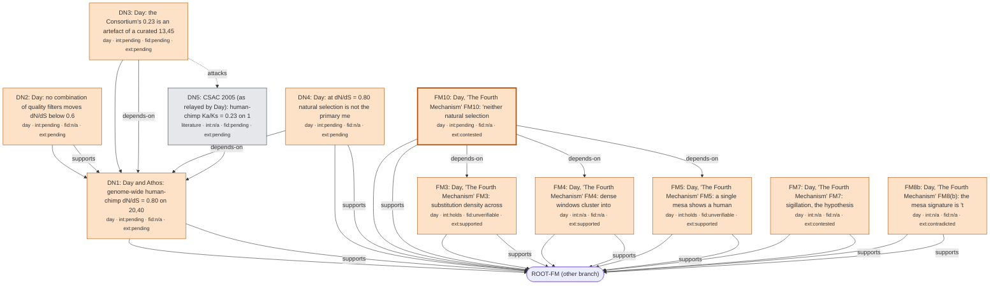

# Branch R

```mermaid
flowchart TD
  n_DN1["DN1: Day and Athos: genome-wide human-chimp dN/dS = 0.80 on 20,40<br/><small>day · int:pending · fid:n/a · ext:pending</small>"]
  style n_DN1 fill:#fde2c8,stroke:#b45309
  n_DN1 --> n_ROOT_FM
  n_DN1 -->|supports| n_ROOT_FM
  n_DN2["DN2: Day: no combination of quality filters moves dN/dS below 0.6<br/><small>day · int:pending · fid:n/a · ext:pending</small>"]
  style n_DN2 fill:#fde2c8,stroke:#b45309
  n_DN2 --> n_DN1
  n_DN2 -->|supports| n_DN1
  n_DN3["DN3: Day: the Consortium's 0.23 is an artefact of a curated 13,45<br/><small>day · int:pending · fid:pending · ext:pending</small>"]
  style n_DN3 fill:#fde2c8,stroke:#b45309
  n_DN3 --> n_DN1
  n_DN3 -.->|attacks| n_DN5
  n_DN3 -->|depends-on| n_DN1
  n_DN4["DN4: Day: at dN/dS = 0.80 natural selection is not the primary me<br/><small>day · int:pending · fid:n/a · ext:pending</small>"]
  style n_DN4 fill:#fde2c8,stroke:#b45309
  n_DN4 --> n_ROOT_FM
  n_DN4 -->|supports| n_ROOT_FM
  n_DN4 -->|depends-on| n_DN1
  n_DN5["DN5: CSAC 2005 (as relayed by Day): human-chimp Ka/Ks = 0.23 on 1<br/><small>literature · int:n/a · fid:pending · ext:pending</small>"]
  style n_DN5 fill:#e5e7eb,stroke:#374151
  n_DN5 --> n_DN1
  n_FM10["FM10: Day, 'The Fourth Mechanism' FM10: 'neither natural selection<br/><small>day · int:pending · fid:n/a · ext:contested</small>"]
  style n_FM10 fill:#fde2c8,stroke:#b45309,stroke-width:3px
  n_FM10 --> n_ROOT_FM
  n_FM10 -->|supports| n_ROOT_FM
  n_FM10 -->|depends-on| n_FM3
  n_FM10 -->|depends-on| n_FM4
  n_FM10 -->|depends-on| n_FM5
  n_FM3["FM3: Day, 'The Fourth Mechanism' FM3: substitution density across<br/><small>day · int:holds · fid:unverifiable · ext:supported</small>"]
  style n_FM3 fill:#fde2c8,stroke:#b45309
  n_FM3 --> n_ROOT_FM
  n_FM3 -->|supports| n_ROOT_FM
  n_FM4["FM4: Day, 'The Fourth Mechanism' FM4: dense windows cluster into <br/><small>day · int:n/a · fid:n/a · ext:supported</small>"]
  style n_FM4 fill:#fde2c8,stroke:#b45309
  n_FM4 --> n_ROOT_FM
  n_FM4 -->|supports| n_ROOT_FM
  n_FM5["FM5: Day, 'The Fourth Mechanism' FM5: a single mesa shows a human<br/><small>day · int:holds · fid:unverifiable · ext:supported</small>"]
  style n_FM5 fill:#fde2c8,stroke:#b45309
  n_FM5 --> n_ROOT_FM
  n_FM5 -->|supports| n_ROOT_FM
  n_FM7["FM7: Day, 'The Fourth Mechanism' FM7: sigillation, the hypothesis<br/><small>day · int:n/a · fid:n/a · ext:contested</small>"]
  style n_FM7 fill:#fde2c8,stroke:#b45309
  n_FM7 --> n_ROOT_FM
  n_FM7 -->|supports| n_ROOT_FM
  n_FM8b["FM8b: Day, 'The Fourth Mechanism' FM8(b): the mesa signature is 't<br/><small>day · int:n/a · fid:n/a · ext:contradicted</small>"]
  style n_FM8b fill:#fde2c8,stroke:#b45309
  n_FM8b --> n_ROOT_FM
  n_FM8b -->|supports| n_ROOT_FM
  n_ROOT_FM(["ROOT-FM (other branch)"])
```
