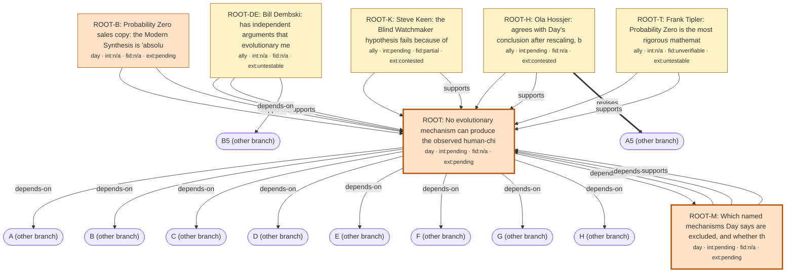

# Branch ROOT

```mermaid
flowchart TD
  n_ROOT["ROOT: No evolutionary mechanism can produce the observed human-chi<br/><small>day · int:pending · fid:n/a · ext:pending</small>"]
  style n_ROOT fill:#fde2c8,stroke:#b45309,stroke-width:3px
  n_ROOT -->|depends-on| n_A
  n_ROOT -->|depends-on| n_B
  n_ROOT -->|depends-on| n_C
  n_ROOT -->|depends-on| n_D
  n_ROOT -->|depends-on| n_E
  n_ROOT -->|depends-on| n_F
  n_ROOT -->|depends-on| n_G
  n_ROOT -->|depends-on| n_H
  n_ROOT -->|depends-on| n_ROOT_M
  n_ROOT_B["ROOT-B: Probability Zero sales copy: the Modern Synthesis is 'absolu<br/><small>day · int:n/a · fid:n/a · ext:pending</small>"]
  style n_ROOT_B fill:#fde2c8,stroke:#b45309
  n_ROOT_B --> n_ROOT
  n_ROOT_B -->|supports| n_ROOT
  n_ROOT_DE["ROOT-DE: Bill Dembski: has independent arguments that evolutionary me<br/><small>ally · int:n/a · fid:n/a · ext:untestable</small>"]
  style n_ROOT_DE fill:#fef3c7,stroke:#a16207
  n_ROOT_DE --> n_ROOT
  n_ROOT_DE -->|supports| n_ROOT
  n_ROOT_DE -->|depends-on| n_B5
  n_ROOT_H["ROOT-H: Ola Hossjer: agrees with Day's conclusion after rescaling, b<br/><small>ally · int:pending · fid:n/a · ext:contested</small>"]
  style n_ROOT_H fill:#fef3c7,stroke:#a16207
  n_ROOT_H --> n_ROOT
  n_ROOT_H -->|supports| n_ROOT
  n_ROOT_H ==>|revises| n_A5
  n_ROOT_K["ROOT-K: Steve Keen: the Blind Watchmaker hypothesis fails because of<br/><small>ally · int:pending · fid:partial · ext:contested</small>"]
  style n_ROOT_K fill:#fef3c7,stroke:#a16207
  n_ROOT_K --> n_ROOT
  n_ROOT_K -->|supports| n_ROOT
  n_ROOT_M["ROOT-M: Which named mechanisms Day says are excluded, and whether th<br/><small>day · int:pending · fid:n/a · ext:pending</small>"]
  style n_ROOT_M fill:#fde2c8,stroke:#b45309,stroke-width:3px
  n_ROOT_M --> n_ROOT
  n_ROOT_M -->|depends-on| n_ROOT
  n_ROOT_M -->|supports| n_ROOT
  n_ROOT_T["ROOT-T: Frank Tipler: Probability Zero is the most rigorous mathemat<br/><small>ally · int:n/a · fid:unverifiable · ext:untestable</small>"]
  style n_ROOT_T fill:#fef3c7,stroke:#a16207
  n_ROOT_T --> n_ROOT
  n_ROOT_T -->|supports| n_ROOT
  n_A(["A (other branch)"])
  n_A5(["A5 (other branch)"])
  n_B(["B (other branch)"])
  n_B5(["B5 (other branch)"])
  n_C(["C (other branch)"])
  n_D(["D (other branch)"])
  n_E(["E (other branch)"])
  n_F(["F (other branch)"])
  n_G(["G (other branch)"])
  n_H(["H (other branch)"])
```
