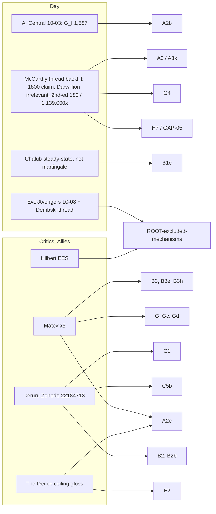

# Corpus refresh 2026-10-09 (new items since the 2026-10-07 harvest)

Scope: everything new on both sides since the R1 pass 2 harvest of 2026-10-07, plus comment threads that pass 2 did not capture (dated back to 2026-09-12; flagged "backfill"). This file proposes claim IDs and defeater targets only. No claim file was created and the argmap was not edited. Logs: `harvest-log-day.md`, `harvest-log-critics.md` (section "Refresh 2026-10-09"). Bibliography: `bib-day.md`, `bib-critics.md`. Quotes: `quotes-day.md` Q79-Q96, `quotes-critics.md` RF-1 to RF-17. Ledger: `ledgers/versions.md` (5 rows added).

## Bottom line
- **The window is thin.** Day posted one new relevant item (blog 2026-10-08). There are no new Zenodo records (39 total; seven files re-checked by md5, all unchanged). On the critic side, no new post appeared from McCarthy, keruru, Camestros, Pharyngula, Hancock, Gutsick Gibbon, Dembski's Substack, Tree of Woe, Uncle John's Band, American Hypnotist or Keen. The promised Gutsick Gibbon "roundtable" has not been published.
- **Most of the new substance is backfill.** Comment threads on McCarthy's and Dembski's Substacks (not captured on 2026-10-07) supply most of the 18 new Day quotes (Q79-Q96) and 17 new critic/ally quotes (RF-1 to RF-17).
- **Three new voices or sources:** Matev (a commenter-critic with five technical points), keruru's Zenodo deposit 22184713 (a measured-Ne response to Day's Hard Limits input), and "Hilbert" (an EES/Third Way advocate who says MITTENS does not apply to his theory).
- **Verdict flags:** one possible change (B2/B2b external verdict, from keruru's measured Ne, unreviewed). Several confirmations. See "Flags" below.

## Day's side

| # | Item (quote ids) | Touches | Type | Proposed IDs / defeater targets | Flag |
|---|---|---|---|---|---|
| D-1 | Blog 2026-10-08 "Not Just the Evo-Avengers" and his Dembski-thread replies 2026-10-04..08 (Q79, Q80, Q81, Q82) | ROOT-excluded-mechanisms, ROOT-no-mechanism-suffices, ROOT-de-dembski-own-arguments | Response (to an EES objection); no new math | `ROOT-day-admission-test` (day): any positive mechanism must be accounted against "timescales and reproductive limits" or it is "irrelevant". `ROOT-ees-not-examined` (day, same thread): "I'm totally unfamiliar with it"; "I have no idea" about EES, together with "I know, to the very base-pair ... six different genomes" (Q82). Defeater target for the second: the pair is in tension (unexamined mechanism vs exact knowledge of mechanism influence) | none |
| D-2 | Dembski-thread comment 2026-09-29 (Q83): Chalub showed k = μ is "a steady-state identity, not a martingale property" | B1, B1e (Chalub 2022 reading), B3g | Restatement | Fidelity target: does Chalub (2022) say "not a martingale property"? Propose `B1e1-chalub-martingale-wording` as a fidelity check. Not examined here | none |
| D-3 | AI Central cross-post 2026-10-03 (Q85): "The more accurate number ... is 1,587 generations per fixation" from "all 273,000 generations across the 12 populations" | A2b (counting rule 1,322 vs 1,587), A2 | Revision (Day adopts the strict count) | `A2b1-day-adopts-1587` (day): derived 205e6/(252,000/1,587) = 1.29 million-fold vs 1.075 million at 1,322. Same post reposts the Z23003785 abstract with 1,322 and 1,075,000-fold unchanged: no revised paper | none (confirms A2b's derived value is Day's own number) |
| D-4 | Sigma Game 2026-09-22 "Apologies" (Q86) and 2026-10-02 "The Gamma Always Runs" (Q87) | B1b, B1, F; A3, A3x (Q87 text repeats "200,000,000" and the 410-million base-pair figure) | Announcement/repost; no new numbers | none. Note: the Gamma post's unnamed commenter says "I have never seen a reliable estimate that is much about 30 million"; Day replies with the 410 Mb figure (units: base pairs, not events, claim A3x). Day's reply restates the bp numerator, so GAP-07's unit mismatch persists | none |
| D-5a | McCarthy-thread comments, backfill (Q88 "drift deader than dead", Q93 "over 10,000 ... will not fixate at all", Q96 "genetic drift isn't happening at all over the last 7000 years") | B2, B2b, B2a, C, C1, C6 | Restatement of Hard Limits and aDNA claims | Q96 conflates "zero or few fixations in the window" (claim C, where R4 found counts at or mildly above neutral) with "no drift". Candidate defeater for C: `C7-zero-fixation-is-not-no-drift` (critic-derived; the C verdict already says internal "non-sequitur") | none |
| D-5b | Q89, Q94 (comments 2026-09-12, 09-16, 09-18): selection "hasn't been performing its real function ... since around 1800"; "3x more deleterious mutations than neutral ones now drifting freely" | H7 (Keightley load), H, C4 (Holocene Ne), GAP-05 (slightly harmful fixations) | **New argument** (unquantified) | `H10-selection-ceased-1800-degrading-genome` (day). `B9-drift-would-fix-harmful-3x-extinction` (day, comment 337302874, 2026-09-15): "if genetic drift were capable of producing actual changes to the genome, the human species would have been rendered infertile and gone extinct within centuries". Defeater target: fixation probability of a deleterious allele with |Nₑs| >> 1 is far below the neutral 1/(2N) (Kimura), so "3x more harmful mutations" does not imply 3x more harmful fixations; this is the GAP-05 question. The 3x figure sourced to McCarthy's 2026-02-03 exchange (bib MC-2) | possible input to the pending H and GAP-05 checks (no number to check yet) |
| D-5c | Q90 (2026-09-15): "My improbability equation is irrelevant, as it even says in the book. It's not 'wrong' because it doesn't exist." McCarthy replies 2026-09-16 (comment 338774739) quoting the book: "The probability is one in one Darwillion ... absolute zero." | G4 (Darwillion), G3, G4b | Revision/retreat (equation status) | Add to `ledgers/versions.md` (done). Defeater target for the retreat: if the equation "doesn't exist" it cannot be the book's headline; McCarthy's quotation is secondhand (the book is not accessible) | none |
| D-5d | Q91 (2026-09-18): quotes the 2nd-edition abstract: 180 fixations = 252,000 / 1,400; 0.000088% of ~205 million; 1,139,000-fold; "18 species pairs"; "approximately 410 million total genomic differences" (same comment) | A2, A3, A3a, A3x (bp vs events), G2b (Duffy 180) | Version datum | `versions.md` row added. Derived: 252,000/1,400 = 180; 205e6/180 = 1,138,889. Still base pairs in the numerator ("410 million total genomic differences" -> "205 million fixations"), so the A3x/GAP-07 unit mismatch is present in the 2nd-edition abstract | none |
| D-5e | Q92 (2026-09-17): "no vertebrate mammalian species has ever originated through ... natural selection, ... genetic drift, or any combination thereof"; Day: "Kimura and neutral theory don't even begin to enter into" the core argument | ROOT-excluded-mechanisms, A, B | Scope statement | `ROOT-scope-vertebrate-mammals` (day). Three different scope statements across the corpus (mammals; "six genomes"; "18 species pairs"): recorded in versions.md | none |
| D-5f | Q95 (2026-09-15): quotes the book: "fixating 1,017 times per generation" as the "parallel drift" defenders' figure (Chapter 10) | B5, B2d, G | Numeric of unknown provenance | `B5i-pz-ch10-1017-per-generation`: derive or locate; book not accessible. Compare Hancock 76.8 per generation (B5c) | none |
| D-6 | "An Epic Test" 2026-10-07, re-read (Q84): "a new disproof ... that has nothing to do with either MITTENS or Reverse-MITTENS"; an unpublished "epic data analysis" | ROOT | Pre-announcement | Placeholder only: `ROOT-newdisproof-pending`. Nothing to check until it is published. Pre-register: not yet predictable | none |
| D-7 | Dembski, Hossjer-thread comment 2026-09-18 and interview-thread 2026-10-05 (RF-10) | ROOT-h-hossjer-agrees-with-main-argument | Ally statement | Hossjer reviewed the first edition (d = 0.45, 127 fixations). Dembski says "the newer numbers make Vox's case even stronger" and hopes for an update; none found | Claim ROOT-h applies to the first-edition numbers only; mark "not updated" |

Zenodo: no new record. No new Day claim appeared in any Zenodo file, so `parameters.yaml` and `versions.md` needed only the five rows already added.

## Critics and allies

| # | Item (quote ids) | Touches | Type | Proposed IDs / defeater targets | Flag |
|---|---|---|---|---|---|
| C-1 | **Matev**, comment 2026-09-17 under McCarthy (RF-1): the Bernoulli Barrier paper's coefficient-of-variation argument; also (same comment) fitness written multiplicatively but evaluated additively, and "required population" presupposing the extreme individuals exist | G, Gc, Gd, G1, Ga, Gb | **New critic argument** (technical) | `G5-cv-falls-variance-rises-matev`: Var of the count of n beneficial alleles carried is np(1-p) and rises with n while the CV falls; Fisher's theorem concerns additive genetic variance in fitness, not the CV of the count. `G6-required-extremes-not-needed-matev`. `G7-additive-vs-multiplicative-fitness-bb-paper-matev`. Check against Z18167588 text and equations; the pre-registered claim G verdict ("arithmetic-error", external "contested") is consistent | supports G verdicts; no change |
| C-2 | Matev, 2026-09-25 (RF-2): with all-neutral alleles at a site, "2N/(2Nₑ) = N/Nₑ, which is greater than one and therefore not even a valid probability when N > Nₑ" | B3, B3a, B3g, B3h, B3d | Reductio of k = μN/Nₑ | `B3i-sum-over-alleles-exceeds-one-matev`: the same N vs Nₑ point as B3g/B3h, in a form that does not rely on Wright-Fisher conventions. Day's 2026-08-27 concession already covers it | none (consistent with B3g, B3h) |
| C-3 | Matev, 2026-09-25 (RF-3): in Day's 8.25-fixation calculation, "one over sixteen-billion for every single mutation ..., including the ones introduced in the first generation after the split"; plus a binomial-tail suggestion | B3e (verdict "non-sequitur", "contradicted") | Support for existing critic point | add as second source to B3e; `A3e-binomial-tail-of-fixation-count-matev` (RF-5): P(at most 180 fixations, given neutral inputs) as an explicit check that does not commit the specific-set error (G3) | none |
| C-4 | Matev, 2026-09-18 (RF-4): unit argument: years per fixation = (gens per fixation) x (years per gen); using a bacterial gens-per-fixation for humans is not "applying the fastest possible fixation rates" | A2, A2d, A2e, A1b, F3, ROOT | **New critic argument** | `A2i-gf-units-years-vs-generations-matev`. Compare Day's 2022 blog post (cited by Matev) where he argues time, not generations, is what counts. Candidate check: what quantity bounds human fixation rate from LTEE (generations per fixation vs per year)? A2e is already "non-sequitur"; this strengthens the sub-point | none; reinforces A2e |
| C-5 | McCarthy comment 2026-09-18 (RF-6): "400 billion x 1/20000 = 35 million point mutations fixing alone" | B5a (22.5 M), A3, F1b | **Critic-side arithmetic error** (minor) | Record against the critic: 4e11/2e4 = 2e7, not 3.5e7. The post's own figure (20M/22.5M) is correct, so only the comment is wrong. Same comment's cricket and mouse examples are anecdotal fast sweeps (flatwing in "fewer than about 20 generations") | none; fairness entry |
| C-6 | McCarthy comment 2026-09-14 (RF-7): lag model, 320,000 productive generations x 50,000 per year x 8e6 years = 4e11; x 1/20,000 = 2e7 | B1b, B6, B1c | Restatement of the "full pipe minus last 4Nₑ" accounting | none (matches R4 B1b/B1c: new-mutation column (T-4Nₑ)/T) | none |
| C-7 | "Hilbert" (EES), 2026-10-04..08 (RF-8, RF-17): MITTENS "hardly" applies to EES, which includes "directional" mechanisms; "the quant problem is not an issue" for EES; the "bigger problem ... is solving functionality" | ROOT-excluded-mechanisms, ROOT-no-mechanism-suffices, D (function) | **Response (deflection)**; no model or number; also a statement that function is the harder problem | `ROOT-ees-escape-hilbert` (ally, to be placed beside the Dembski-linked EES/TWE mentions). Defeater target for the escape: Day's admission test (D-1). Note the two sides agree that EES is unexamined quantitatively | none |
| C-8 | "The Deuce" (Day-sympathetic), 2026-09-19 (RF-9): the ~190 beneficial fixations are a ceiling under maximal selection, not an addition: "It's either/or" | A2e, E2 (strong-selection zones), ROOT-excluded-mechanisms | Ally gloss (not Day's wording) | `A2e1-ceiling-not-additive-ally-gloss`. Defeater: standard theory has drift and selection operating concurrently; E2's strong-selection zones give a hard-selection sub-case. Day's Q92 phrase "or any combination thereof" is the neighbouring claim | tension with F2/H2-hard results is possible; check E2 before using |
| C-9 | **keruru Zenodo 22184713** (2026-08-31, Draft 1) §6 and §6.2 (RF-12, RF-13, RF-14); §4b.1 (RF-15); §7 (RF-16) | B2, B2a, B2b, C4, C5, C5a, C5b, B1c, C1, C1b, B4g | **New quantitative response** to Day's Hard Limits input (Nₑ = 4N/(Vₖ+2)) | `B2e-measured-ne-vs-wright-formula` (critic): temporal Nₑ is "wrong by three orders of magnitude" vs Wright's 0.57 N for a Bronze Age census of 1e7 (draft's §6). `B2f-4ne-transit-fraction-table` (critic, derived): 4Nₑ = 3,752 / 27,732 / 32,556 / 39,340 generations = 1.4% / 10.7% / 12.5% / 15.1% of a ~260,000-generation lineage. `C5c-structure-sampling-vk-artefact-sims` (critic): island model gives Nₑ/N 0.83-2.44 (structure raises it), a moving frame ~1.0, Vₖ lowers it but saturates near 0.05. `C1d-nonreproduction-twelve-sigma-locus` (critic): an unnamed "published analysis" of the same AADR resource is not reproduced for rs35619459 (series 0.858, 0.836, 0.790, 0.854) | **B2/B2b external verdict (now "contested") could move toward "contradicted"** if the temporal Nₑ survives replication: Day's ceiling on census N depends on Nₑ ∝ N. The draft is unreviewed, carries `[CHECK]` marks, and is internally inconsistent on the ratio (abstract "of order 10^-4"; §6 "4 x 10^-4"; §6.2 "8 x 10^-4"; 8,139/1e7 = 8.1e-4, derived). Keruru himself says "We do not claim the ceiling argument is refuted." Recommend an independent AADR replication before changing B2/B2b |
| C-10 | keruru §7 (RF-16): "The 1240K panel was designed on modern variation" | C1 | Support for C1 (a critic of Day concedes the same limitation for his own estimator) | add as a parallel to C1 and as a symmetric-scrutiny entry (keruru's own draft lists no ancestry control, no relatedness filtering, extrapolated generation time) | none |
| C-11 | Reddit user justatest90 (RF-11): "Dr. Hancock says Day makes a 2n mistake, but Day just accounts for it elsewhere, by halving the mutation target" | A3d (factor of two), B6c, B5c, G2 | Defence of Day on one Hancock point, by a reader who says they read the book | `A3d1-hancock-2n-vs-halving-target`: needs the Hancock transcript locator (video `_Vu0ZVVjwHc`) and the Day paper location where the target is halved | none |
| C-12 | Reddit user qbg (not quoted): main MITTENS paper "submitted to Nature on December 28th 2025 and ... rejected 15 days later on January 12th 2026", citing Day's own statements | epistemic only | Secondhand | none | none |

Other critic-side searches (Pharyngula, Camestros, Moran/Sandwalk, Felsenstein, Panda's Thumb, ReMine/Truman, Bowers, Graur) returned nothing new.

## Effect on the pending checks
- **H (cost of selection):** no new critic input and no new Day number. The only new H-related material is unquantified: Day's "selection ceased ~1800 / 3x more deleterious than neutral" (D-5b) and the Deuce's "either/or" (C-8). If the hard-selected-load run is rerun, the "3x" figure (McCarthy thread, MC-2) can serve as a Day-side input for the deleterious fraction; there is no derivation to audit.
- **D (sequence space):** nothing new on Day's side (the "Best They've Got" I and II posts of 2026-10-05/06 are unanswered by anyone). Hilbert's comment that "the bigger problem ... is solving functionality" (RF-17) is a third-party statement that function, not speed, is the harder problem. No critic engaged Wistar, Eden, Ulam or Schutzenberger in this window.
- **C1b (aDNA):** (i) Day restates "genetic drift isn't happening at all over the last 7000 years" (Q96) on 2026-09-13, before the Z23046531 counts (1 and 3 completions); the R4 finding is that the counts are at or mildly above neutral expectation. (ii) keruru's deposit adds a reproducibility disagreement over an aDNA frequency series and his own ascertainment and ancestry-control caveats; his allele table lists SLC24A5 (rs1426654) at 0.87, 0.97, 0.90, 0.91 across four bins (no fixation within the window); the LCT and SLC45A2 rows were not interpreted here. (iii) Day announced an "epic data analysis" on 2026-10-07 that is not yet published; it may be an aDNA follow-up (unknown).
- **GAP-07 (indel/SV event counts):** no new counts. Day's 2nd-edition abstract text (Q91) and his Sigma Game reply (Q87) still equate "410 million total genomic differences" (base pairs) with "~205 million fixations required", so the unit mismatch (A3x) is still in the current text. McCarthy's 2026-09-17 SV remark (MC-11, already in A3x) remains the only critic statement. The unnamed commenter's "about 30 million" figure (Sigma Game) is a SNV-scale guess with no source.

## Flags (existing verdicts)
1. **B2 and B2b (Hard Limits ceiling; external "contested"):** keruru's measured Nₑ (RF-12 to RF-14) bears directly on the formula input. Possible move to "contradicted" if replicated. Not recommended to change on an unreviewed draft with `[CHECK]` figures and an internal inconsistency.
2. **A2e (LTEE as ceiling; "non-sequitur" internal):** Matev's unit argument (C-4) and the Deuce's ceiling gloss (C-8) are two independent restatements of the same weakness and one of the premise Day's allies read into it. No change.
3. **G (Bernoulli Barrier; "arithmetic-error"):** Matev's points (C-1) agree with the existing verdict and add the multiplicative/additive inconsistency; the Fisher's-theorem point should be checked against the paper text before it is cited as a defeater.
4. **ROOT-h (Hossjer agrees):** applies to first-edition inputs; Dembski's statement that newer numbers are "even stronger" is the ally's, not Hossjer's (D-7).
5. **C-5 (McCarthy 35M slip):** critic-side arithmetic; recorded for symmetric scrutiny. The post figures stand.
6. **versions.md** gained: 2nd-edition numbers (180/1,400/1,139,000x), Day's adoption of 1,587, Darwillion status, "selection ended ~1800", scope statements.

## Inaccessible or not done
- discourse.peacefulscience.org: DNS does not resolve (Nesslig20 Part III unchecked).
- old.reddit.com search: login wall; Arctic Shift and PullPush used instead (Arctic Shift intermittently times out).
- socialgalactic.com microposts (the Vibe Patrol video; micropost under the 10-08 post): TLS chain not verifiable; not bypassed.
- McCarthy paid posts; *Probability Zero* 2nd edition (paid); Amazon pages: unchanged from 2026-10-07.
- YouTube comment threads (Gutsick Gibbon 3,000+, Duffy): not re-pulled; no new videos.
- Open from the earlier harvest: Bowers' original review; Dembski's attached "Mittens 3" PDF; Cambridge TOC for Rosenhouse chs. 7-8; keruru's k = μ exact-Markov-chain deposit (not identified; 22184713 is the aDNA/Ne deposit).
