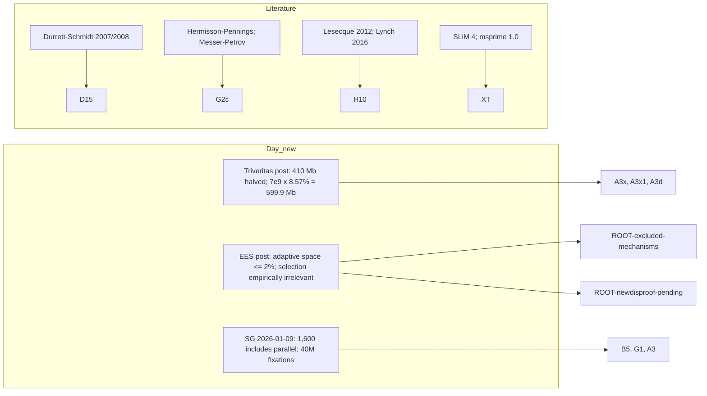

# Corpus refresh 2026-10-09b (second pass, same day; adds social media and foundational literature)

Scope: (1) anything new since the morning pass of 2026-10-09 (`refresh-2026-10-09.md`), including X and other social media; (2) a branch-out: sources neither side has cited, and foundational literature the audit should rest on. This file only proposes claim ids and defeater targets; no claim file, argmap, hierarchy, board or verdict was edited. Logs: `harvest-log-day.md`, `harvest-log-critics.md`, `harvest-log-literature.md` (sections "Refresh 2026-10-09b"). Bibliography: `bib-day.md`, `bib-critics.md`, `bib-literature.md`. Quotes: `quotes-day.md` Q118-Q126, `quotes-critics.md` RF-18, `quotes-literature.md` ("Refresh 2026-10-09b"). Ledger: `ledgers/versions.md` (2 rows). Procedure: `HOWTO-refresh.md`.

## Bottom line
- **Day: two new substantive posts on 2026-10-09.** (a) "Mailvox: Invoking the Triveritas" restates the Yoo 2025 total as "410 million base pairs", says he halved it, and then argues Yoo "can't possibly be correct" because "7 billion x 0.0857 ... 599,900,000" using an "8.57 percent" size difference he attributes to the CSAC 2005 partial genomes (Q118-Q121). The multiplication is right; the 7 billion and the 8.57 percent are uncited and do not occur in the extracted text of CSAC 2005 or Yoo 2025. (b) "The Irrelevance of EES" says EES addresses only the "adaptive space" ("at most 2 percent of the average genome"), claims to have "conclusively proven" that "natural selection is empirically irrelevant", and points to a 96-core, 512 GB, GPU resource for a UATV broadcast that evening (Q122-Q124). No paper, data or code yet: this is the long-announced "epic data analysis".
- **Zenodo:** no new record and no changed checksum in any of the 39 records of "Day, Vox".
- **Critics and allies:** nothing new. Comment-thread counts are unchanged except one trivial Dembski-thread comment. No Gutsick Gibbon roundtable, no new Hancock video, no new McCarthy, keruru, Camestros, Pharyngula or Tree of Woe item on the topic. Peaceful Science (DNS) and Reddit 2026-10-05..09 could not be checked.
- **Social media:** X, Gab, Telegram, Rumble and Locals are JS shells or blocked to read-only access; no post text could be obtained from any of them. Bluesky search works unauthenticated and returned only sentiment posts (2026-10-03..06). Recorded as inaccessible, not guessed.
- **Backfill:** Sigma Game 2026-01-09 "We Knew How This Would Go" (Q125-Q126): "The 1,600 generations per fixation rate INCLUDES parallel fixation"; "40 million fixations".
- **Branch-out:** 20 literature items added (5 full text, 8 abstract only, 1 repository description, 6 record only). The most useful: Durrett & Schmidt 2007 (full text) and 2008, Messer & Petrov 2013 (full text), Hermisson & Pennings 2005, Lesecque et al 2012 with Lynch 2016, and the simulator papers (SLiM 4, msprime 1.0).

## What was checked
| Source | Result |
|---|---|
| Zenodo API, creators "Day, Vox" (2 pages) | unchanged: 39 records, same `modified`, same per-file md5 |
| voxday.net `/feed/`, `/tag/evolution/`, front page | 4 new URLs dated 2026-10-09: 2 kept (new), 2 excluded (off topic) |
| Sigma Game archive API | 10-07, 10-08, 10-09 posts off topic (not fetched); 2026-01-09 backfill found (new) |
| AI Central archive | 10-09 post off topic; unchanged otherwise |
| Day's replies in Dembski and McCarthy threads | unchanged (one added Dembski-thread comment by another user) |
| McCarthy, keruru (Substack + Zenodo 22184713), Camestros, Pharyngula, Dembski, Tree of Woe, Kurgan, others | unchanged / nothing on topic |
| Gutsick Gibbon, Hancock channels (yt-dlp flat list) | unchanged; roundtable not published |
| Peaceful Science | inaccessible (DNS) |
| r/DebateEvolution | inaccessible for 10-05..09 (Arctic Shift 522, PullPush stops at 10-04, reddit.com 403) |
| X @voxday and Nitter mirrors | inaccessible (JS shell, 402, PoW check, suspended mirror) |
| Gab, Telegram, Rumble, Locals | inaccessible (JS only / contact page / 404 / 302) |
| Bluesky search (api.bsky.app) | 15 posts, sentiment only; nothing new after 2026-10-06 |
| Mastodon search | empty |
| Web search for other critiques/endorsements (2 queries) | only already-known sources (McCarthy, Tree of Woe, American Hypnotist, Uncle John's Band, wholereason, audaxconsilium, Sigma Game); no new primary critique |

## Day's side (new)
| # | Item | Touches | Type | Proposed ids / defeater targets | Flag |
|---|---|---|---|---|---|
| D-1 | Triveritas post (Q118-Q121) | A3x, A3x1, A3d, A3a | New numeric argument | `A3x2-day-7e9-times-8.57pct-vs-yoo-410mb` (day): fidelity check of "8.57 percent" (CSAC) and "7 billion" (denominator unstated). Valid Day point to record: he concedes that the direction of the difference is unknown and argues it does not matter; the total he computes (599.9 Mb) is arithmetically right. Defeater target for the argument: a size difference between two assemblies is a difference in total length, not a count of substitutions or events, so multiplying by genome size does not give "fixations" (the A3x unit question again) | A3x/GAP-07 unit mismatch persists and now has Day's explicit statement (base pairs, halved). F: "8.57" and "7 billion" uncited, non-standard: `unverifiable` |
| D-2 | EES post (Q122) | ROOT-excluded-mechanisms, E, H | Response to Hilbert | `ROOT-day-ees-adaptive-space-2pct` (day): "at most 2 percent" is uncited (F: unverifiable); the argument that EES "doesn't address the same fixation problem" assumes the fixation claim it is meant to support (N: circular). Valid Day point: the EES advocate offers no quantitative model either (RF-8, RF-17, RF-18); both sides leave EES unquantified | none |
| D-3 | "Conclusively proven ... natural selection is empirically irrelevant" and the 96-core resource (Q123, Q124) | ROOT, ROOT-newdisproof-pending | Pre-announcement | Extend the placeholder `ROOT-newdisproof-pending`; pre-register on publication. Do not score a claim with no text | none |
| D-4 | Sigma Game 2026-01-09 (Q125, Q126; backfill) | B5, G1, A2, A3 | Version datum | `versions.md` row added: 40 million fixations (2026-01) vs 205 million (2nd-edition abstract, Q91) | none |

## Critics and allies (new)
| # | Item | Touches | Type | Proposed ids / defeater targets | Flag |
|---|---|---|---|---|---|
| C-1 | Hilbert comments relayed in Day's EES post (RF-18) | ROOT-excluded-mechanisms | Relay (rule U) | attach to `ROOT-ees-escape-hilbert` (already proposed); no scoring (relay) | none |
| C-2 | Dembski-thread additions (17 + 1 + 2 comments) | - | off topic | none | none |
| C-3 | Bluesky reactions to the Gutsick Gibbon video | - | sentiment | none | none |

No new critic argument or error this pass. Both sides: the critic-side symmetric item, Hilbert's ending of the exchange with an insult after offering no model, is recorded as tone, not scored.

## Foundational literature added (details in `bib-literature.md`)
| Item | Access | Bears on | Why it matters (one line, both sides) |
|---|---|---|---|
| Durrett & Schmidt 2007 (arXiv math/0702883) | full text | D15, D | Waiting time for a specified regulatory word: 100,000 years (6 letters) in their model; 650 million years for 8 letters without a 7/8 match. Day-side: waiting can be very long; critic-side: tolerating a 7/8 match gives about 60,000 years |
| Durrett & Schmidt 2008 (Genetics) | abstract | D15 | Two-step human regulatory change ">100 million years", with Drosophila "a few million"; also "flaws in some of Michael Behe's arguments" |
| Behe & Snoke 2004 | abstract | D15 | Day-side foundation: multi-residue features need population sizes "no less than 10^9" for fixation in 10^8 generations (superscripts lost in the extracted abstract) |
| Lynch 2010 | abstract | D15, F2 | Mainstream scaling of waiting times for multi-mutation adaptations |
| Hermisson & Pennings 2005 | abstract | G2c, A6 | Standing variation raises the fixation probability of weakly selected substitutions; conditions given |
| Messer & Petrov 2013 | full text | G2c, A6, A6a | Soft sweeps "might be the dominant mode ... in many species"; hard sweeps expected when waiting time is long |
| Desai & Fisher 2007 | abstract | A2e, E7 | Asexual rate of adaptation grows only logarithmically with N and mu |
| Lesecque et al 2012 | abstract | H, H10, GAP-05 | Under relative-fitness selection a species can tolerate tens or hundreds of new deleterious mutations per genome per generation |
| Lynch 2016 | full text | H10, H7 | Expects genetic deterioration under relaxed selection (direction supports Day's claim, size not given) |
| Moorjani et al 2016 | abstract | B4, A1a, C6 | Primate molecular clock varies; CpG transitions most clock-like |
| SLiM 4, msprime 1.0, fwdpy11 | full text / full text / repo description | XT, D15 | Simulator citations for the cross-tool check |
| Jonsson 2017, Charlesworth 2009 and 2013, Kondrashov 1995, Hossjer et al 2021, Kimura & Maruyama 1969, Razeto-Barry 2012 | record / abstract | A5, B2, B3, H, D15 | Citations confirmed against the Europe PMC index; not retrieved |

Several of these are already described from memory in `prior-art.md` (PA-17, PA-24, PA-25, PA-30); the additions replace "unverified" status with retrieved text for the items marked full text or abstract. Four short sections PA-38 to PA-41 were added to `prior-art.md`.

## Verdict flags (existing verdicts; no change made)
1. **A3x / GAP-07 (units):** Day's 2026-10-09 post states the numerator is base pairs and still halves it into "fixations". Supports the existing critic-side finding; no change. His new 600 Mb figure would raise the required count, which strengthens his headline if accepted, so a fair check should note both directions.
2. **A3x1 (Yoo fidelity):** the claimed 8.57 percent and 7 billion do not appear in the extracted CSAC 2005 or Yoo 2025 text; Yoo's Table 1 gives haplotype assemblies of 3.0-3.6 Gb. Day's statement "Yoo ... can't possibly be correct" is itself unverified; fidelity of the attribution to CSAC: `unverifiable`.
3. **ROOT-excluded-mechanisms:** Day's own response to EES does not engage it with a model (N: circular); the EES side offers none either. Symmetric.
4. **H10:** literature support exists for the direction (Lynch 2016) and against the severity (Lesecque 2012); the "3x drift fixation" figure still has no source.
5. **Hancock's standing-variation prediction (G2c):** Hermisson & Pennings and Messer & Petrov show that it is a parameter-dependent prediction, not a general result. Neither side has supplied the parameters for the human-chimp case.

## Inaccessible or not done
- X/Twitter and mirrors, Gab, Telegram channel feed, Rumble, Locals, SocialGalactic (TLS), Peaceful Science (DNS), Reddit for 10-05..09 (Arctic Shift 522, PullPush lag, reddit.com 403).
- UATV broadcast of 2026-10-09 evening: not yet published; check next pass for the data analysis.
- McCarthy paid posts; *Probability Zero* 2nd edition (paid); Amazon pages; YouTube comment threads.
- Literature: full text of Hermisson & Pennings, Behe & Snoke, Durrett & Schmidt 2008, Lynch 2010, Desai & Fisher 2007, Lesecque 2012, Moorjani 2016 (PMC bot challenge; a user-downloaded copy would allow quotes beyond the abstract); fwdpy11 documentation; Haldane 1957, Kimura 1983, Felsenstein, Ewens; Muller's ratchet primary papers (not added).
- Open from earlier: Bowers' original review, Dembski's "Mittens 3" PDF, Cambridge TOC for Rosenhouse chapters 7-8, keruru's exact-Markov-chain deposit.
